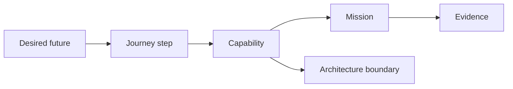
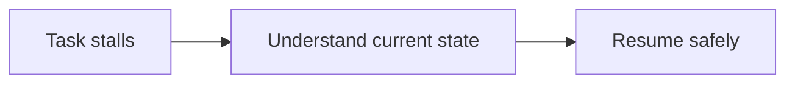
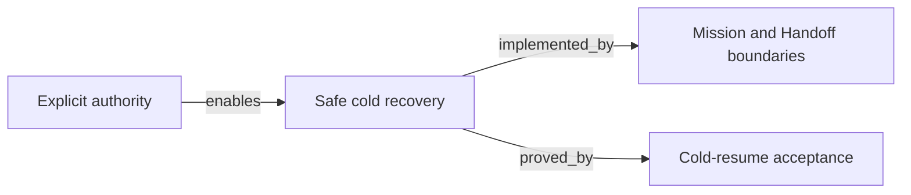

# Atlas

An Atlas is a mutable planning map for one coherent product-value slice. It
connects the reason a change matters to the capabilities and architecture that
make it possible. It helps an owner, an operator, and a later agent orient
without turning a roadmap into execution authority.

An Atlas is canonical Markdown for its own explanation. Its minimal frontmatter
identifies an Atlas to readers; it is not a governed record and the CLI does not
validate it. An Atlas does not grant authority or create Mission drift. Contracts
and Missions remain the places where behavior is agreed and implementation is
authorized.

Use one lowercase, hyphenated file per slice:

```text
.spectacular/atlas/
├── README.md
├── task-recovery.md
└── release-confidence.md
```

Do not number Atlas files. They are navigable maps, not a lifecycle queue.

## Two connected boards

Every Atlas carries two views of the same slice:

- **Outcome board** — the user, their journey, the desired outcome, and the
  observable success signal.
- **System board** — the capabilities, ownership boundaries, dependencies,
  relevant modules or interfaces, technical risks, and proof.

The shared middle is a capability. Keep the connection explicit:



## Relationship vocabulary

Use only the smallest useful labels:

| Label | Meaning |
| --- | --- |
| `serves` | a capability helps an actor reach an outcome |
| `enables` | one capability or concern makes another possible |
| `depends_on` | work cannot proceed without another capability or boundary |
| `implemented_by` | a capability is realized by a module, interface, or data boundary |
| `proved_by` | evidence or a check supports a stated claim |
| `at_risk_from` | a risk can undermine an outcome or capability |

Do not invent a separate ontology, graph database, or generic record system.
Plain nouns and labelled connections are enough while the map remains human-led.

## Suggested shape

````md
---
atlas_schema: spectacular.atlas.v1
title: Task recovery
---

# Atlas: Task recovery

## Outcome board

| Actor | Journey step | Desired outcome | Success signal |
| --- | --- | --- | --- |
| Operator | Understand a stalled task | Resume with one safe next action | A cold session can orient without chat history |



## System board

| Capability | Connection | Implementation boundary | Proof / risk |
| --- | --- | --- | --- |
| Safe cold recovery | serves `Understand current state` | Mission + Handoff records | Cold-resume acceptance test |
| Explicit authority | enables `Safe cold recovery` | Mission validation | Risk: ambiguous owner gate |



## Links and open questions

- Campaign: `<campaign path>`
- Candidate Missions or Contracts: `<references>`
- Open question: `<what must be decided before work freezes?>`
````

Keep an Atlas compact. If a board no longer fits on one screen or one coherent
conversation, split it by value slice rather than making a giant product graph.
