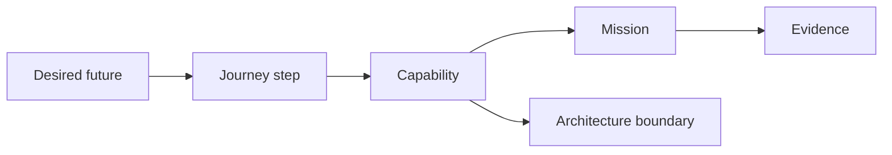
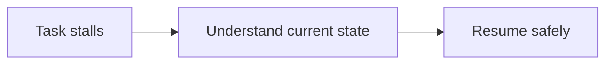
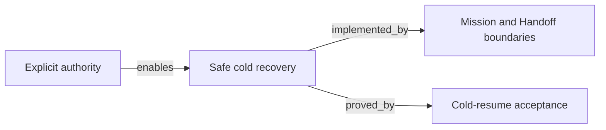

# Atlas

An Atlas is a top-view map: the user journey, the business system, the shape of a
product-value slice seen from above. It connects the reason a change matters to
the capabilities and architecture that make it possible, so an owner, an
operator, and a later agent can orient without a roadmap becoming execution
authority.

An Atlas is used twice. First at the thinking-init stage, before any Proposal
exists, as the place where a shape becomes legible. Later as an attachment: a
Proposal or a Contract points at the Atlas that explains the ground it stands on.

An Atlas is canonical Markdown for its own explanation. Its frontmatter names the
entity (`type: Atlas`) and the schema that would validate it, but no CLI command
does — an Atlas has nothing mechanical to check. It is skip-listed in discovery,
which is what makes it non-governing; the `type:` field is identity, not
authority. An Atlas does not grant authority or create Mission drift. Contracts
and Missions remain the places where behavior is agreed and implementation is
authorized.

## Where thinking lives before an Atlas

`.spectacular/raw/` is the sketchpad: gitignored, skip-listed, no frontmatter, no
naming rules, folders or files as you like. Nothing there is an entity and nothing
cites it. Ideas live there until one earns a linkable Atlas map.

The progression is a cycle, not a pipeline. Grilling, option matrices, and
half-decisions coexist and cross-reference in `raw/` and `atlas/` for as long as
they need to. Only crossing into `proposals/` is directional: a Proposal is the
first official Spectacular document, and writing one is a claim that the thinking
has settled enough to be validated.

Use one lowercase, hyphenated file per slice:

```text
.spectacular/atlas/
├── README.md
├── task-recovery.md
└── release-confidence.md
```

Do not number Atlas files. They are navigable maps, not a lifecycle queue.

## Two connected boards

Every Atlas carries two views of the same slice:

- **Outcome board** — the user, their journey, the desired outcome, and the
  observable success signal.
- **System board** — the capabilities, ownership boundaries, dependencies,
  relevant modules or interfaces, technical risks, and proof.

The shared middle is a capability. Keep the connection explicit:



## Relationship vocabulary

Use only the smallest useful labels:

| Label | Meaning |
| --- | --- |
| `serves` | a capability helps an actor reach an outcome |
| `enables` | one capability or concern makes another possible |
| `depends_on` | work cannot proceed without another capability or boundary |
| `implemented_by` | a capability is realized by a module, interface, or data boundary |
| `proved_by` | evidence or a check supports a stated claim |
| `at_risk_from` | a risk can undermine an outcome or capability |

Do not invent a separate ontology, graph database, or generic record system.
Plain nouns and labelled connections are enough while the map remains human-led.

## Suggested shape

````md
---
type: Atlas
schema: spectacular.atlas.v1
title: Task recovery
---

# Atlas: Task recovery

## Outcome board

| Actor | Journey step | Desired outcome | Success signal |
| --- | --- | --- | --- |
| Operator | Understand a stalled task | Resume with one safe next action | A cold session can orient without chat history |



## System board

| Capability | Connection | Implementation boundary | Proof / risk |
| --- | --- | --- | --- |
| Safe cold recovery | serves `Understand current state` | Mission + Handoff records | Cold-resume acceptance test |
| Explicit authority | enables `Safe cold recovery` | Mission validation | Risk: ambiguous owner gate |



## Links and open questions

- Campaign: `<campaign path>`
- Candidate Missions or Contracts: `<references>`
- Open question: `<what must be decided before work freezes?>`
````

Keep an Atlas compact. If a board no longer fits on one screen or one coherent
conversation, split it by value slice rather than making a giant product graph.
