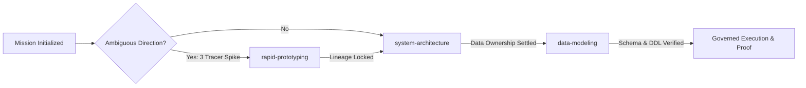
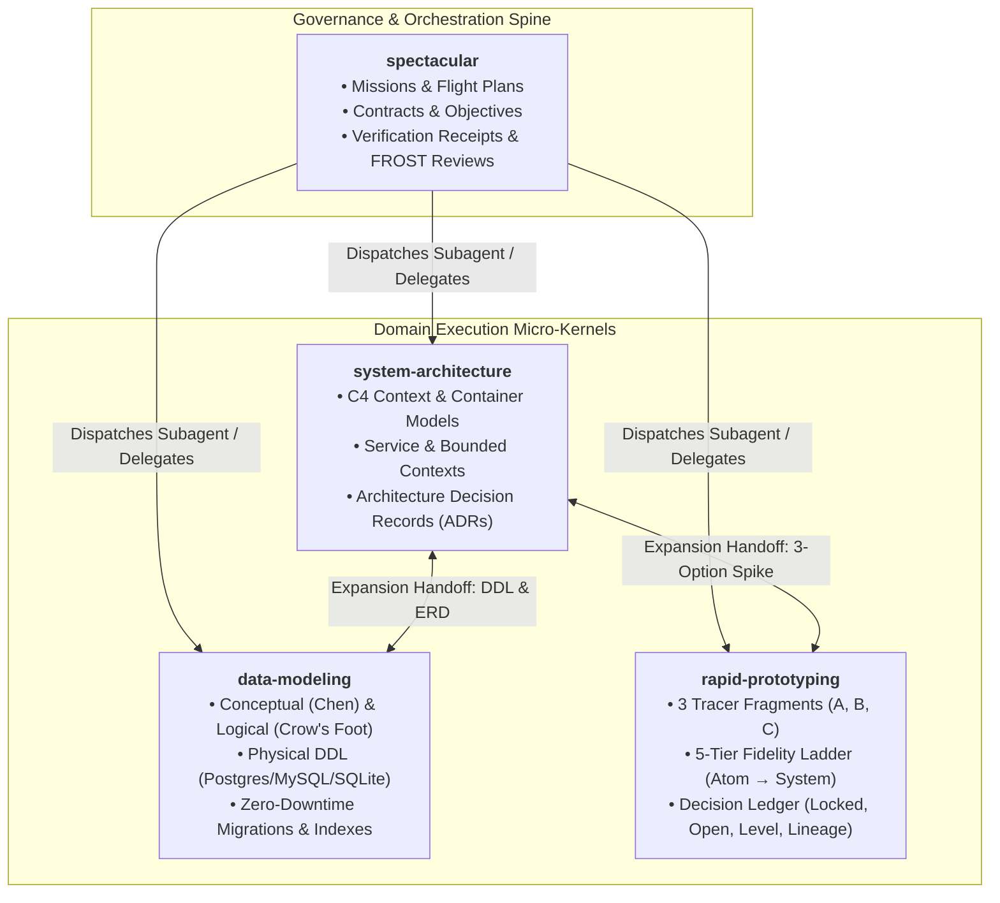
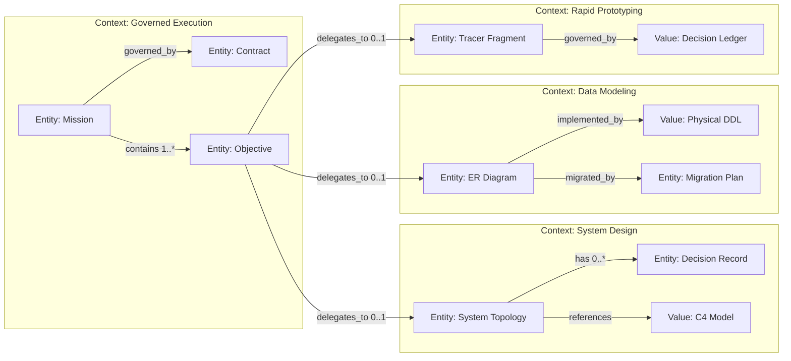

# Atlas: Companion Skills and Domain Execution Topology

This Atlas maps Spectacular's **4-Skill Starting Pack**, the separation between **Mission Governance** and **Domain Execution**, and the deterministic **Expansion Handoff State Machine**.

---

## 1. Outcome Board

| Actor | Journey Step | Desired Outcome | Success Signal |
|---|---|---|---|
| **Mission Lead** | Frame problem & bounds | Govern scope, contracts, and proof without domain bloat | Single-file Mission (`M<N>.md`) with clear capability boundaries |
| **System Architect** | Design topology & ADRs | Make system shapes and trade-offs traceable to NFRs | C4 Context/Container models + verified ADR records |
| **Data Modeler** | Design schemas & migrations | Generate normalized schemas, ERDs, and zero-downtime DDL | Crow's Foot ERD + dialect DDL + non-blocking Expand/Contract plan |
| **Prototyper** | De-risk ambiguous choices | Settle single open axes across 3 tracer options (A/B/C) | Decision ledger locked on selected lineage (`root → B → A`) |

---

## 2. System Board

### A. The 4-Pillar Starting Pack

---

### B. Trigger & Boundary Matrix (Zero Overlap)

| Skill | Primary Operational Domain | Quoted Trigger Keywords | Negative Constraints (`DO NOT`) |
|---|---|---|---|
| **`spectacular`** | Governance, Mission lifecycle, and flight plans | `"start mission"`, `"spectacular decide"`, `"flight plan"`, `"autopilot"`, `"complete mission"`, `$spectacular` | Do not invoke for ungrounded chat, generic planning, or ordinary git ops. |
| **`system-architecture`** | System topology, C4 models, and trade-off ADRs | `"system architecture"`, `"architecture review"`, `"C4 diagram"`, `"ADR"`, `"service boundaries"`, `"bounded context"` | Do not invoke for local code refactors, database DDL, or isolated UI styling. |
| **`data-modeling`** | ERDs, SQL DDL, indexes, and schema migrations | `"ER diagram"`, `"ERD"`, `"database schema"`, `"data model"`, `"SQL DDL"`, `"database migration"`, `"Crow's Foot"` | Do not invoke for simple data inspection or high-level topology without entities. |
| **`rapid-prototyping`** | 3-option tracer spikes and progressive fidelity growth | `"prototype"`, `"explore options"`, `"tracer fragment"`, `"matrix prototype"`, `"compare designs"`, `"fidelity ladder"` | Do not invoke for single-path tasks, simple bugs, or open-ended brainstorming. |

---

## 3. Domain Board

---

## 4. Links and Open Questions

- **Companion Skill Sources:** `skills/system-architecture/`, `skills/data-modeling/`, `skills/rapid-prototyping/`
- **Related Atlases:**
  - [operating-levels-and-software-factory.md](operating-levels-and-software-factory.md)
  - [domain-overview.md](domain-overview.md)
  - [lean-autopilot-and-orchestration.md](lean-autopilot-and-orchestration.md)
- **Open Question:** As UI engineering companion skills (e.g. `ui-craftsman` or `component-architect`) are introduced, should they nest directly under `rapid-prototyping` Level 2–4 or form a 5th standalone pillar?
