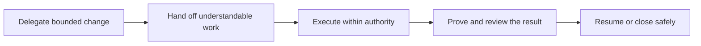
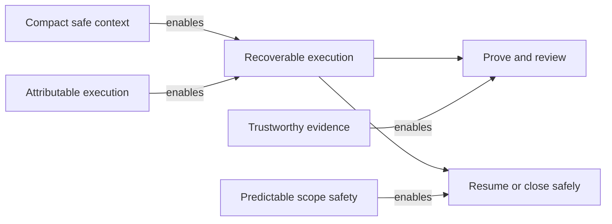

# Atlas: Decision-aware bounded execution

## Outcome board

| Actor | Journey step | Desired outcome | Success signal |
| --- | --- | --- | --- |
| Owner | Delegate a bounded change | Retain clear authority without supervising every implementation detail | The task states its limits, return path, and next owner gate |
| Operator | Resume or hand off work | Understand what is true and take one safe next action | A cold session needs no hidden chat history |
| Reviewer | Assess a completion claim | Trace the claim to attributable evidence | Evidence names the checked commit and its limitations |

## System board

| Capability | Connection | Implementation boundary | Proof / risk |
| --- | --- | --- | --- |
| Recoverable governed execution | serves all listed journey steps | Governance and Contract baseline | A cold session can find the applicable agreement |
| Compact safe agent context | enables `Hand off understandable work` | Charter compiler and named sources | Context-ingestion benchmark |
| Operator-visible decision control | enables `Delegate a bounded change` | Charter and Decision command surface | Owner choices remain attributable |
| Attributable task execution | enables `Execute within authority` | Objective-scoped Run lifecycle | Isolation and transition checks |
| Safe independent delegation | enables `Hand off understandable work` | Handoff validation and write reservations | No competing write authority |
| Trustworthy completion evidence | enables `Prove and review the result` | Evidence records and review | Fresh, commit-bound Evidence |
| Predictable scope safety | enables `Resume or close safely` | Deterministic guardrails and fixtures | Benign fixtures do not regress |

## Links and open questions

- Campaign: `../campaigns/context-sandwich-steering.md`
- Missions: `M15` through `M21`
- Open question: Which planning connections deserve mechanical validation after
  the Atlas convention has seen real use?
