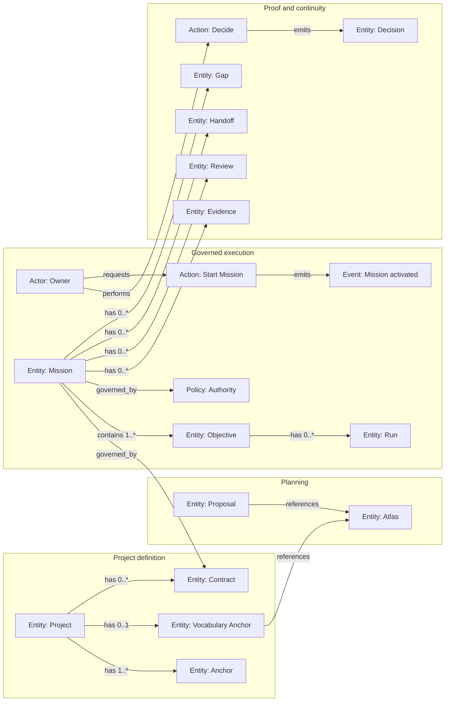

# Atlas: Spectacular domain overview

This is the visual companion to [VOCABULARY.md](../VOCABULARY.md). It shows the
whole domain at a legible level; the Vocabulary defines every concept and wins
if the two documents differ.

## Domain board

## Legend

| Type | Rendered as | Purpose |
| --- | --- | --- |
| Bounded Context | Mermaid subgraph | Names the context in which terms are interpreted. |
| Actor | `Actor:` node | Person, organisation, or agent that participates. |
| Entity | `Entity:` node | A thing with identity and lifecycle. |
| Value Object | `Value:` node | A defined value without independent identity. |
| Action | `Action:` node | A meaningful permitted operation. |
| Event | `Event:` node | A fact that occurred. |
| Policy / Invariant | `Policy:` node | A rule governing states or actions. |
| External System | `External:` node | A dependency outside the domain. |

Relationships are labelled edges, never nodes. Use the default labels defined
in `VOCABULARY.md`; place `1`, `0..1`, `1..*`, or `0..*` on an edge when the
cardinality is important. No External System is part of this overview today.

## Open questions

- After several projects use this model, which ontology-impact checks are stable
  enough to become warning-only conformance checks?
