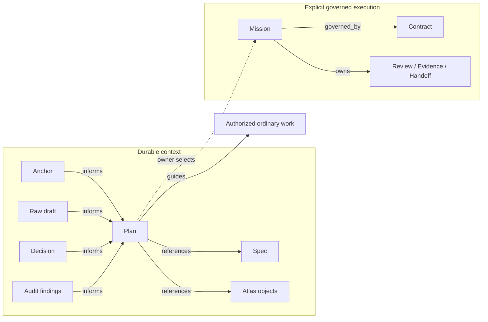

# Spectacular domain overview

The [Vocabulary](../VOCABULARY.md) defines meanings. Ordinary context remains
useful independently of the optional governed execution graph.

```mermaid
flowchart LR
    subgraph Context[Durable context]
      Anchor[Anchor]
      Raw[Raw draft]
      Plan[Plan]
      Spec[Spec]
      Atlas[Atlas objects]
      Decision[Decision]
      Audit[Audit findings]
    end
    Anchor -->|informs| Plan
    Raw -->|informs| Plan
    Plan -->|references| Spec
    Plan -->|references| Atlas
    Decision -->|informs| Plan
    Audit -->|informs| Plan
    Plan -->|guides| Work[Authorized ordinary work]
    subgraph Governed[Explicit governed execution]
      Contract[Contract]
      Mission[Mission]
      Proof[Review / Evidence / Handoff]
    end
    Plan -.->|owner selects| Mission
    Mission -->|governed_by| Contract
    Mission -->|owns| Proof
```

## Interpretation

An object’s type and home explain its meaning; they do not authorize an effect.
A plan can guide ordinary work without a Proposal, Contract, or Mission. A reusable
spec remains context until explicitly adopted as a mechanically bound agreement.
Audit findings do not replace a governed Review or certify completion.

Keep entities, concepts, and relationships navigable through typed small files.
Paths are soft-document identity; governed objects retain UUIDs and fingerprints.
Use directed labelled edges and meaningful cardinalities; diagrams are projections,
not additional mechanical constraints.

See [workspace navigation](workspace-navigation.md),
[specification lifecycle](specification-and-governance-lifecycle.md), and the
[governed object model](governed-execution-model.md).
