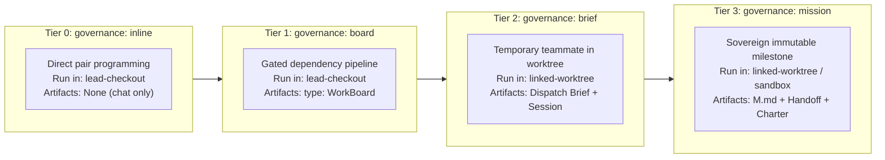

# Atlas: Governance tiers and cadence

This is the visual companion to [D30](../decisions/D30-gated-pipeline-work-boards-and-graduated-orchestration.md). It visualizes the 4-tier Graduated Governance Ladder and answers: *"What governs this slice of work?"*

## 1. The 4-Tier Graduated Governance Ladder

```mermaid
quadrantChart
    title Ceremony vs Consequence
    x-axis Low Ceremony --> High Ceremony
    y-axis Routine Task --> Critical Milestone
    quadrant-1 Tier 3: Mission
    quadrant-2 Tier 2: Dispatch
    quadrant-3 Tier 0: Inline
    quadrant-4 Tier 1: Wave
    "Direct Chat Edits": [0.15, 0.2]
    "WorkBoard Pipeline": [0.4, 0.4]
    "Side Session in Worktree": [0.65, 0.6]
    "Governed Mission Bundle": [0.85, 0.85]
```

## 2. Tier Comparison & Properties


