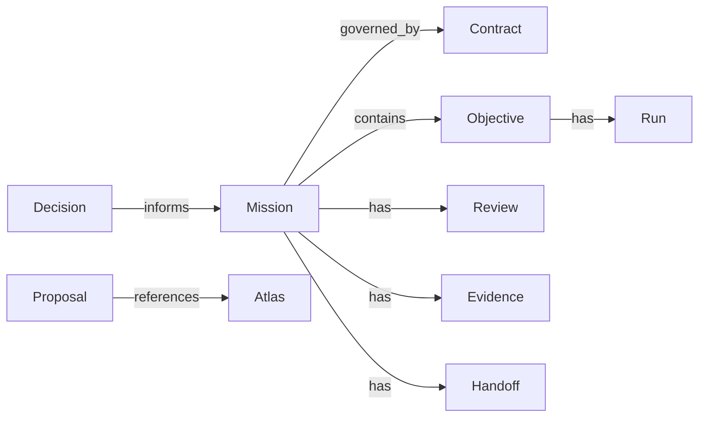

# Governed execution objects

Use this model only for explicitly selected governed work. The
[Vocabulary](../ONTOLOGY.md) defines project terms; the
[generated interface](../../skills/spectacular/generated/mechanical-interface.md)
and code define exact fields, transitions, and validation.

## Objects and ownership

| Object | Identity and role | Owning container |
|---|---|---|
| Contract | UUID and contract_version; agreed capability | contracts/ |
| Mission | UUID and M reference; frozen scope, authority, claims, binding | missions/M*-*/ |
| Objective | UUID and Mission-scoped O reference; bounded outcome | Inline or promoted objectives/ |
| Run | UUID and Mission-scoped R reference; mutable execution attempt | Inline or promoted runs/ |
| Review | UUID and RV reference; attributable evaluation | Mission reviews/, or supported project scope |
| Evidence | UUID and E reference; observation supporting a claim | Normally Mission evidence/ |
| Handoff | UUID and H reference; bounded operational context transfer | Normally Mission handoffs/ |
| Gap | UUID/G reference or Contract gap; unresolved limitation and resolution | Owning record/collection |
| Assessment | Existing governed evaluation record | Supported assessments/ scope |
| Proposal | UUID and P reference; open question with no activation authority | proposals/, then authorized archive |
| Decision | UUID and D reference for governed form; attributable choice | decisions/ |

Compact Missions keep inline Objectives and Runs until a supported transition
promotes them. Do not split existing records by manually replacing content with
pointers. The command’s returned path owns canonical placement.

## Relationships

A Decision informs work; it is not activation authority. The owner approves the
frozen outcome and scope. A successful test, Review, Evidence, and completion are
different facts. Every frozen claim needs attributable proof before completion.

## Contract and historical integrity

Contract amendments retain Gap entries and stated resolutions. Amend only gaps
and editorial fields through contract amend; changes to agreed behavior require
a Contract version change. Existing live binding protections apply.

A completed Mission’s Contract fingerprint is a freeze point, not a stale pointer.
Later amendments do not repoint it. Historical text is recovered through Git.
Retired Proposals name their resolver before an authorized archive move.

## States and claims

Mission and Run states follow their enforced interfaces. An explanatory diagram
or an Atlas body does not add a state transition. UUIDs identify governed entities;
human references navigate them; fingerprints identify revisions. Soft context
uses document metadata and links instead of claiming those guarantees.

Current bindings are preserved. This model does not migrate historical records,
publish raw context, or enroll ordinary plans in governed execution.
