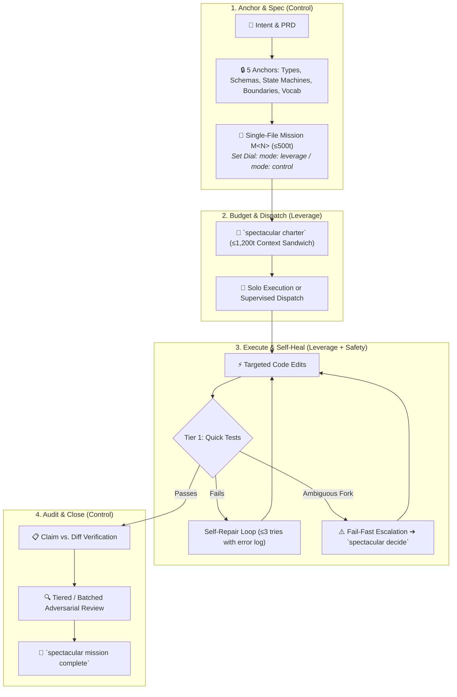
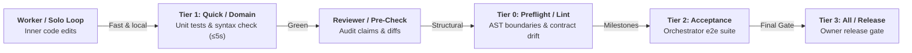
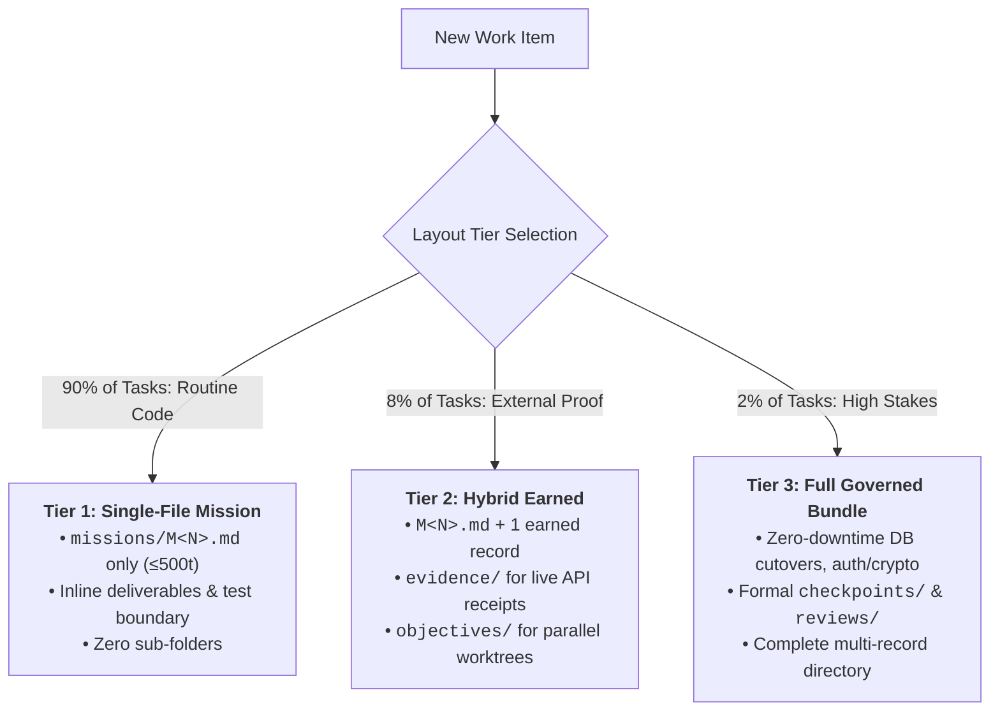
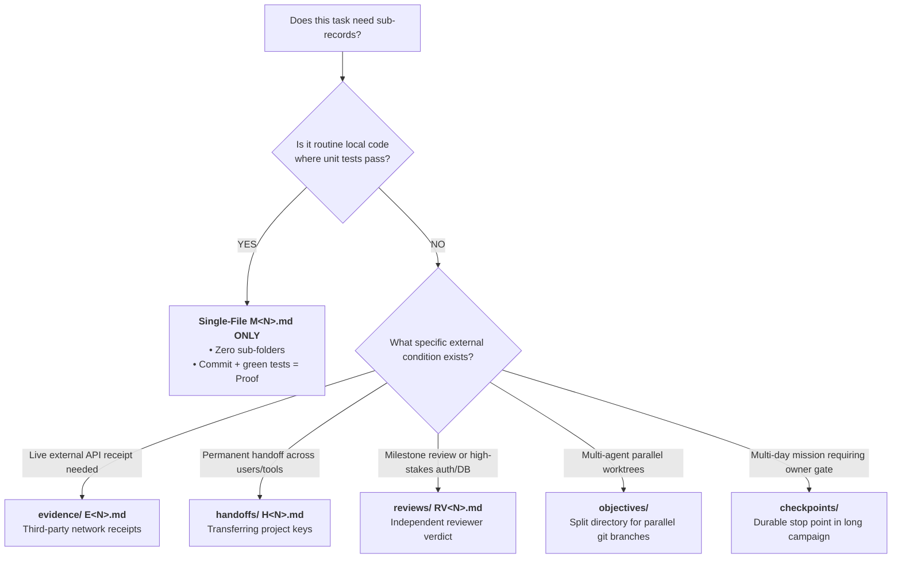
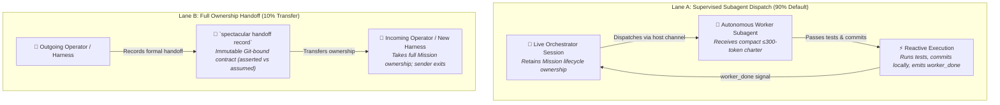
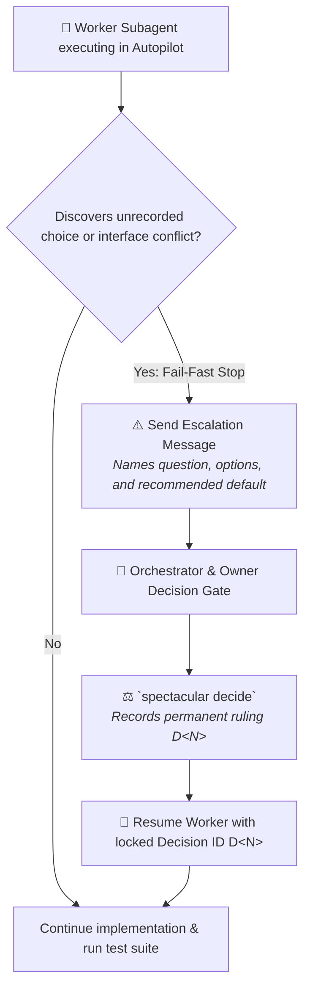
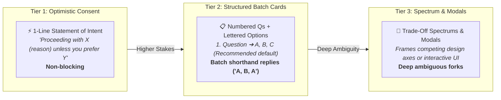

# Atlas: Lean Autopilot and Orchestration Architecture

This Atlas projects the operational topology of Spectacular's **Lean 3-Layer Autopilot Model**, **3-Tier Layout Matrix**, **Dual-Lane Orchestration**, and **3-Tier Question Escalator**.

---

## 1. Outcome Board

| Actor | Journey Step | Desired Outcome | Success Signal |
|---|---|---|---|
| **Human Owner** | Steer project & bulk-decide | Settle architectural forks once with zero repetitive questions | `spectacular decide` records permanent `D<N>` rulings |
| **Orchestrator** | Plan and supervise roadmap | Sequence 4–8 milestone blocks and dispatch workers | Flight plan maintains topological order with zero file clutter |
| **Worker Subagent** | Execute bounded mission | Implement code and pass tests autonomously in autopilot | Tests pass (`exit 0`) + Git commit with zero sub-record sprawl |
| **Independent Reviewer** | Verify high-stakes claims | Inspect diffs and primary evidence without modifying code | Reviewer returns clean FROST verdict (`pass`/`fail` + findings) |

---

## 2. System Board

### A. Tiered Verification Matrix (Zero Duplicate Runs)

---

### B. The 3-Tier Layout Judgment Matrix

---

### C. Sub-Record Earned Decision Tree

| Record Type | **NEVER** Create For (90% Routine) | **ONLY** Create When (The Earned Exception) |
|---|---|---|
| **`evidence/`** | Normal code changes, refactors, or local bug fixes. | **Third-party receipts**: You called Stripe, AWS, or an external API and need durable proof of the HTTP response that local tests cannot reproduce. |
| **`reviews/`** | Individual routine tasks. | **Milestones & High Stakes**: Batch-reviewing a finished 4-mission Campaign milestone, or high-risk auth/payments/zero-downtime DB migrations. |
| **`handoffs/`** | Delegating a task to a worker subagent in the same session. | **Permanent Transfer**: Handing the project keys to another human or switching runtimes (e.g. Claude $\to$ Antigravity). |
| **`objectives/`** | Sequential steps inside a standard single-file mission. | **Parallel Worktrees**: Two different agents working in separate git branches/worktrees simultaneously on the same mission. |
| **`checkpoints/`** | Checking in after an objective finishes (use a simple run note). | **Multi-Day Governance Gates**: A high-stakes mission where work pauses for human/legal sign-off before irreversible operations. |

---

### D. Dual-Lane Orchestration: Supervised Dispatch vs. Full Handoff

---

### C. The Fail-Fast Escalation & Decision Gate Protocol

---

### D. The 3-Tier Question Escalator

---

## 3. Links and References

- Product Documentation: [`docs/architecture.md`](../../docs/architecture.md), [`docs/process.md`](../../docs/process.md), [`docs/quickstart.md`](../../docs/quickstart.md)
- Skill References: [`skills/spectacular/references/runtime.md`](../../skills/spectacular/references/runtime.md), [`skills/spectacular/references/owner-guidance.md`](../../skills/spectacular/references/owner-guidance.md), [`skills/spectacular/references/prepare.md`](../../skills/spectacular/references/prepare.md)
- Decisions: `D11-proposal-retirement`, `D15-branch-guardrail-at-activation`, `D24-schema-field-mechanically-governs-frontmatter`, `D28-dynamic-operating-dial-and-anchors`
