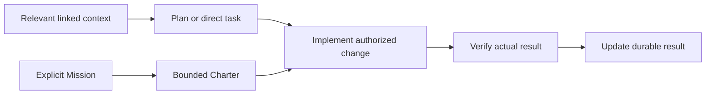

# Lean execution and optional orchestration

Default execution uses relevant context and direct authorized work. A plan makes
approach and continuity durable when useful. The owner may explicitly select a
Mission; its requirements then come from the agreement rather than task risk.

## Three useful layers

| Layer | Content owner | Purpose |
|---|---|---|
| Project truth | Relevant anchors, Atlas, Decisions | Explain current constraints and objects |
| Work | Plan, or explicitly selected Mission | Bound the intended outcome and record results |
| Implementation | Code and appropriate tests | Deliver and verify the authorized change |

There is no mandatory five-anchor starter pack. Create a concern-specific anchor
only when the content needs independent meaning or lifetime. Large behavior specs
can become linked specs/ files; they do not gain Contract authority by extraction.

```mermaid
flowchart LR
    Context[Relevant linked context] --> Work[Plan or direct task]
    Work --> Implement[Implement authorized change]
    Implement --> Verify[Verify actual result]
    Verify --> Result[Update durable result]
    Mission[Explicit Mission] --> Charter[Bounded Charter]
    Charter --> Implement
```

## Optional coordination

Use sequential work unless authorized delegation has independent inputs and
non-overlapping write scopes. Workers return artifacts and checks; the lead
verifies integration. A context Charter uses the declared tokenizer and budget;
exact token or cost claims need measurements rather than heuristics.

## Verification and records

Choose checks for the actual change. A routine task does not require a commit,
formal Review, or evidence package. A selected Mission requires attributable
proof for every frozen claim; green tests or a commit alone do not satisfy that.

Keep continuity in the existing plan. Create a governed Review, Evidence, or
Handoff only when its selected workflow requires it, using the command-reported
path. Promotion of Objectives/Runs follows supported transitions; manually
splitting bound records is unsafe.

[Governed model](governed-execution-model.md) ·
[Workspace navigation](workspace-navigation.md) ·
[Session continuity](session-orchestration-and-lifecycle.md)
