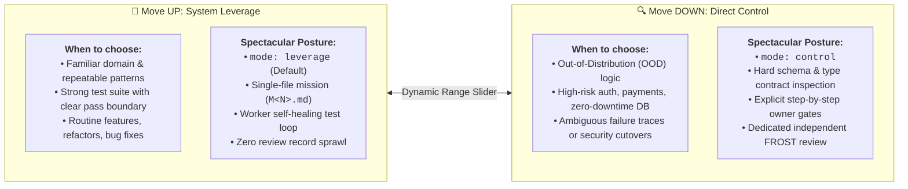
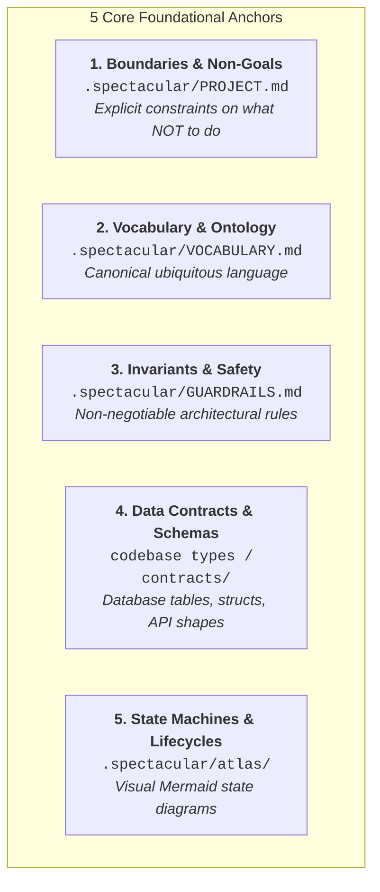
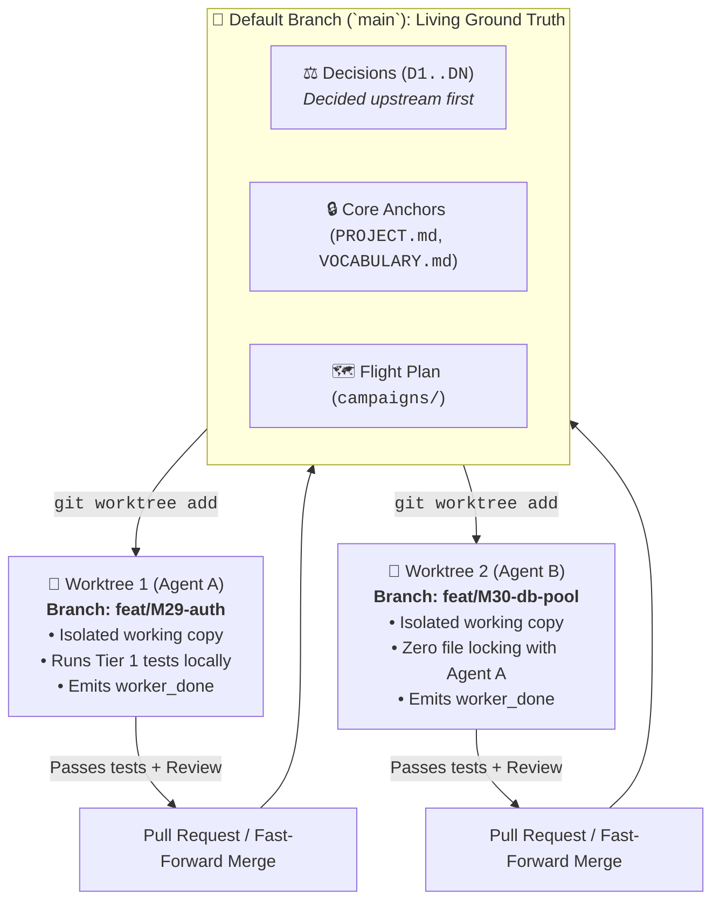

# Atlas: Operating Levels and Software Factory Architecture

This Atlas projects the operational topology of Spectacular's **20-Level Agentic Operating Model**, **Dynamic Operating Dial** (`mode: leverage` vs. `mode: control`), **5 Foundational Anchors**, and **Trunk-First Multi-Agent Collaboration**.

---

## 1. Outcome Board

| Actor | Journey Step | Desired Outcome | Success Signal |
|---|---|---|---|
| **Human Architect** | Ground domain & boundaries | Settle hard data models and invariants before code execution | Schemas, types, and decisions committed upstream to `main` |
| **Orchestrator** | Choose leverage vs. control | Set mission posture based on task risk and distribution | `mode: leverage` (speed) or `mode: control` (audit) declared |
| **Worker / Solo** | Self-heal against tools | Implement features and fix test failures autonomously | Fast Tier 1 unit test pass (`exit 0`) with zero prompt loops |
| **Reviewer** | Independent claim audit | Inspect diffs and primary evidence without modifying code | Structured FROST review verdict recorded (`pass`/`fail`) |

```mermaid
flowchart TD
    subgraph Pyramid["The 5 Operating Tiers (20 Levels)"]
        G5["<b>Group 5: Agentic System (Levels 17–20)</b><br>Product · Agent · AI Developer Workflow (ADW) · Software Factory"]
        G4["<b>Group 4: Delivery & Intent (Levels 13–16)</b><br>Application · Repository · Plan · Media-Rich Documentation"]
        G3["<b>Group 3: Data & Execution (Levels 09–12)</b><br>Database Table · Database · CLI Tools · Deterministic Scripts"]
        G2["<b>Group 2: Code Structure (Levels 06–08)</b><br>File · Module · Directory Boundaries"]
        G1["<b>Group 1: Code Primitives (Levels 01–05)</b><br>Line · Block · Function · Type Contract · Class"]
    end

    G5 -->|Steers & Orchestrates| G4
    G4 -->|Compiles Context Sandwich| G3
    G3 -->|Executes deterministic tools against| G2
    G2 -->|Enforces modular AST boundaries on| G1

    style G5 fill:#2d3748,stroke:#4a5568,color:#fff
    style G4 fill:#2b6cb0,stroke:#3182ce,color:#fff
    style G3 fill:#2c7a7b,stroke:#319795,color:#fff
    style G2 fill:#2f855a,stroke:#38a169,color:#fff
    style G1 fill:#744210,stroke:#975a16,color:#fff
```

---

## 2. System Board

### A. The Dynamic Operating Dial: System Leverage vs. Direct Control

---

### B. The 5 Foundational Anchors Mapping

Before autonomous execution, Spectacular grounds the rules of physics across 5 canonical project surfaces:

---

### C. Trunk-First Collaboration & Worktree Isolation

---

## 3. Links and References

- Product Documentation: [`docs/architecture.md`](../../docs/architecture.md), [`docs/process.md`](../../docs/process.md)
- Skill References: [`skills/spectacular/SKILL.md`](../../skills/spectacular/SKILL.md), [`skills/spectacular/references/prepare.md`](../../skills/spectacular/references/prepare.md), [`skills/spectacular/references/execute.md`](../../skills/spectacular/references/execute.md), [`skills/spectacular/references/close.md`](../../skills/spectacular/references/close.md)
- Key Decisions: [`D28-dynamic-operating-dial-and-anchors`](../decisions/D28-dynamic-operating-dial-and-anchors.md), [`D15-branch-guardrail-at-activation`](../decisions/D15-branch-guardrail-at-activation.md), [`D16-auto-prune-merged-worktrees`](../decisions/D16-auto-prune-merged-worktrees.md)
