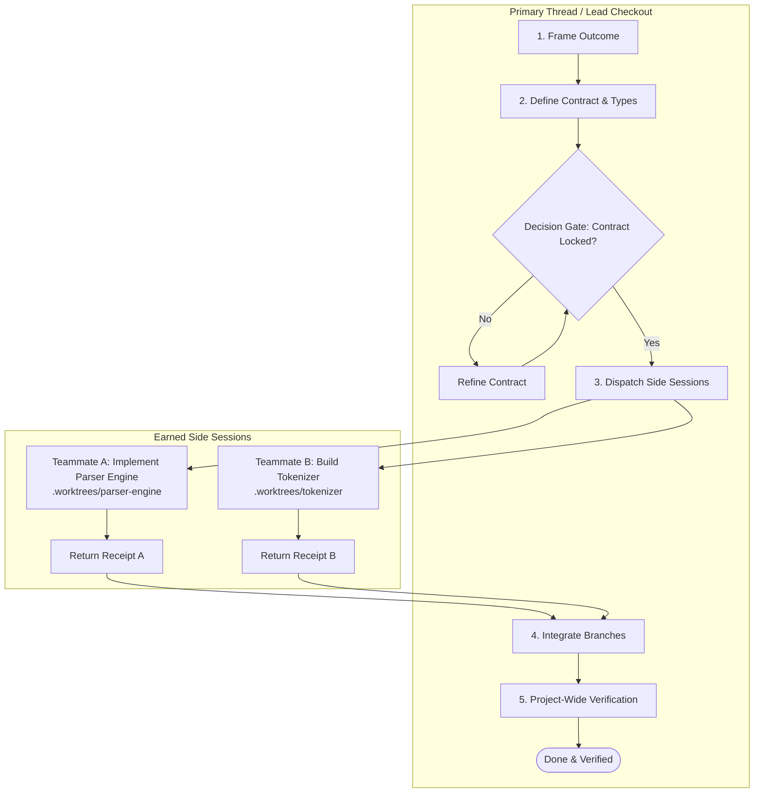
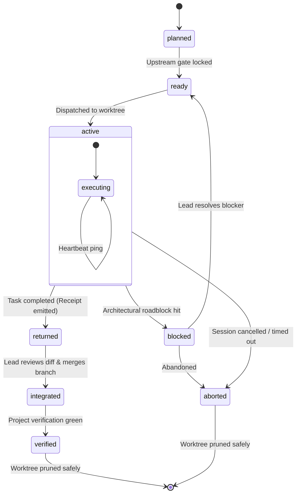
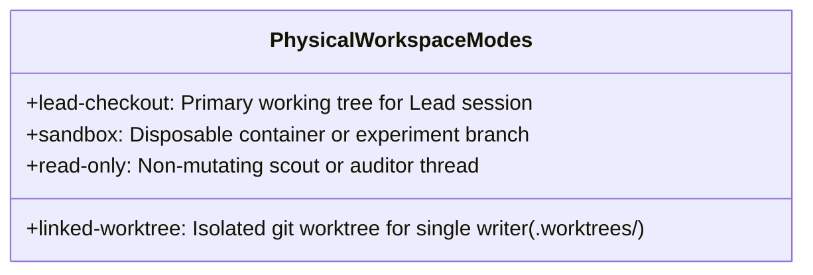

# Atlas: Session orchestration and lifecycle

This is the visual companion to [D30](../decisions/D30-gated-pipeline-work-boards-and-graduated-orchestration.md) and [runtime.md](../../skills/spectacular/references/runtime.md). It models how work progresses across sequential waves and temporary side sessions.

## 1. The Gated Wave Flow

Sequential execution in the Lead session is the baseline. Parallel side sessions in isolated Git worktrees are earned only after interface/contract gates lock.

## 2. The 7-State Session State Machine

A side session never marks an item done. It only returns code, diffs, and test receipts. The Lead alone integrates and verifies.

## 3. Physical Workspace Modes

