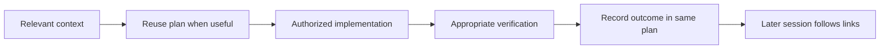

# Session continuity

Durable context keeps a task understandable across chats and working phases.
A fresh session reads the current anchor, task plan, relevant links, passed
checks, unresolved choices, and next useful action; it does not replay all history.

## Ordinary work

```mermaid
flowchart LR
    Context[Relevant context] --> Plan[Reuse plan when useful]
    Plan --> Work[Authorized implementation]
    Work --> Check[Appropriate verification]
    Check --> Result[Record outcome in same plan]
    Result --> Resume[Later session follows links]
```

Planning and implementation can use the same file. Native host plan mode owns its
restrictions; Spectacular stores the durable project copy in plans/ when permitted.
A continuity note can remain a section of that plan. Extract a linked Reference
only when another reader needs a separate artifact.

## Optional side sessions

Delegate only when explicitly authorized or required by an applicable skill.
Give each worker a bounded outcome, relevant context, disjoint allowed writes,
and an acceptance check. Returned work is inspected and integrated by the lead;
a return receipt alone does not prove the integrated outcome.

Use the host’s native coordination channels for live status. Durable artifacts
and verified outcomes remain in the project. Governed dispatch uses its supported
Charter/Handoff procedure and preserves existing authority boundaries.

Named Missions continue through their supported lifecycle; directory presence or
a session reset does not select one. See [governed objects](governed-execution-model.md)
and [workspace navigation](workspace-navigation.md).
