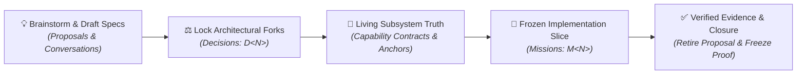
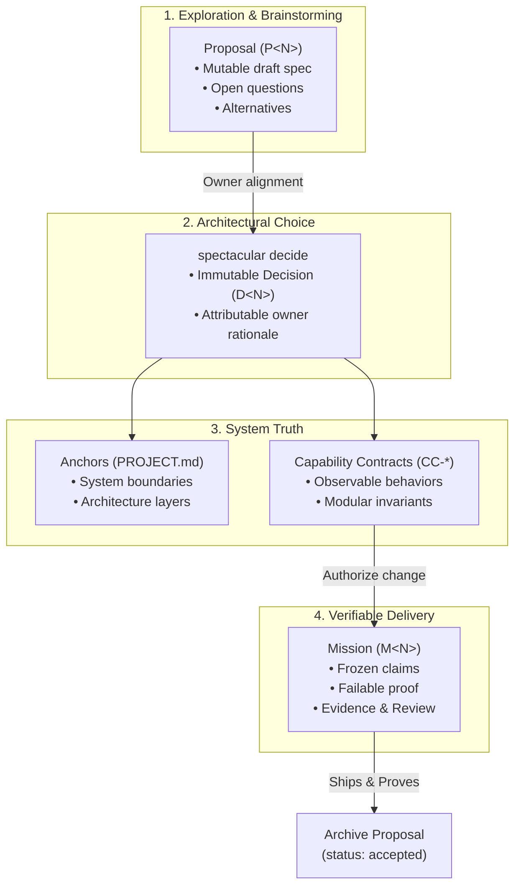

# Atlas: Specification evolution and governance lifecycle

## Outcome board

| Actor | Journey step | Desired outcome | Success signal |
| --- | --- | --- | --- |
| Founder / Owner | Brainstorm draft specifications | Iterate rapidly on ideas and requirements without fear of breaking active execution state | Proposals can be freely rewritten across dozens of chat turns |
| Architect / Lead | Settle critical architectural forks | Record permanent rationale and trade-offs that future agents and humans will not re-debate | `spectacular decide` records an immutable UUIDv7 Decision receipt |
| Developer / Agent | Implement observable features | Work against frozen, verifiable claims with exact Git baselines and failable proofs | Mission execution produces attributable Evidence and independent Reviews |
| Team / Maintainer | Discover accepted system truth | Find living subsystem capabilities and system boundaries instantly | Capability Contracts (`contracts/CC-*.md`) reflect current accepted reality |

## System board

| Capability | Connection | Implementation boundary | Proof / risk |
| --- | --- | --- | --- |
| Exploratory scratchpad | enables `Brainstorm draft specifications` | `.spectacular/proposals/P<N>.md` (mutable, zero authority) | Zero drift errors during rapid conversational rewrites |
| Atomic architectural rulings | enables `Settle critical architectural forks` | `spectacular decide` (`.spectacular/decisions/D<N>.md`) | Idempotent two-phase transaction journal |
| Living modular specifications | enables `Discover accepted system truth` | `.spectacular/contracts/CC-<name>.md` (`contract_version`) | In-flight Mission editing with gap amendment tracking |
| Frozen execution envelopes | enables `Implement observable features` | `spectacular mission start` (`.spectacular/missions/M<N>/`) | SHA-256 semantic fingerprint and branch guardrail |
| Retired proposal tracking | enables `Verify Evidence & Closure` | `.spectacular/archive/proposals/` (`resolved_by:`) | Transparent historical trace from idea to shipped proof |

## Links and references

- Product Documentation: [`docs/architecture.md`](../../docs/architecture.md), [`docs/process.md`](../../docs/process.md)
- Agent Skill Guidance: [`skills/spectacular/references/prepare.md`](../../skills/spectacular/references/prepare.md)
- Decisions: `D11-proposal-retirement`, `D15-branch-guardrail-at-activation`, `D24-accepted`
