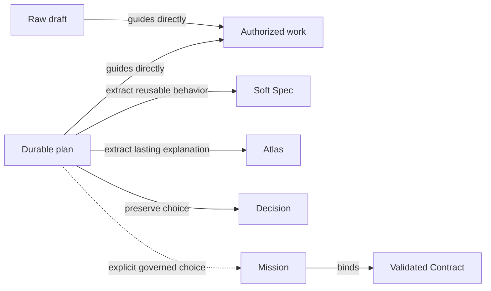

# Specification and work evolution

A file changes role when its purpose changes, not because it grows or work starts.
Update the existing owner first; create another object only for independent use.

| Current content | Useful next form | What changes |
|---|---|---|
| Raw draft | Plan | Maintain outcome, approach, progress, and results |
| Plan contains reusable behavior | Linked Spec | Extract behavior/interfaces, keep work in the plan |
| Plan contains lasting explanation | Linked Atlas object | Reuse domain context across future plans |
| Choice needs durable rationale | Decision | Preserve the choice and supersession |
| Agreement needs mechanical binding | Contract | Select the governed agreement/version pipeline |
| Work needs frozen scope and formal proof | Mission | Explicit owner selection and activation |

These are choices, not a mandatory promotion pipeline. A raw draft can start
implementation directly. A plan can stay the same document through delivery.
A Contract can serve many Missions; completed Mission bindings remain historical.

```mermaid
flowchart LR
    Raw[Raw draft] -->|guides directly| Work[Authorized work]
    Plan[Durable plan] -->|guides directly| Work
    Plan -->|extract reusable behavior| Spec[Soft Spec]
    Plan -->|extract lasting explanation| Atlas[Atlas]
    Plan -->|preserve choice| Decision[Decision]
    Plan -.->|explicit governed choice| Mission[Mission]
    Mission -->|binds| Contract[Validated Contract]
```

## Inspection and continuity

Capture useful findings in the plan. Extract an Audit when it has an independent
scope, inspected revision, readers, and limitations. Formal Reviews and Handoffs
follow the governed owner and command-reported paths when that route is selected.

Retirement of existing governed Proposals keeps resolver and archival metadata.
Do not relabel or move historical records to imitate the soft workflow. Raw has
no promotion obligation and stays unpublished unless retention is explicitly changed.

[Workspace navigation](workspace-navigation.md) ·
[Domain overview](domain-overview.md) · [Planning work](../plans/durable-plan-mode.md)
