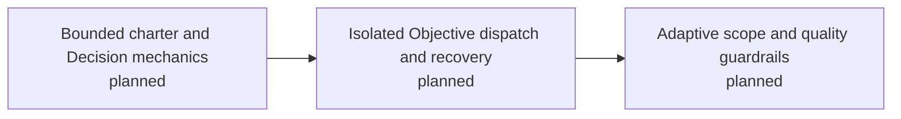

# Campaign: Decision-aware bounded execution

> Planning map only. It grants no execution authority.

<!-- spectacular:campaign-mermaid:start -->

<!-- spectacular:campaign-mermaid:end -->

## B1 — Candidate M15: Compile bounded, decision-aware charters

**Capability unlocked:** An Orchestrator can select relevant Decisions by meaning,
compile an attributable charter for one Objective, and record a durable owner
choice without changing Run state.

**Proof boundary:** Total context ingestion falls by at least 40% against the M14
full-scan baseline with no regression in safety, task success, recovery, or
decision fidelity. Only after that proof passes may the public surface grow from
14 to 18 commands through `charter`, `decide`, `run transition`, and
`evidence record`, with `run start` becoming Objective-scoped.

## B2 — Candidate M16: Dispatch isolated Objectives safely

**Capability unlocked:** The Orchestrator can dispatch eligible, disjoint Runs on
Objectives across concurrent Missions into native-Git worktrees while the owner
continues steering.

**Proof boundary:** Every unmet entry gate refuses before effect; every timeout,
scope escape, exhausted repair, and conflict preserves work under a named ref;
only clean verified integrations become eligible for owner-confirmed cleanup.

## B3 — Candidate M17: Calibrate scope and anti-slop guardrails

**Capability unlocked:** Delegated work is stopped for real authority or scope
violations while coherent larger slices remain possible with justification.

**Proof boundary:** Paired fixtures distinguish scope escape, unauthorized
dependencies, and immutable-context loss from harmless numeric-default overruns;
the M14 behavioral gate reports no regression.

## Decisions carried forward

- Native Git owns branch and worktree effects; Spectacular inspects and records.
- Repository-changing Runners require an active Mission.
- High-level planning owns the Objective DAG and disjoint writable perimeters.
- One Orchestrator session is bounded to one Mission; separate integration
  worktrees may host concurrent Missions.
- Runs belong to Objectives. Distinct eligible Objectives may run concurrently;
  no numeric ceiling substitutes for dependency and writable-scope checks.
- Roughly 1,200 tokens budgets the governance envelope, not source or diagnostics.
- Two to four writable files is a default, not a universal hard limit.
- The AI selects Decision refs from a compact summary; compiled charters cite refs
  such as `Sources: [D12, D13]`.
- `charter` is a temporary live-retrieval helper; the frozen Handoff preserves the
  actual assignment and returned Evidence links back to it.
- `decide` records a complete Orchestrator-drafted Decision, refreshes indexes,
  and reports only explicitly unblocked work without mutating Run state.
- Runs and Objectives may finish implementation before clustered or final proof;
  `after_proof:` is used only when downstream work must wait for the frozen gate.
- Baselines are always observed; fail-first is conditional on the claimed change.
- `A/B/C/M/G/F` are visible conversation shortcuts, never hidden authority.

## Non-goals

- No persistent preflight cache; live frontmatter retrieval remains the baseline
  until benchmarks prove caching has earned a separate Mission.
- P10 preparation-verdict mechanics belong to a separate Mission.
- No external scheduler, Git wrapper, or whole-workspace delegated scan.
