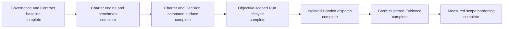

# Campaign: Decision-aware bounded execution

> Planning map only. It grants no execution authority. Each block is a separately
> activated, independently reviewed Mission candidate so the owner can accept or
> repair one behavior boundary at a time.

Only B1/M15 is activation-ready. The retained M16-M21 plan files are future design
sketches: preserve them as input, but do not keep them synchronized, validate them,
or review them as final plans. Re-prepare only the next block after its predecessor's
Evidence is accepted.

Plan inputs: [context-sandwich-steering-plans](context-sandwich-steering-plans/README.md).

<!-- spectacular:campaign-mermaid:start -->

<!-- spectacular:campaign-mermaid:end -->

## B1 — Candidate M15: Reconcile governance and Contract baselines

Restore D12's inherited proof conditions through D21, record the real 14-command
baseline, reconcile stale Contract command counts, and freeze the Contract-version
transition map, reference tokenizer, and Run transition table. No product
implementation or public command changes.

Consequence: an owner or cold operator can find the governing agreement before
acting, rather than reconstructing it from session history.

## B2 — Candidate M16: Build and benchmark the charter engine

Implement the internal read-only compiler using the bound Contract, explicit
Mission/Objective `sources:`, and invocation-added sources. Enforce the settled
1,200/1,400/1,440 behavior and prove at least 40% lower total context ingestion
against pinned M14 fixtures with zero behavioral regression. No public command.

Consequence: a delegated operator gets only the context needed to act safely,
without paying for an unbounded workspace read.

## B3 — Candidate M17: Expose charter and Decision recording

Expose `charter` and atomic `decide` only after M16 proof. Decision recording
updates the Decision record and all generated indexes as one recoverable operation,
reports only explicitly unblocked work, and never mutates Run state. Surface: 14→16.

Consequence: owners can make and later inspect consequential choices without
silently changing execution state.

## B4 — Candidate M18: Introduce the Objective-scoped Run lifecycle

Version the Run Contract, make `run start` Objective-scoped, and add explicit
attributable `run transition`. Prove old completed Missions still decode under
their frozen bindings. Surface: 16→17.

Consequence: operators can see which attempt owns work and what transition is
allowed, making execution state understandable after a handoff.

## B5 — Candidate M19: Dispatch frozen Handoffs in native-Git isolation

Enforce exact-file or trailing-directory `writes:` reservations across active
Missions. Spectacular inspects native Git state but creates, switches, merges, and
deletes nothing. Cleanup remains an Orchestrator proposal requiring owner consent.
Retire P8 only after its isolation question is fully answered and shipped.

Consequence: independently delegated operators do not overwrite one another or
mistake a shared workspace for isolated authority.

## B6 — Candidate M20: Record basic clustered Evidence

Add atomic Evidence recording for Runs, Objectives, clusters, and final Mission
gates. Preserve attribution, fresh commit/tree, declared checks, contrary evidence,
and limitations without letting Evidence certify itself. Proof-sensitive dispatch
remains an explicit frozen Handoff condition managed by the Orchestrator. No second
dependency graph or concurrent timeline is added. Surface: 17→18.

Consequence: reviewers can tell what was observed, on which commit, and whether
the completion claim is trustworthy.

## B7 — Candidate M21: Measure and harden scope guardrails

Use paired fixtures to distinguish actual authority escape, dependency drift, and
immutable-context loss from harmless file-count or size overruns. Promote only
deterministic rules with no benign-fixture rejection; zero new rules is acceptable.
Two-to-four files remains guidance, coherent larger directory perimeters remain
possible, and subjective quality stays with the Orchestrator. The existing
`concurrent-run-timelines` Gap remains open until real demand earns that feature.

Consequence: owners receive guardrails that catch genuine authority escapes
without blocking safe, ordinary work.

## Contract transition map

- M15 binds the stable product Contract while versioning the unbound CLI and
  project-surface Contracts for the real baseline and explicit `sources:` input.
- M16 binds the reconciled CLI Contract. M17 binds the stable product Contract
  while versioning the CLI Contract for the 16-command surface only after M16 proof.
- M18 binds the stable product Contract while versioning the CLI and project-surface
  Contracts for Objective-scoped Runs and the 17-command surface;
  completed Mission fingerprints are never repointed.
- M19 binds the new project-surface Contract while versioning the product Contract
  for frozen-Handoff isolation behavior.
- M20 binds the product Contract while versioning only the CLI Contract for atomic
  clustered Evidence and the 18-command surface; CC-projsurf and its timeline Gap
  remain unchanged.
- M21 binds the new CLI Contract and versions CC-projsurf only if a deterministic
  guardrail earns promotion; otherwise it changes no Contract. It always runs the
  final Campaign regression.

## Decisions carried forward

- Native Git owns branch and worktree effects; Spectacular only inspects and records.
- High-level planning owns the Objective DAG and disjoint writable perimeters.
- Runs belong to Objectives; no numeric ceiling substitutes for dependencies and
  reservations.
- Charter retrieval is live and explicit; no persistent cache or recursive semantic
  source discovery.
- The frozen Handoff is the assignment. Charter output is temporary assistance.
- Evidence may cluster; small Runs do not require wasteful standalone proof records.
- Proof-sensitive sequencing remains an explicit Handoff condition; no second
  dependency graph or automatic proof scheduler is introduced.
- Active Mission operational fields may change. A frozen semantic planning error
  stops work for owner repair, abort, or a new Mission; P11 adds no `mission revise`.
- `A/B/C/M/G/F` remain visible conversation shortcuts, never hidden authority.

## Non-goals

- P10 preparation-verdict mechanics belong to a separate Mission.
- No external scheduler, Git wrapper, persistent preflight cache, autonomous
  semantic source selection, or whole-workspace delegated scan.
