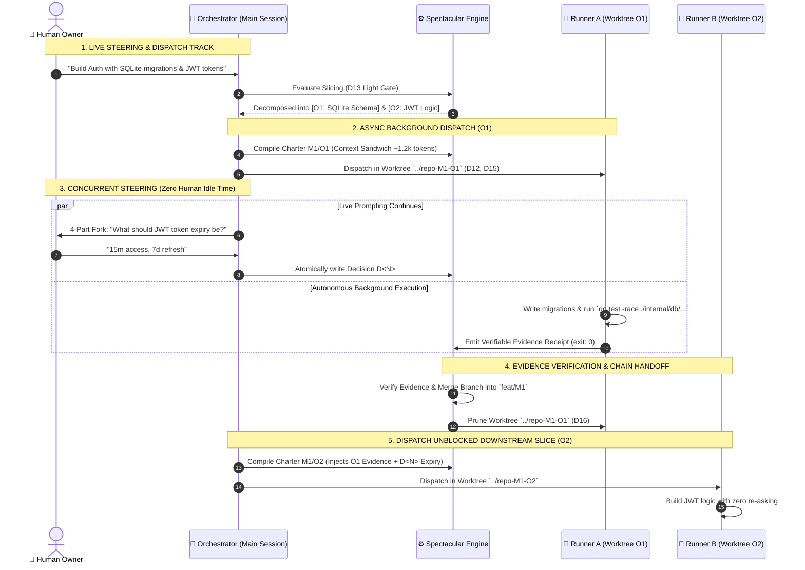
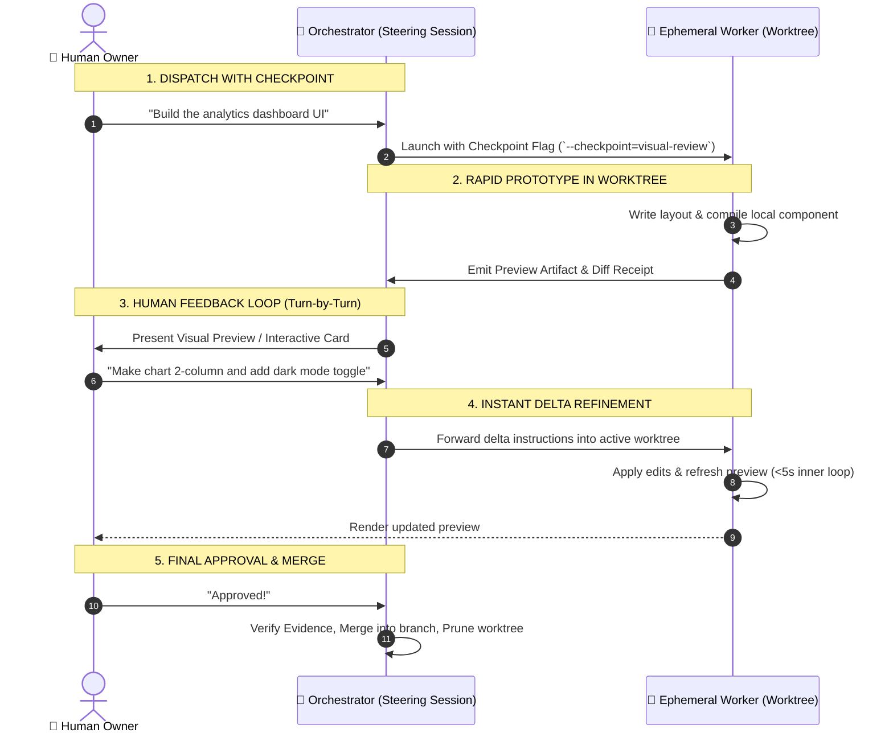

# Context-sandwich compilation and decision steering protocol

Exploration for a possible Mission. Nothing here is frozen — this Proposal carries no execution authority and binds only when a Mission plan freezes its claims.

## The problem in one line

Software development with autonomous AI agents oscillates between context starvation (where agents wander and hallucinate) and context bloat (where dumping dozens of files into context wastes tokens, causes attention dilution, and slows execution).

## Core Insights & Proposed Capabilities

### 1. The Context-Sandwich Compilation Protocol
A deterministic, machine-compiled 3-layer envelope assembled per Objective or delegated worker:

```
┌─────────────────────────────────────────────────────────────┐
│ 1. FROZEN TRUTH (Top Slice)                                 │
│    • PROJECT.md scope + architectural boundary invariants   │
│    • Active Mission claim & pass boundary (O<N>)            │
├─────────────────────────────────────────────────────────────┤
│ 2. OWNER STEERING & PREVIOUS DECISIONS (Filling)            │
│    • Relevant Decisions (.spectacular/decisions/)           │
│    • Resolved Gaps & explicit non-goals                     │
├─────────────────────────────────────────────────────────────┤
│ 3. PERMITTED SOURCES & BOUNDARIES (Bottom Slice)            │
│    • Exact 2-4 source files to read/edit                    │
│    • Explicit STOP triggers & verification command          │
└─────────────────────────────────────────────────────────────┘
```

- **Compile on Demand**: Instead of agents reading entire directory trees, the system compiles a minimal charter (`~1,200` tokens) tailored strictly to the active task.
- **Strict Read Containment**: Delegated agents (Runners) receive only the compiled sandwich and are forbidden from scanning global context.

### 2. High-Velocity Decision Steering (`spectacular decide`)
- **Structured 4-Part Forks**: Whenever an ambiguity, risk, or fork arises, the agent presents a compact card: (1) Plain outcome · (2) Technical basis · (3) Options (`action -> consequence`) · (4) Recommended default & why.
- **Atomic Record & Immediate Unblock**: An owner answer (e.g. `"Option A"`) writes a durable record `.spectacular/decisions/D<N>-<slug>.md` and unblocks the waiting Run.
- **Zero-Re-Ask Invariant**: Prior Decisions automatically propagate into downstream worker charters. Agents never ask about settled topics again.

### 3. Progressive Fidelity for Greenfield Kickoff & The Dynamic Clarity Assessment

The number of clarifying questions asked during kickoff is **never a fixed quota**. It scales dynamically with the clarity and completeness of the owner's initial prompt or PRD:

```
┌─────────────────────────────────────────────────────────────┐
│ 1. HIGH-FIDELITY SPEC / CRISP PRD (Zero-Question Fast Path) │
│    • Schema, endpoints, and stack are stated.               │
│    ──► 0 questions asked; immediate Flight Plan emitted.    │
├─────────────────────────────────────────────────────────────┤
│ 2. MODERATE FIDELITY (1 Targeted Structural Fork)           │
│    • Outcome is clear, but 1 architectural boundary open.   │
│    ──► 1 focused 4-part trade-off card.                     │
├─────────────────────────────────────────────────────────────┤
│ 3. RAW BRAIN DUMP / HIGH AMBIGUITY (Dynamic Sizing)         │
│    • Core boundaries unstated; multi-path possibilities.    │
│    ──► 1 Assumption Baseline card + 1-2 Structural Forks.   │
└─────────────────────────────────────────────────────────────┘
```

#### The 3-Anchor Minimal Clarity Threshold
To evaluate whether incoming prompt/PRD content is sufficient to skip questions, the Orchestrator checks for three anchors:
1. **North-Star Outcome**: 1-sentence user-observable behavior + explicit non-goals.
2. **Mechanical Boundary**: Input data shape $\to$ Transformation $\to$ Output shape + chosen stack.
3. **Pass Boundary**: 1 deterministic, failable verification command (`exit 0`).

If the input already satisfies all 3 anchors, the system takes the **Zero-Question Fast Path** directly to Campaign Flight Planning.

### 4. Objective-Bound Evidence Verification
- Verification is anchored to objective proof requirements (`pass_boundary` & `proof_requirement`), decoupling success from manual inspection of raw code diffs.
- The owner reviews the 3-line Evidence receipt, not hundreds of lines of boilerplate.

### 5. Pipelined "Live Prompting to Build" & Asynchronous Dispatch
Decouple the human steering / decision loop from the background worker execution loop:



- **Immediate Dispatch on Confirmed Slices**: The moment an Objective's pass boundary and scope are confirmed, the Orchestrator compiles its Context Sandwich and dispatches a background Runner in an isolated Git worktree (`git worktree add`).
- **Zero Human Idle Time**: While workers build and test confirmed slices in the background, the owner and Orchestrator continue live prompting to clarify and resolve the *next* tranche of decisions.
- **Continuous Handoff & Chain Assembly**: Completed worker evidence receipts seamlessly feed into the inputs of newly unblocked downstream charters.

### 6. Async Execution Entry Gates & Mechanical Enforcement

An asynchronous background Runner can **only** start when all four gates pass:

```
┌─────────────────────────────────────────────────────────────┐
│ GATE 1: Owner Authorization                                 │
│ • Mission activated (M<N>) OR explicit Objective approval   │
├─────────────────────────────────────────────────────────────┤
│ GATE 2: Dependency Unblocked (Topological Clearance)        │
│ • All upstream Objectives marked DONE with Evidence receipt │
├─────────────────────────────────────────────────────────────┤
│ GATE 3: Bounded Charter Compiled (Context Sandwich)         │
│ • Scope, 2-4 target files, manifest allowance & pass_bound  │
├─────────────────────────────────────────────────────────────┤
│ GATE 4: Clean Physical Isolation                            │
│ • Separate Git worktree allocated on a unique branch path   │
├─────────────────────────────────────────────────────────────┤
│ GATE 5: Zero Open Decision Collision                        │
│ • No active Open: decision intersects target file perimeter │
└─────────────────────────────────────────────────────────────┘
                             │
                             ▼
               [ASYNC RUNNER LAUNCHED]
```

#### Mechanical Enforcement Layers
1. **Typed CLI Gatekeeper (`spectacular mission check`)**: Rejects execution attempts if declared dependencies, Git baseline, or contract bindings are unmet (`exit_status: 3`, zero mutation).
2. **Physical Git Isolation (`git worktree add`)**: Workers run in uniquely named detached working directories (`../<repo>-<mission>-<objective>-<hash>`), eliminating concurrent file mutation and branch-lock hazards on `main`.
3. **Merge Queue & Post-Merge Verification**: Evidence `exit 0` is verified against the runner tree, serialized into a merge queue for `feat/M<N>`, and immediately re-verified with a post-merge pass-boundary check before Evidence receipt is finalized.
4. **Evidence-Bound Handoff**: A worker cannot self-assert completion; it must emit a machine-verifiable Evidence record with exit code `0` against its failable proof requirement before downstream charters unblock.

### 7. Anatomy of a Good Ephemeral Run vs. Circuit-Breaker Stop Gaps

#### Qualities of a Good Ephemeral Run
- **Tight File Perimeter**: Targets only 2–4 designated files (e.g. `internal/db/schema.go`, `schema_test.go`), with authorized manifest/lockfile exemption (`go.mod`, `package.json`).
- **Failable Verification Target**: Passes a deterministic test command (`exit 0`).
- **Self-Contained Context**: Operates entirely within its compiled Context Sandwich without needing out-of-band queries.
- **Auto-Pruning on Happy Path**: Worktree is automatically pruned (`git worktree remove`) immediately upon post-merge Evidence verification.

#### Automated Stop Gaps & Quarantine Safety
When execution deviates from the happy path, automated stop gaps freeze background work safely:

```
┌─────────────────────────────────────────────────────────────┐
│ 🛑 AUTOMATED STOP GAPS & QUARANTINE POLICIES                │
├─────────────────────────────────────────────────────────────┤
│ 1. Two-Strike Test Failure                                  │
│    • 2 failed repairs ──► Quarantine to wip/ ref & ask owner│
│ 2. Scope Escape Lock                                        │
│    • Edits outside permitted files/manifests ──► Revert.    │
│ 3. Heartbeat Watchdog & Cost Ceiling                        │
│    • >15 min wall-clock or token ceiling ──► SIGTERM & reap │
│ 4. Merge Conflict Interceptor                               │
│    • Branch merge conflict ──► Quarantine worktree & prompt.│
│ 5. Strict Quarantine Policy (No Silent --force)             │
│    • Dirty/failed trees are committed to wip/ ref, NEVER    │
│      destroyed with git worktree remove --force.            │
└─────────────────────────────────────────────────────────────┘
```

### 8. Continuous Human Feedback & Interactive Steering

When software building requires interactive guidance (UI/UX layout, API ergonomics, or business logic calibration), the system engages **Interactive Steering with Checkpoints**:



#### Core Principles for Continuous Feedback
1. **Clean Steering Surface**: The owner never wades through raw console chatter or dirty working trees; the Orchestrator renders high-level artifacts and decision cards.
2. **Delta-Only Ingestion**: Feedback prompts compile into focused delta charters applied directly to the active worktree without resetting context.
3. **Durable Capture**: Reusable owner guidance (e.g. style conventions, invariant choices) is automatically committed as Decisions (`.spectacular/decisions/`), preventing repetitive human input across sessions.

### 9. Unified Decision Ledger & Single-Keystroke Steering Grammar

To align UI/UX iterative proposal loops (e.g. `matrix-proposal-loop`) with full-stack engine execution, Spectacular adopts a standardized **Decision Ledger State Invariant**:

```text
Locked:  [SQLite Schema, JWT Auth, 15m Expiry]
Open:    [Role-Based Access Control Model]
Level:   3 (Worktree Slice Execution)
Lineage: root → D12 → D13 → O1
```

#### The 5-Level Software Fidelity Ladder
| Level | Scope | Typical Artifact / Evidence |
|---|---|---|
| **1. Intent** | Raw prompt, constraints, non-goals | 1-line outcome & non-goals |
| **2. Triad & Flight Plan** | Core anchors & campaign breakdown | `PROJECT.md`, `STACK.md`, `ARCHITECTURE.md` |
| **3. Slice Execution** | Focused feature in isolated worktree | Unit/integration test pass (`exit 0`) |
| **4. Subsystem Integration** | Multi-slice composition & API routes | End-to-end acceptance receipt |
| **5. Production Release** | Trunk merge, version alignment | Release gate verification & tag |

#### Rapid 1-Key Steering Transitions
- `[A] / [B] / [C]`: Select named option from a 4-part decision card $\to$ locks choice and advances lineage.
- `[M] Merge`: Combine selected parts of multiple options into a hybrid decision.
- `[G] Grow`: Advance confirmed slice to the next fidelity level.
- `[F] Finalize`: Verify Evidence, merge branch, and auto-prune worktree.

### 10. High-Density Architectural Steering & Anti-Abdication Invariant

Fast steering must **never** mean abdicating foundational architectural control to an AI agent. The objective is not "fewer decisions", but **maximum decision density per second of owner attention**.

```
┌─────────────────────────────────────────────────────────────┐
│ 🔀 DENSE 4-PART ARCHITECTURAL CARD EXAMPLE                  │
├─────────────────────────────────────────────────────────────┤
│ 1. THE CONCRETE PROBLEM:                                    │
│    When a user changes their password, how do we revoke     │
│    active JWTs across devices?                              │
├─────────────────────────────────────────────────────────────┤
│ 2. TECHNICAL OPTIONS:                                       │
│    [A] Redis Denylist (Fastest lookup, adds Redis infra)    │
│    [B] `token_version` column on User in SQLite             │
│        (Zero infra, forces DB read on each auth check)      │
│    [C] Short 5m JWTs + Refresh Token Rotation in SQLite     │
│        (Recommended: balances DB load & immediate revoke)   │
├─────────────────────────────────────────────────────────────┤
│ 3. CONCRETE TRADE-OFF:                                      │
│    Option C means revocation takes max 5m, but avoids Redis.│
└─────────────────────────────────────────────────────────────┘
```

#### The Anti-Abdication Rules:
1. **Zero Silent Assumptions**: Agents are strictly forbidden from making unprompted architectural, security, or data-model choices. Every fork must surface as a structured decision card.
2. **Dense Option Framing**: The Orchestrator frames the exact technical problem, trade-offs, and failure modes so the owner can make deep structural calls in seconds.
3. **Custom Modification Allowed**: The owner can always override or tailor the choice (e.g. `"C, but make refresh tokens expire in 14 days"`).
4. **Permanent Audit Trail**: Every choice is permanently committed to `.spectacular/decisions/`—the owner remains the Chief Architect, while autonomous background runners execute the construction.

### 11. The 4-Class Decision Classification Model

To eliminate annoying, low-IQ grilling (e.g. asking obvious table-stakes questions like *"Should users have passwords?"*), decisions are strictly partitioned into four presentation classes:

```
┌─────────────────────────────────────────────────────────────┐
│ 1. ASSUMPTION BASELINE (Table Stakes) ──► Statement Card    │
│    "I'm assuming X, Y, Z. Any pushback?" (Silent if none)   │
├─────────────────────────────────────────────────────────────┤
│ 2. STRUCTURAL FORK (Architecture/Data) ──► 4-Part Card      │
│    [A] / [B] / [C] finite architectural trade-offs          │
├─────────────────────────────────────────────────────────────┤
│ 3. TASTE & ERGONOMICS (UX/Styling/API) ──► Tracer / Visual  │
│    [A] Dense list vs [B] Card grid vs [C] Minimal canvas    │
├─────────────────────────────────────────────────────────────┤
│ 4. OPERATIONAL INVARIANT (Auth/Infra) ──► Policy Card       │
│    Hard operational constraints (Budget, SLO, Deploy target)│
└─────────────────────────────────────────────────────────────┘
```

#### Class 1: Assumption Baseline (Table Stakes / The "Pushback Card")
- **Definition**: Strictly non-architectural hygiene (standard HTTP error envelopes, kebab-case URLs, standard lint formatting).
- **Hard Anti-Laundering Boundary**: Agents are strictly forbidden from placing auth schemes (e.g. JWT vs Sessions), hashing algorithms (Argon2id vs bcrypt), data-isolation boundaries (tenant column vs RLS), or financial/billing logic into Class 1. All such choices are **strictly Class 2 Structural Forks**.
- **Rule**: Present as a consolidated hygiene statement (*"I am proceeding with standard JSON error responses `{error, message}` and UTC timestamp formatting. Any pushback before I start?"*).
- **Execution Safety**: When async dispatch is armed, Pushback Cards must be confirmed before any background worker executes on their assumptions. Silence is measured against a quiescent state, never in-flight mutations.

#### Class 2: Structural Architectural Forks (Foundational Bones)
- **Definition**: Irreversible choices that are expensive to rewrite later (multi-tenancy isolation, auth algorithms, sync engine, queue delivery guarantees, adding 3rd-party dependencies).
- **Rule**: Frame as a concise **4-Part Decision Card** with technical basis, explicit trade-offs, and recommended default. Requires explicit owner selection (`A`, `B`, `C`, or custom guidance) before any worker is chartered.

#### Class 3: Taste & Ergonomics (Look, Feel & Developer Experience)
- **Definition**: Visual styling, layout density, CLI verbosity, API payload ergonomics.
- **Rule**: Present as a **Tracer Fragment / Visual Preview Comparison** (3 visual specimens to pick between).

#### Class 4: Operational Invariants (Real-World Constraints)
- **Definition**: Infrastructure limits, deployment target (Single VPS vs Serverless vs AWS), budget ceilings.
- **Rule**: Clear constraint lock card before infrastructure provisioning begins.

### 12. Quality Assurance, Zero-Regression CI/CD & Verification Architecture

To ensure background workers produce high-quality code without silent regressions, Spectacular replaces agent self-reporting with a **4-Layer Defense-in-Depth Verification Architecture**:

```
┌─────────────────────────────────────────────────────────────┐
│ LAYER 1: Paired Behavioral CI/CD Benchmark Suite            │
│ • Prevents agent degradation & evaluates models/skills     │
├─────────────────────────────────────────────────────────────┤
│ LAYER 2: Deterministic Machine Gates (Pass Boundaries)      │
│ • Local failable test commands (`exit 0`) per Objective     │
├─────────────────────────────────────────────────────────────┤
│ LAYER 3: Ephemeral Checkpoint Reviews (HITL Quality Gates)  │
│ • 3-line evidence cards + visual artifacts for human eyes   │
├─────────────────────────────────────────────────────────────┤
│ LAYER 4: Mechanical Preflight & Release Gates (`verify.sh`) │
│ • Multi-tier repo verification before trunk merge / release │
└─────────────────────────────────────────────────────────────┘
```

#### Layer 1: Paired Behavioral CI/CD Benchmark Suite
- **Location**: [`test/evals/spectacular/`](test/evals/spectacular/)
- **Mechanism**: Paired A/B execution comparing candidate commits against immutable baselines.
- **6 Quality Dimensions**: Evaluates Safety (0 violations), Routing Accuracy, Context Token Reduction, Task Success, Interaction Noise (0 question grilling), and Error Recovery.
- **Gate Enforcement**: Automatically yields a `Verdict: REGRESSION` and halts release if candidate performance drops below baseline.

#### Layer 2: Deterministic Machine Gates (Pass Boundaries)
- **Failable Verification Target**: Every Objective requires an executable proof command (e.g. `go test -race ./internal/...` or `pytest`).
- **Cryptographic Evidence Record**: Passing runs generate an attributable `.spectacular/evidence/E<N>.md` record capturing the exact command, exit code `0`, output digest, and Git tree SHA.
- **Topological Locking**: Downstream charters remain mechanically locked until upstream Evidence is cryptographically verified.

#### Layer 3: Ephemeral Checkpoint Reviews (HITL Quality Gates)
- **3-Line Evidence Cards**: Human reviews high-level proof summaries (Claim, Test Pass Count, Scope Leaks), completely eliminating the need to review 500-line code diffs.
- **Visual Artifact Previews**: UI/UX slices emit browser preview mockups for 1-turn human taste calibration before final merge.

#### Layer 4: Multi-Tier Repository Verification (`test/verify.sh`)
- Tiered verification before trunk integration:
  - **Tier 0/1 (`preflight`)**: Sub-second static syntax and contract drift receipt.
  - **Tier 2 (`quick`)**: Unit tests across all packages.
  - **Tier 3 (`acceptance`)**: End-to-end integration fixtures.
  - **Tier 4 (`all`)**: Full race-detector test suite and multi-platform compilation gate.

### 13. Anti-Slop, Anti-Bloat & Minimal Complexity Invariants

To prevent autonomous AI workers from generating bloated boilerplate, premature abstractions, and dependency sprawl, Spectacular enforces five strict anti-slop mechanical invariants:

```
┌─────────────────────────────────────────────────────────────┐
│ 1. PERIMETER CONSTRICTION (Max 2-4 Files per Slice)         │
│    • Workers are mechanically bound to chartered files.     │
├─────────────────────────────────────────────────────────────┤
│ 2. YAGNI & NON-GOALS INJECTION (Context Sandwich)           │
│    • Explicitly forbids abstract factories, unneeded infra. │
├─────────────────────────────────────────────────────────────┤
│ 3. ZERO-DEPENDENCY DEFAULT (Standard Library First)         │
│    • New 3rd-party packages require a Class 2 Decision Card.│
├─────────────────────────────────────────────────────────────┤
│ 4. "EARN YOUR ABSTRACTION" (Inline Until Promoted)          │
│    • 1 usage = Inline. 2 usages = Duplicate. 3 = Abstract. │
├─────────────────────────────────────────────────────────────┤
│ 5. STATIC LINE & TOKEN BUDGET CEILINGS                      │
│    • Strict line caps on skills (<=90) & charters (~1.2k tok)│
└─────────────────────────────────────────────────────────────┘
```

#### Rule 1: Tight File Perimeter Constriction
- Charters restrict file modifications to 2–4 designated paths.
- Creating or editing files outside the chartered perimeter triggers an automatic `refusal: scope_escape` and rejects the Evidence receipt.

#### Rule 2: Explicit Non-Goals in Charters
- Every compiled Context Sandwich injects an unambiguous `NON-GOALS` block (e.g. *"Do not add generic factory interfaces; do not install external logging/config frameworks; use Go stdlib `log/slog`"*).

#### Rule 3: Standard Library Default & Dependency Lock
- Background workers must use the language standard library by default.
- Introducing a new third-party dependency in `go.mod`, `package.json`, or `requirements.txt` is treated as a Class 2 Structural Fork requiring explicit owner authorization.

#### Rule 4: "Earn Your Abstraction" (Inline-First Rule)
- No multi-layered wrapper hierarchies (`Controller -> Service -> Manager -> Repository -> DAO -> Entity`).
- Code begins inline in simple handlers. Shared abstractions are permitted only when a third distinct call site requires it.

#### Rule 5: Static Line & Token Ceilings
- Skills maintain strict line ceilings (`SKILL.md` body $\le 90$ lines).
- Worker charters are token-budgeted at ~1,200 tokens to maximize model reasoning focus and prevent context drift.

## Non-Goals
- Do not introduce runtime complexity or external SaaS dependencies.
- Do not replace human owner authority over outcomes, architecture, or scope.
- Do not make decision records mandatory for trivial implementation details (e.g. local variable naming).
- Do not allow concurrent workers to edit overlapping files in a shared worktree.
