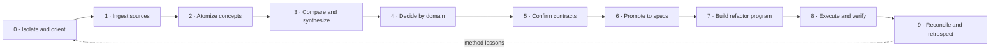

# Refactor method — a new beginning

## Purpose

Preserve the method used to redesign Spectacular so it can be resumed after context loss, audited
after implementation, and evaluated as a possible reusable refactor-workflow skill. This document
owns the end-to-end method. [`evidence/WORKFLOW.md`](evidence/WORKFLOW.md) owns the detailed intake
schema, [`ORCHESTRATION.md`](ORCHESTRATION.md) owns distributed work and checkpoint authority, and
[`FOUNDATION-PLAN.md`](FOUNDATION-PLAN.md) owns the current decision-program snapshot.

## Session goal

Transform contradictory plans, expert suggestions, GitHub issues, repository evidence, and owner
preferences into unequivocal product decisions, coherent contracts, approved specifications, and
only then a safe executable refactor—without accumulating AI-generated surface that lacks a proven
job, owner, or maintenance justification. The method must remain resumable across context windows,
side sessions, agents, and implementation Missions without turning summaries into a second truth.

## Method invariants

1. Sources are proposals and evidence, never authority merely because they are long or confident.
2. Preserve provenance, contradictions, rejected paths, assumptions, and uncertainty.
3. Separate ingestion, comparison, decisions, specifications, planning, and implementation.
4. Keep one independently decidable idea per concept card.
5. Never infer a human disposition from an agent recommendation.
6. Verify repository claims cheaply; mark unverified claims honestly.
7. Decide upstream contracts before downstream names, folders, commands, agents, or deletions.
8. A subsystem survives only through a unique valuable outcome, clear owner, evidence, and acceptable
   context/maintenance cost.
9. Skills, agents, modes, adapters, and mechanisms are different abstractions; file movement is not
   evidence of a good boundary.
10. No implementation begins without approved specifications and measurable validation.
11. Every destructive reduction has a recoverable Git boundary and explicit compatibility strategy.
12. At completion, review the method itself before turning it into tooling or a skill.
13. One orchestration task owns program reconciliation, checkpoint state, and successor authorization.
14. Side sessions receive bounded packets and return typed facts, evidence, decisions, conflicts,
    and one next action; they do not silently promote or reconcile their own result.
15. Sessions, agents, Missions, runs, native plans, and branches are distinct boundaries.

## End-to-end lifecycle

## Phase 0 — Isolate and orient

1. Work on a clean refactor branch; preserve unrelated user changes.
2. Read current product intent, principles, capability index, decisions, code, and tests.
3. Treat current implementation as evidence of reality, not automatic permission to preserve it.
4. Create a Vision workbench rather than a production request because material direction is unsettled.
5. Record the goal, boundaries, inherited constraints, and approval rule in `VISION.md`.

## Phase 1 — Ingest each source

For every new source:

1. Assign the next source ID and record provenance, authority, date, completeness, and raw location.
2. Summarize its thesis and focus without copying the whole source.
3. Extract proposals, warnings, evidence claims, assumptions, and open questions.
4. Check current repository facts when they materially affect the proposal.
5. Identify stale assumptions, duplicate arguments, contradictions, unsupported certainty, and drift.
6. Create or update atomic PZL concept cards; add provenance to an existing card when the idea is
   genuinely equivalent instead of manufacturing a duplicate.
7. Update source index, concept index, domain map, contradiction matrix, and counts.
8. Run a synthesis checkpoint when the source changes a major domain or decision order.
9. Leave every human disposition pending.

GitHub issue corpora additionally receive one issue-evidence card per issue/comment thread so the
chronological source remains recoverable while concepts become the comparison units.

## Phase 2 — Atomic concept model

Each concept card owns:

- one core message;
- value and affected user/job;
- assumptions;
- evidence status and provenance;
- dependencies, overlaps, and conflicts;
- trade-offs and a clear recommendation;
- an explicit human disposition.

Concept cards are puzzle pieces, not mini-specifications. Their purpose is recomposition: the same
piece may support several product alternatives without being copied.

## Phase 3 — Rolling comparison and synthesis

After each substantial ingestion wave:

1. merge true duplicates through provenance;
2. split cards that contain independently decidable ideas;
3. distinguish factual disputes from value/design choices;
4. update evidence strength and source authority;
5. map dependency chains and decision collisions;
6. create derived Mermaid views only as navigation projections;
7. identify the few upstream decisions that remove the most downstream fog;
8. state what the new source changes and what it does not justify.

Derived indexes and diagrams never overwrite concept state or canonical evidence.

## Distributed-program stress test

This rebuild is intentionally testing the product capability being designed. A large refactor
combines long-lived context, contradictory evidence, many Type-1 decisions, dependent contracts,
specialist investigations, independent review, and later parallel implementation. Success means a
fresh session can recover the exact program state and safely advance one bounded edge without
loading the entire corpus or inventing authority.

[`ORCHESTRATION.md`](ORCHESTRATION.md) is the live control contract. This task remains the root
orchestration and checkpoint-review session. It owns routing, dependency order, accepted upstream
contracts, review of return packets, explicit `accept | bounce | escalate | supersede`
dispositions, reconciliation, and the one safe next action. Side sessions own bounded evidence,
decision grilling, spikes, specification work, implementation Missions, or fresh-context review.

The requirement is settled; its eventual product placement is not. S07 must decide whether the
observed capability belongs wholly in Spectacular core or whether a decision/refactor companion
owns some high-ambiguity work behind a typed handoff.

## Phase 4 — Decide in bounded domain sessions

When intake is sufficiently complete, run the sessions in `FOUNDATION-PLAN.md`. Each sitting loads
only its linked concepts, conflicts, current repository evidence, and accepted upstream contracts.
Use a copy-ready handoff from [`handoffs/`](handoffs/) for side tasks; every result returns here for
checkpoint review before a successor is authorized.

Each decision packet must contain:

1. exact question and scope;
2. viable options and explicit non-options;
3. known facts, assumptions, and missing evidence;
4. consequence, blast radius, reversibility, migration burden, and evidence threshold;
5. user value, safety, complexity, compatibility, and maintenance trade-offs;
6. one recommendation, its failure modes, authorized owner, required advisers, and escalation path;
7. the owner's `adopt | adapt | reject | defer | needs-evidence` disposition;
8. a concise accepted contract and downstream constraints;
9. research or a spike only when its result could change the decision.

Before asking questions, choose the cheapest sufficient decision artifact:

- first classify consequence and reversibility on a spectrum rather than through permanent binary
  labels or fixed universal timeboxes;
- option matrix and sequential grilling for authority, policy, naming, and dependent choices;
- a tension/contradiction matrix before generating alternatives when goals conflict;
- research for missing facts;
- a spike for feasibility;
- an executable simulator for state/recovery logic;
- contrastive functional variants for experiential choices;
- a parametric boundary-state sandbox when uncertainty varies continuously across latency, scale,
  confidence, autonomy, or failure conditions;
- synthetic personas only as heuristic adversarial lenses that generate risks and questions, never
  as substitutes for user research, accessibility validation, or behavioral evidence;
- bounded deterministic/independent review before human inspection when consequence justifies it;
- direct execution when the work is already clear, bounded, reversible, and evidence-gated.

Decision density means retained, correctly understood decisions per unit of human attention. Never
maximize raw option or decision counts, and never make a high-fidelity artifact when a cheaper one
can settle the uncertainty.

Do not interleave domains. Reopen an accepted upstream decision only with named new evidence and an
explicit account of the downstream contracts it invalidates.

## Phase 5 — Confirm boundaries and contracts

Before spec promotion, confirm as a coherent whole:

- product promise, protected loop, target users, and non-goals;
- truth hierarchy and contract information model;
- work-unit identity and lifecycles;
- execution, human, and provider authority;
- evidence, closure, retention, and resume contracts;
- Spectacular versus companion/agent/mode/adapter responsibilities;
- retrieval, scaffold, vocabulary, and command boundaries;
- subsystem survival and graph/multi-agent ceiling;
- compatibility and migration posture.

Check for cross-session contradictions before approving the Vision. Locally sensible contracts must
not combine into an incoherent product.

## Phase 6 — Promote into specifications

1. Repack accepted concepts into the fewest coherent Vision fragments.
2. Preserve rejected/deferred alternatives in evidence; do not dilute accepted contracts with them.
3. Approve the whole Vision explicitly.
4. Derive small specifications around stable behavior or interface boundaries—not source documents,
   sessions, or code folders.
5. Give every spec acceptance criteria, compatibility impact, migration behavior, and evidence path.
6. Resolve dependencies among specs before creating implementation requests.

## Phase 7 — Build the executable refactor program

Only after specifications are approved:

1. separate immediate safety/correctness stabilization from architectural change;
2. order work by contract dependencies and vertical slices;
3. define checkpoints where stopping still leaves a coherent smaller product;
4. use one request per accepted implementation boundary, not per thinking session;
5. preserve removed behavior through tags/refs or explicit migration artifacts;
6. attach required tests, benchmarks, compatibility checks, and rollback evidence;
7. delay language ports or rewrites until the final surface and measured need are known.
8. apply the Mission, baseline, branch/worktree, permission, stop-condition, and return contracts in
   [`ORCHESTRATION.md`](ORCHESTRATION.md); never treat a branch as a work unit or create one per agent.

## Phase 8 — Execute, verify, and reconcile

For each implementation batch:

1. compile the accepted contract, scope, authority, stop conditions, and evidence requirements;
2. implement the smallest coherent vertical change;
3. run deterministic checks and risk-triggered independent review;
4. compare results with baseline metrics and accepted contracts;
5. record deviations instead of silently expanding scope;
6. reconcile current specs only after evidence passes;
7. preserve a precise next action and recovery point after every terminal state.
8. keep one Mission orchestrator as the only lifecycle/checkpoint mutator; parallel builders are
   permitted only for closed, disjoint-file units with an explicit join.

## Phase 9 — Refactor retrospective and method recovery

After the product refactor is complete, reopen this document and evaluate:

- Which fields and artifacts materially improved decisions?
- Which indexes or cards duplicated authority or created maintenance work?
- Did atomic decomposition expose contradictions that source-by-source review missed?
- Which recommendations were wrong, and why?
- Which decisions were expensive to revisit?
- Where did manual IDs, links, counts, or projections drift?
- Which steps are deterministic enough for tooling?
- Which steps require human/agent judgment and should remain conversational?
- Can the proven method work outside Spectacular without importing its taxonomy?
- Which orchestration responsibilities naturally belonged to Spectacular core, a companion,
  the host runtime, deterministic tooling, or a reviewer role?

The capability itself is now required. Only then decide its exact packaging and whether a
standalone decision/refactor companion is justified. Build any companion from the observed
successful method, not from the current aspirational process.

## Failure modes to prevent

- Merge-first mega-plans that erase provenance.
- Source-by-source voting that misses global contradictions.
- Treating issue status, source prestige, or confident prose as acceptance.
- Creating one new artifact, skill, agent, or lifecycle per idea.
- Optimizing line count while increasing tool calls, errors, or hidden context.
- Deciding deletion criteria while looking at the subsystem being judged.
- Making diagrams, summaries, caches, or handoffs a second authority.
- Extracting companions that require private Spectacular state or duplicate truth.
- Turning decision sessions into implementation sessions.
- Rewriting before the product surface and migration contract are settled.

## Cold-resume protocol

A future agent or session resumes in this order:

1. Read this `METHOD.md` for the operating method and current phase.
2. Read [`ORCHESTRATION.md`](ORCHESTRATION.md) for authority, dispatch, branch, and checkpoint state.
3. Read [`FOUNDATION-PLAN.md`](FOUNDATION-PLAN.md) for the decision program and priority spine.
4. Read [`VISION.md`](VISION.md) for scope, intent, constraints, and approval state.
5. Read [`evidence/index.md`](evidence/index.md) for source counts and navigation.
6. Read only the latest synthesis checkpoint and the active source/session/handoff packet.
7. Do not preload all source or concept files; follow IDs and links on demand.
8. Verify counts and run `spectacular doctor vision` before concluding durable work.

## Current state

- Branch: `refactor/a-new-beginning`.
- Current phase: distributed orchestration and constitutional-decision setup; later sources may
  still be ingested without interrupting an active decision unless they contain reversal evidence.
- Ingested baseline: Sources 001–014, 171 concept cards, 23 GitHub issue cards.
- Latest synthesis: checkpoint 012.
- Human dispositions: 0.
- Promoted specifications: 0.
- Active handoff queue: H01 evidence audit + H04 independent foundation review in parallel →
  orchestration checkpoint → H02 S01 Product Constitution → H03 skeptic.
- Baseline precondition: review and commit only this Vision workbench before dispatching side tasks
  that need a shared Git baseline; unrelated untracked files remain excluded.
- Next source ID remains `source-015`.
