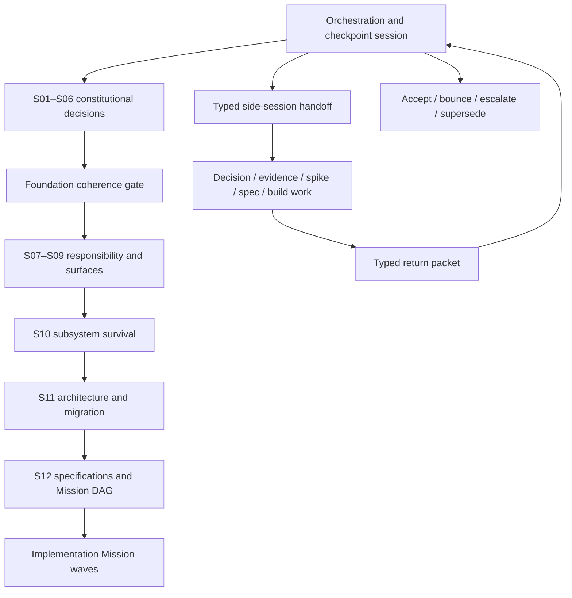

# Refactor orchestration and checkpoint contract

## Purpose

This refactor is the live stress test for a capability Spectacular—or an optional companion—must
eventually support: assemble a large, contradictory information set into durable decisions,
distribute bounded work across sessions and agents without losing authority or context, and
reconcile the results into an approved rebuild.

This task is the **program orchestration and checkpoint-review session**. It preserves the whole
decision graph but does not absorb every investigation, interview, spike, specification, or coding
attempt into one context window.

## Capability hypothesis under test

```text
Many sources and decisions
  → bounded decision packets
  → typed side-session handoffs
  → evidence/decision/specification returns
  → central checkpoint review
  → coherent contract and Mission DAG
  → isolated implementation
  → verified reconciliation
```

The experiment must reveal which responsibilities belong in Spectacular core and which, if any,
form a standalone decision/refactor companion. The placement decision remains pending for S07; the
need for the orchestration capability is now an explicit owner requirement.

## Work hierarchy

| Layer | Owns | Does not own |
|---|---|---|
| Program | Whole rebuild goal, dependency graph, accepted contracts, checkpoint state | Implementation detail |
| Decision session | One Type-1 decision packet and owner disposition | Product code or downstream surface choices |
| Specification | One accepted behavior/interface contract | Execution attempt state |
| Mission/request | One independently reviewable implementation outcome | Unsettled product direction |
| Run/session | One attempt or resumable execution interval | Durable product intent |
| Native plan | Current-session edits and checks | Cross-session milestone authority |
| Subagent brief | One closed delegation with named files and check | Planning, lifecycle, or product authority |

A session is a context boundary. A Mission is a durable outcome. An agent is a role. A branch is a
mutation-isolation boundary. None is a synonym for another.

## Program topology



## Orchestration-session responsibilities

This task must:

1. maintain the program goal, current phase, accepted upstream contracts, dependency order, and one
   safe next action;
2. choose whether work stays here or becomes a decision, evidence, spike, specification, Mission,
   run, or subagent handoff;
3. prepare closed handoff prompts with bounded context, authority, branch permissions, stop
   conditions, and return schema;
4. prevent concurrent work whose branches, files, schemas, decisions, or release constraints
   conflict;
5. review every returned packet against its contract, primary evidence, upstream decisions, and
   changed Git baseline;
6. accept, bounce, escalate, or supersede returns explicitly—never merge them by confidence;
7. record owner dispositions and reconcile accepted results into the Vision/Foundation Contract;
8. authorize the next session or Mission only after its dependencies are satisfied;
9. preserve a cold-resume checkpoint and audit the method's context/maintenance cost;
10. keep implementation, provider mutations, and merge authority within their declared boundaries.

This task should not perform a delegable deep audit or implementation merely because it can. It may
make small orchestration-document edits and integration corrections needed to keep the program
coherent.

## Side-session responsibilities

Every side session must:

- read only the named packet and follow links on demand;
- distinguish facts, assumptions, recommendations, and owner decisions;
- remain within its decision, evidence, spike, specification, or Mission boundary;
- stop rather than invent authority, scope, a shared interface, or a missing product decision;
- avoid lifecycle changes unless the handoff explicitly grants them;
- return the required schema with precise file/evidence refs and one next action;
- leave unrelated user changes untouched.

Only a decision-session lead may grill the owner, and only for its named decision. Investigators,
builders, and reviewers do not turn missing authority into conversational scope expansion.

## Dispatch classes

| Class | Parallel? | Writes? | Branch rule |
|---|---:|---:|---|
| Decision lead | Sequential with other Type-1 decisions | Return by default | No branch unless authorized to persist its packet |
| Evidence investigator | Yes when questions are independent | No | No branch |
| Skeptic/reviewer | Yes across independent returns | No | No branch |
| Feasibility spike | Yes when isolated | Disposable code + evidence | Dedicated `codex/spike/prototype-<id>-<slug>` worktree |
| Spec author | Only for disjoint contracts with a designed join | Spec scope only | Dedicated spec branch when shared review is required |
| Implementation Mission | By accepted traffic state | Named Mission scope | One `codex/feat/v2-<mission-slug>` worktree and PR |
| In-session builder subagent | Only for at least three closed disjoint-file units | Named files only | Shares Mission branch; no branch per subagent |

## Branch and worktree policy

1. `refactor/a-new-beginning` is the program-planning branch, not an implementation branch.
2. Read-only work creates no branch.
3. A separate top-level session creates a branch only when it will mutate durable files.
4. Concurrent mutating sessions require separate worktrees and branches from an exact recorded
   baseline.
5. One implementation Mission owns one branch and one reviewable PR.
6. Do not create a branch per agent; parallel builders share the Mission branch only when file
   ownership is disjoint and the orchestrator has designed the join.
7. Serialize changes to `cli/spectacular`, lifecycle schemas, command registries, canonical
   contracts, shared tests, or the same file.
8. Never stash, reset, overwrite unrelated changes, merge, mark a PR ready, deploy, or delete a
   remote branch unless the handoff grants that exact authority.
9. Local commits, push, and draft-PR creation are separate permissions. A normal implementation
   handoff may grant them; merge remains human-gated.
10. Spike code is evidence, not production. Preserve its findings and recovery pointer before
    disposal or promotion.

### Current planning baseline

The Vision workbench baseline is commit `c8ff3fd` on `refactor/a-new-beginning`. H01 and H04 may use
that exact commit for independent read-only work. Later mutating sessions must record their own base
commit and still exclude unrelated untracked `.agents/skills/`, `.qwen/`, or `skills-lock.json`.

## Checkpoint-review state machine

```text
READY → DISPATCHED → RETURNED → REVIEWING
                              ↘ ACCEPTED → RECONCILED → NEXT READY
                              ↘ BOUNCED  → REDISPATCHED
                              ↘ ESCALATED → OWNER DECISION
```

At every return, the orchestration task checks:

1. packet completeness and authority;
2. exact baseline and changed files, if any;
3. primary evidence and test results;
4. compliance with accepted upstream contracts;
5. scope, reversibility, migration, and compatibility consequences;
6. conflicts with other active sessions/Missions;
7. whether the result is accepted, needs repair, needs owner judgment, or invalidates an upstream
   decision;
8. the one safe next action.

## Universal return packet

```yaml
return:
  handoff_id: <HNN>
  status: complete | blocked | failed
  baseline: <commit-or-read-only-snapshot>
  result: <one-paragraph outcome>
  decisions: [<explicit owner decisions only>]
  facts: [<verified facts with refs>]
  assumptions: [<remaining assumptions>]
  artifacts: [<created or changed refs>]
  evidence: [<checks, outputs, citations, or observations>]
  conflicts: [<upstream or concurrent collisions>]
  scope_deviations: [<none or exact deviation>]
  next_action: <one concrete continuation>
```

## First dispatch sequence

1. Dispatch in parallel after the planning-baseline commit:
   - **H01 — Product-boundary evidence audit:** read-only current-product and contradiction packet.
   - **H04 — Independent foundation adversarial review:** different-model, fresh-context audit of
     the entire proposed method, decision order, responsibility model, and implementation guards.
2. Orchestration checkpoint: disposition H04's blocking findings and repair the program if needed.
3. **H02 — S01 Product Constitution lead:** owner grilling informed by H01 and any accepted H04
   corrections; returns a proposed
   Product Constitution packet with explicit dispositions.
4. **H03 — Product Constitution skeptic:** fresh-context audit after H02, before reconciliation.
5. Orchestration checkpoint: accept, bounce, or escalate S01; only then authorize S02.

Copy-ready prompts live in [`handoffs/`](handoffs/).

## Method evaluation

At each major checkpoint record:

- context loaded by orchestrator and side session;
- handoff omissions and redispatches;
- decisions retained or reopened;
- duplicated or stale artifacts;
- parallel work accepted, bounced, or conflicted;
- human attention and elapsed sessions;
- whether Spectacular core or a companion naturally owned each responsibility.

The eventual product/skill design must follow this observed evidence rather than merely copying the
current orchestration document.
