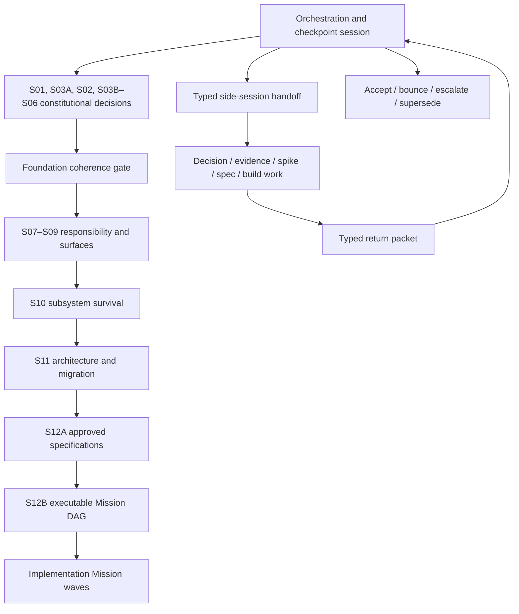

# Refactor orchestration and checkpoint contract

## Purpose

This refactor is the live stress test for a capability Spectacular—or an optional companion—must
eventually support: assemble a large, contradictory information set into durable decisions,
distribute bounded work across sessions and agents without losing authority or context, and
reconcile the results into an approved rebuild.

This task is the **program orchestration and checkpoint-review session**. It preserves the whole
decision graph but does not absorb every investigation, interview, spike, specification, or coding
attempt into one context window.

## Capability hypothesis under test

```text
Many sources and decisions
  → bounded decision packets
  → typed side-session handoffs
  → evidence/decision/specification returns
  → central checkpoint review
  → coherent contract and Mission DAG
  → isolated implementation
  → verified reconciliation
```

The experiment must reveal which responsibilities belong in Spectacular core and which, if any,
form a standalone decision/refactor companion. The placement decision remains pending for S07; the
need for the orchestration capability is now an explicit owner requirement.

## Work hierarchy

| Layer | Owns | Does not own |
|---|---|---|
| Program | Whole rebuild goal, dependency graph, accepted contracts, checkpoint state | Implementation detail |
| Decision session | One Type-1 decision packet and owner disposition | Product code or downstream surface choices |
| Specification | One accepted behavior/interface contract | Execution attempt state |
| Mission/request | One independently reviewable implementation outcome | Unsettled product direction |
| Run/session | One attempt or resumable execution interval | Durable product intent |
| Native plan | Current-session edits and checks | Cross-session milestone authority |
| Subagent brief | One closed delegation with named files and check | Planning, lifecycle, or product authority |

A session is a context boundary. A Mission is a durable outcome. An agent is a role. A branch is a
mutation-isolation boundary. None is a synonym for another.

## Program topology



## Orchestration-session responsibilities

This task must:

1. maintain the program goal, current phase, accepted upstream contracts, dependency order, and one
   safe next action;
2. choose whether work stays here or becomes a decision, evidence, spike, specification, Mission,
   run, or subagent handoff;
3. prepare closed handoff prompts with bounded context, authority, branch permissions, stop
   conditions, and return schema;
4. prevent concurrent work whose branches, files, schemas, decisions, or release constraints
   conflict;
5. review every returned packet against its contract, primary evidence, upstream decisions, and
   changed Git baseline;
6. accept, bounce, escalate, or supersede returns explicitly—never merge them by confidence;
7. record owner dispositions and reconcile accepted results into the Vision/Foundation Contract;
8. authorize the next session or Mission only after its dependencies are satisfied;
9. preserve a cold-resume checkpoint and audit the method's context/maintenance cost;
10. keep implementation, provider mutations, and merge authority within their declared boundaries.

This task should not perform a delegable deep audit or implementation merely because it can. It may
make small orchestration-document edits and integration corrections needed to keep the program
coherent.

## Side-session responsibilities

Every side session must:

- read only the named packet and follow links on demand;
- distinguish facts, assumptions, recommendations, and owner decisions;
- remain within its decision, evidence, spike, specification, or Mission boundary;
- stop rather than invent authority, scope, a shared interface, or a missing product decision;
- avoid lifecycle changes unless the handoff explicitly grants them;
- return the required schema with precise file/evidence refs and one next action;
- leave unrelated user changes untouched.

Only a decision-session lead may grill the owner, and only for its named decision. Investigators,
builders, and reviewers do not turn missing authority into conversational scope expansion.

## Dispatch classes

| Class | Parallel? | Writes? | Branch rule |
|---|---:|---:|---|
| Decision lead | Sequential with other Type-1 decisions | Return by default | No branch unless authorized to persist its packet |
| Evidence investigator | Yes when questions are independent | No | No branch |
| Skeptic/reviewer | Yes across independent returns | No | No branch |
| Feasibility spike | Yes when isolated | Disposable code + evidence | Dedicated `codex/spike/prototype-<id>-<slug>` worktree |
| Spec author | Only for disjoint contracts with a designed join | Spec scope only | Dedicated spec branch when shared review is required |
| Implementation Mission | By accepted traffic state | Named Mission scope | One `codex/feat/v2-<mission-slug>` worktree and PR |
| In-session builder subagent | Only for at least three closed disjoint-file units | Named files only | Shares Mission branch; no branch per subagent |

## Branch and worktree policy

1. `refactor/a-new-beginning` is the program-planning branch, not an implementation branch.
2. Read-only work creates no branch.
3. A separate top-level session creates a branch only when it will mutate durable files.
4. Concurrent mutating sessions require separate worktrees and branches from an exact recorded
   baseline.
5. Before any mutation, validate the declared baseline against the actual commit/tree, dirty state,
   worktrees, named files, generated/shared surfaces, and accepted upstream-contract versions. A
   mismatch is `reject` unless this task explicitly revalidates and reissues the handoff.
6. One implementation Mission owns one branch and one reviewable PR.
7. Do not create a branch per agent; parallel builders share the Mission branch only when file
   ownership is disjoint and the orchestrator has designed the join.
8. Serialize changes to `cli/spectacular`, lifecycle schemas, command registries, canonical
   contracts, shared tests, or the same file.
9. Never stash, reset, overwrite unrelated changes, merge, mark a PR ready, deploy, or delete a
   remote branch unless the handoff grants that exact authority.
10. Local commits, push, and draft-PR creation are separate permissions. A normal implementation
   handoff may grant them; merge remains human-gated.
11. Spike code is evidence, not production. Preserve its findings and recovery pointer before
    disposal or promotion.

### Current planning baseline

The Vision workbench baseline is commit `c8ff3fd` on `refactor/a-new-beginning`. H01 and H04 may use
that exact commit for independent read-only work. Later mutating sessions must record their own base
commit and still exclude unrelated untracked `.agents/skills/`, `.qwen/`, or `skills-lock.json`.

## Checkpoint-review state machine

```text
READY → DISPATCHED → RETURNED → REVIEWING
                              ↘ ACCEPTED → RECONCILED → NEXT READY
                              ↘ BOUNCED  → REDISPATCHED
                              ↘ ESCALATED → OWNER DECISION
```

At every return, the orchestration task checks:

1. packet completeness and authority;
2. exact baseline and changed files, if any;
3. primary evidence and test results;
4. compliance with accepted upstream contracts;
5. scope, reversibility, migration, and compatibility consequences;
6. conflicts with other active sessions/Missions;
7. whether the result is accepted, needs repair, needs owner judgment, or invalidates an upstream
   decision;
8. the one safe next action.

The first check is deterministic: `schema_version`, handoff identity/hash, immutable input refs,
accepted-contract versions, reviewer/runtime identity, read set, and reviewed commit/tree must match
the issued handoff. Baseline drift is never silently normalized.

## Universal return packet

```yaml
return:
  schema_version: spectacular.handoff-return.v2
  handoff_id: <HNN>
  handoff_hash: <sha256-of-issued-handoff>
  status: complete | blocked | failed
  baseline:
    commit: <immutable-commit>
    tree: <reviewed-tree>
    dirty_state: clean | declared-pre-existing
  input_refs: [<immutable source refs and versions>]
  upstream_contracts: [<accepted contract id@version>]
  reviewer: <task/thread/model-or-runtime identity>
  read_set: [<files, commits, provider refs actually inspected>]
  result: <one-paragraph outcome>
  decisions: [<explicit owner decisions only>]
  facts: [<verified facts with refs>]
  assumptions: [<remaining assumptions>]
  artifacts: [<created or changed refs>]
  evidence: [<checks, outputs, citations, or observations>]
  conflicts: [<upstream or concurrent collisions>]
  scope_deviations: [<none or exact deviation>]
  next_action: <one concrete continuation>
```

## First dispatch sequence

1. Dispatch in parallel after the planning-baseline commit:
   - **H01 — Product-boundary evidence audit:** read-only current-product and contradiction packet.
   - **H04 — Independent foundation adversarial review:** different-model, fresh-context audit of
     the entire proposed method, decision order, responsibility model, and implementation guards.
2. Orchestration checkpoint: H04 was accepted with required repairs B1–B4; see
   [`evidence/returns/H04-foundation-adversarial-review.md`](evidence/returns/H04-foundation-adversarial-review.md).
3. **H02 — S01 Product Constitution lead:** completed with owner dispositions; see
   [`evidence/returns/H02-product-constitution.md`](evidence/returns/H02-product-constitution.md).
4. **H03 — Product Constitution skeptic:** fresh-context audit of H02 against H01 and reconciled H04.
5. Orchestration checkpoint: accept, bounce, or escalate S01; only then authorize S02.

H03 returned `pass-with-required-changes`. The central checkpoint accepted the review and bounced
H02 for neutral ontology/vocabulary, responsibility-neutral tool boundaries, explicit separation
of authorization policy from provider enforcement, and owner disposition of Git, Skill/CLI,
P8–P9, and governing-versus-owning-delivery wording. H02 revision 2 satisfied every required change
with explicit owner dispositions. Central disposition: **S01 accepted**. The canonical result is
[`PRODUCT-CONSTITUTION.md`](PRODUCT-CONSTITUTION.md). Accepted Constitution SHA-256:
`99565c58316c4c193fe6108b514b04f664bdee966a840ad2e982ecf580e7dab7`.

H06 then ran S03A from the accepted S01 baseline and obtained explicit owner dispositions for
claim-scoped authority, lean pointer-first provenance, claim-scoped freshness, projection
non-authority, and explicit unknowns with bounded continuation. Central disposition: **S03A
accepted**. The canonical result is
[`TRUTH-PROVENANCE-FLOOR.md`](TRUTH-PROVENANCE-FLOOR.md). S02 is now the next authorized owner
decision session; S03B and all later sessions remain blocked by their declared dependencies.

H07 then ran S02 and obtained explicit owner dispositions for protected-loop gates, a no-numeric
lightweight comparative review, claim-specific evidence, anti-gaming, reversibility, subsystem
survival, disposable prototypes, and three provider-neutral acceptance scenarios. Central
disposition: **S02 accepted with normalization**. The later no-numeric disposition supersedes the
earlier “weighted scorecard” wording. The canonical result is
[`SUCCESS-EVIDENCE-CONSTITUTION.md`](SUCCESS-EVIDENCE-CONSTITUTION.md). S03B is the next authorized
owner-decision session.

H08 then ran S03B and obtained explicit owner dispositions for claim-scoped authority, the Minimum
Capability Contract envelope, named gaps, a small Level-1 relationship ceiling, and
non-authoritative drill-down projections. Central disposition: **S03B accepted**. The canonical
result is [`PRODUCT-TRUTH-CONTRACT-MODEL.md`](PRODUCT-TRUTH-CONTRACT-MODEL.md). S04 is now the next
ready owner-decision session; it has not yet been dispatched.

H09 then ran S04 and obtained explicit owner dispositions for one durable Mission work unit,
Mission-owned Objectives, boundary-based Runs, run-local Tasks, linked goals, typed Gaps,
intra-Mission Handoffs, compact lifecycles, and cold resume. Central disposition: **S04 accepted
with normalization**: Proposal acceptance authorizes a target delta but does not replace the
current Capability Contract before reconciliation. The canonical result is
[`WORK-UNIT-LIFECYCLE-CONTRACT.md`](WORK-UNIT-LIFECYCLE-CONTRACT.md). S05 is accepted with an
explicit Autopilot clarification: only the owner resolves a Mission or changes current Capability
Contract truth. The canonical result is
[`EXECUTION-AUTHORITY-CONTRACT.md`](EXECUTION-AUTHORITY-CONTRACT.md). H11 then ran S06 and obtained
explicit owner acceptance for claim-scoped evidence, risk-triggered independent review, bounded
repair, closure order, and a pointer-first terminal return. Central disposition: **S06 accepted**.
The canonical result is
[`EVIDENCE-CLOSURE-CONTINUITY-CONTRACT.md`](EVIDENCE-CLOSURE-CONTINUITY-CONTRACT.md). S07 is
accepted with an optional-companion clarification: Pageworks, Bugworks, and Specwright remain
specialists and do not displace the core loop. The canonical result is
[`RESPONSIBILITY-PLACEMENT-CONTRACT.md`](RESPONSIBILITY-PLACEMENT-CONTRACT.md). S08 is next-ready
and has not been dispatched. H13 then ran S08 and obtained explicit owner dispositions for
scope-relative cold starts, non-authoritative projections, earned workspace growth, and deferred
advisory retrieval. Central disposition: **S08 accepted**. The canonical result is
[`RETRIEVAL-AND-EARNED-WORKSPACE-CONTRACT.md`](RETRIEVAL-AND-EARNED-WORKSPACE-CONTRACT.md). S09 is
accepted with earned-record and compatibility normalizations. H14 established canonical language,
identity shapes, Skill/CLI grammar, source-backed cards, and the typed authority spine. The
canonical result is
[`PUBLIC-LANGUAGE-AND-INTERFACE-CONTRACT.md`](PUBLIC-LANGUAGE-AND-INTERFACE-CONTRACT.md). The
compatibility-floor checkpoint is accepted. H15 established a frozen v1 release, v2-only core,
whole-project atomic migration, an isolated disposable migration capsule, and evidence-gated
retirement. The canonical result is
[`CLEAN-BREAK-CUTOVER-AND-RECOVERY-CONTRACT.md`](CLEAN-BREAK-CUTOVER-AND-RECOVERY-CONTRACT.md).
H17 completed S10 and central orchestration accepted it with normalization. The authoritative
result is [`SUBSYSTEM-SURVIVAL-CONTRACT.md`](SUBSYSTEM-SURVIVAL-CONTRACT.md); the complete reviewed
return is [`evidence/returns/H17-s10-subsystem-survival.md`](evidence/returns/H17-s10-subsystem-survival.md).
The earlier A/B and C checkpoint files remain historical progress records. H18 now runs S11 as a
read-only, interactive owner-decision session in Codex thread
`019fe697-77b5-7f63-ab75-702044c02ae1`. It must resolve clusters A–E one at a time and return to
central accept, bounce, or escalate; S12A remains blocked.

Copy-ready prompts live in [`handoffs/`](handoffs/).

## Parallel research-intake lane

H05 may study named competing or adjacent skills while the constitutional sequence proceeds. It is
read-only and returns comparative evidence only; it cannot ingest concepts, edit this workbench, or
authorize a product direction. This orchestration task reviews the return and selects which atomic
findings, if any, become `source-015` or later. Research interrupts an accepted upstream contract
only when it supplies named, verifiable, reversal-grade evidence and accounts for the downstream
contracts affected.

H05 returned against baseline `7a85469` and was accepted with bounded ingestion as Source 015. It
added PZL-172 and PZL-173 to S06, reinforced existing runtime/handoff/repair/projection concepts,
and supplied no reversal-grade finding. No reconciliation spike or companion extraction is yet
authorized because S03 and S05 own prerequisite truth and authority contracts.

## Method evaluation

At each major checkpoint record:

- context loaded by orchestrator and side session;
- handoff omissions and redispatches;
- decisions retained or reopened;
- duplicated or stale artifacts;
- parallel work accepted, bounced, or conflicted;
- human attention and elapsed sessions;
- whether Spectacular core or a companion naturally owned each responsibility.

The eventual product/skill design must follow this observed evidence rather than merely copying the
current orchestration document.
