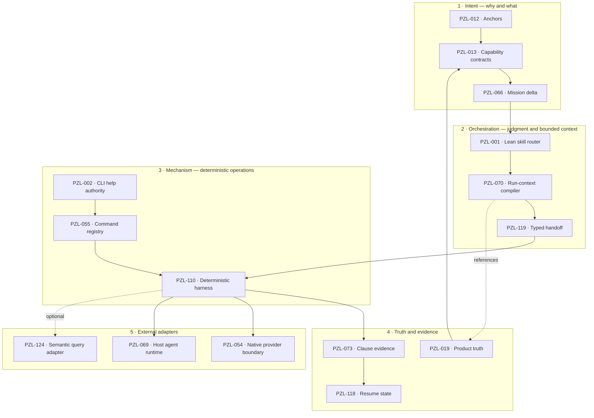

# Spectacular abstraction map

This view applies Source 010's abstraction question to Spectacular. It is an audit
projection, not accepted architecture. Linked PZL cards retain authority.

## Boundary audit

| Boundary | Required interface | Current question |
|---|---|---|
| Intent → orchestration | accepted outcome, authority, constraints, non-goals | Does Mission/request/spec ownership overlap? |
| Orchestration → mechanism | one mechanical operation with validated parameters | Does the skill document CLI behavior the CLI should own? |
| Mechanism → truth | explicit read/write contract, schema, provenance, failure | Does the CLI create or reinterpret product decisions? |
| Truth → orchestration | bounded authoritative projection plus freshness | Can status/run context omit or shadow canonical evidence? |
| Mechanism → adapters | narrow capability, permission, and mutation boundary | Are Git/GitHub and host-agent operations duplicated internally? |

## Audit rule

For each command, reference, agent, and collection, record its owning layer, callers,
authoritative inputs, guaranteed output, deterministic checks, failure mode, and drill-down
path. A component that owns two layers or duplicates authority becomes a refactor candidate;
crossing a layer is not itself a defect.
