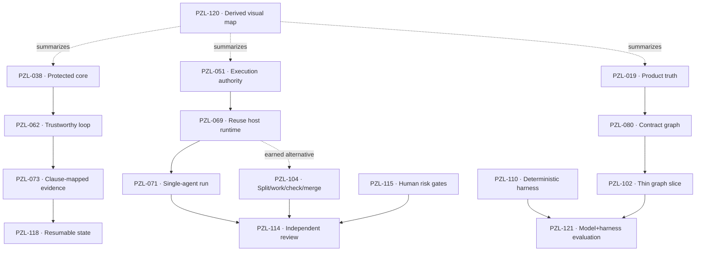

# Refactor decision map

This is a compressed navigation projection, not a specification or decision record.
Stable PZL cards own meaning, evidence, and disposition. The map shows only relationships
that currently affect decision order.

The current complete priority spine now lives in
[`top-20-foundational-decisions.md`](top-20-foundational-decisions.md); this smaller map remains a
useful historical view of the earlier graph/harness frontier.

## Node index

| Node | Why it is on the frontier |
|---|---|
| [PZL-038](concepts/PZL-038-protected-core.md) | Defines what must survive before reduction. |
| [PZL-062](concepts/PZL-062-trustworthy-closed-loop.md) | Candidate behavioral center of the product. |
| [PZL-051](concepts/PZL-051-mechanical-cli-agentic-skill.md) | Determines CLI, skill, and host responsibilities. |
| [PZL-069](concepts/PZL-069-reuse-host-runtime.md) | Prevents a second agent platform by default. |
| [PZL-071](concepts/PZL-071-single-agent-checkpointed-run.md) | Minimal execution candidate. |
| [PZL-104](concepts/PZL-104-split-work-check-merge.md) | Earned multi-agent alternative, not current default. |
| [PZL-019](concepts/PZL-019-product-truth-and-records.md) | Separates contract, implementation, observation, and record. |
| [PZL-080](concepts/PZL-080-system-contract-graph.md) | Candidate accepted-contract projection. |
| [PZL-102](concepts/PZL-102-thin-vertical-graph-slice.md) | Required evidence gate before graph expansion. |
| [PZL-110](concepts/PZL-110-deterministic-agent-harness.md) | Mechanical reliability layer. |
| [PZL-121](concepts/PZL-121-model-harness-evaluation.md) | Measures architecture rather than slogans. |
| [PZL-073](concepts/PZL-073-clause-mapped-evidence.md) | Connects intended behavior to proof. |
| [PZL-118](concepts/PZL-118-crash-resumable-state.md) | Makes cold continuation testable. |
| [PZL-114](concepts/PZL-114-independent-evidence-review.md) | Separates production from consequential assurance. |
| [PZL-115](concepts/PZL-115-risk-calibrated-human-gates.md) | Places human authority by consequence. |
| [PZL-120](concepts/PZL-120-derived-mermaid-map.md) | Experiments with visual progressive disclosure. |

## Reading rule

Start at the leftmost unresolved choice in a branch. Open the linked card and its
conflicts before evaluating a downstream node. When card metadata changes, update or
regenerate this view; never use the diagram to overwrite a card.
