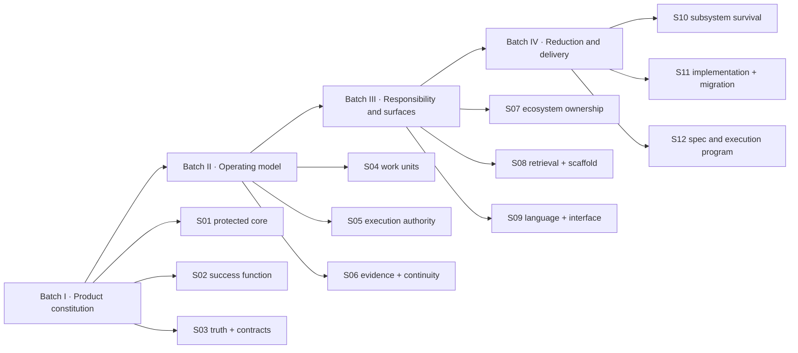

# Decisive refactor sessions

## Purpose

Move from a complete suggestion corpus to explicit product choices without mixing architecture,
surface cleanup, and implementation. Each session owns one decision domain and ends with a small
contract packet. A recommendation is not accepted until the owner records the disposition.

## Program shape

## Session contract

Every session receives only its linked PZL cards, conflicts, current repository evidence, and prior
accepted decisions. It must produce:

1. one precise decision question or a tightly coupled set;
2. viable options and explicit non-options;
3. evidence and assumptions separated;
4. impact, reversibility, uncertainty, migration burden, and evidence threshold;
5. a recommendation with compatibility and maintenance consequences;
6. authorized owner, required advisers, deadline/escalation path, and material dissent;
7. the owner's `adopt | adapt | reject | defer | needs-evidence` disposition;
8. a short contract statement and downstream constraints;
9. named research/spike work only when it could change the decision.

A session does not edit product code, create implementation tasks, or reopen decisions from an
earlier batch without identifying the new evidence.

### Distributed session contract

A decision session may run in a separate task, but it does not own the program. The orchestration
task prepares its bounded handoff, controls dependencies, and reviews the typed return. A session
lead may interview the owner only about its named decision; evidence investigators and reviewers do
not expand scope. The return is `accepted`, `bounced`, `escalated`, or `superseded` centrally before
any downstream session begins. Branch, worktree, permission, and return rules are defined in
[`../ORCHESTRATION.md`](../ORCHESTRATION.md).

### Interaction-artifact rule

Choose the cheapest sufficient decision surface before starting the session:

| Uncertainty | Preferred surface |
|---|---|
| Decision effort and ceremony | Classify impact, reversibility, uncertainty, and evidence threshold first |
| Authority, value, naming, scope, or policy | Option matrix plus branch-first grilling |
| Competing goals or an unknown option space | Tension/uncertainty matrix before artifact generation |
| External or repository fact | Bounded research/evidence card |
| Technical feasibility | Disposable spike |
| State transitions, failure recovery, races, or transformations | Executable logic harness |
| UI, interaction, hierarchy, or density | Two to four contrastive functional variants |
| Continuous dimensions or boundary states | Parametric sandbox across the smallest material axes |
| User-perspective hypotheses | Synthetic persona lenses followed by real research or accessibility evidence when claims require it |
| Quality/coherence before human inspection | Deterministic checks plus bounded independent review |
| Already clear, bounded, and reversible work | Direct execution toward an evidence-backed review |

Do not maximize option count or artifact fidelity. Measure whether accepted decisions survive later
implementation and whether the surface reduced confusion, reversal, and human effort.

## Batch I — Product constitution

### S01 — Product identity, protected core, and non-goals

**Decide:** what behavior makes the product Spectacular and which attractive jobs it refuses.

**Inputs:** PZL-012–013, 019–020, 038, 062, 064, current PRD non-goals.

**Required output:** one product promise, protected loop, target user priority, non-goal list, and
standalone/no-mandatory-tool invariant.

**Exit gate:** deletion and extraction proposals can be rejected for crossing the product boundary.

### S02 — Refactor success function and evidence constitution

**Decide:** what the refactor optimizes relative to the accepted Product Constitution, how
trade-offs are weighted, what evidence earns survival, and which measurements cannot be gamed.

**Inputs:** accepted S01 contract; PZL-010, 026, 033, 037, 078, 121, 128–129, 150, 167.

**Required output:** weighted scorecard covering protected-loop correctness, cold-start cost, user
adoption, maintainer burden, compatibility, recovery, and retained decisions per human-attention
unit; reversibility/impact rubric; predeclared survival and prototype rules.

**Exit gate:** later sessions can compare two designs with the same rubric without redefining the
product being optimized.

### S03 — Truth hierarchy and contract model

**Decide:** the authority order among intent, accepted contracts, code/tests, production behavior,
evidence, decisions, and history; capability-first versus typed system-graph depth.

**Inputs:** PZL-013, 019, 064, 073–074, 080–084, 086, 122, 169.

**Required output:** truth hierarchy, contract envelope, freshness/provenance rules, missing-contract
behavior, and graph adoption level.

**Exit gate:** one fact has one authority and every projection has a drill-down path.

## Batch II — Operating model

### S04 — Work-unit ontology and lifecycle

**Decide:** meanings and relationships of Capability Contract, SPC/spec, Mission/request, portfolio
goal, objective, run, task, decision, discovery node, and record.

**Inputs:** PZL-011–018, 021, 039, 066, 068, 076, 088–089, 099–100, 131, 134, 139, 145.

**Required output:** canonical vocabulary, identity boundaries, lifecycle state machines, nesting
rules, and a decision on whether a portfolio Mission exists.

**Exit gate:** no two artifacts own the same intent or progress state.

### S05 — Execution authority, human authority, and side effects

**Decide:** whether Spectacular executes, compiles a host-owned run, or only governs lifecycle;
which effects require human gates; which mutations belong to native providers.

**Inputs:** PZL-048, 051, 054, 067, 069–072, 085, 087, 094, 115, 137, 146, 149,
168.

**Required output:** authority matrix, permission envelope, stop conditions, Git/GitHub boundary,
human approval policy by consequence, and advice/escalation contract for owned decisions.

**Exit gate:** every mutation and lifecycle transition has exactly one authorized owner.

### S06 — Verification, evidence, closure, and continuity

**Decide:** what proof is required by change class, who may verify, how closure reconciles truth,
and what state allows cold resume after interruption.

**Inputs:** PZL-073–075, 092–097, 108, 110, 114, 116, 118–119, 126–127, 140, 154.

**Required output:** evidence envelope, independent-review triggers, bounded repair loop, completion
states, retention rules, and terminal next-action schema.

**Exit gate:** a fresh agent can explain and resume a Mission from durable state alone.

## Batch III — Responsibility and surfaces

### S07 — Spectacular core, companions, agents, modes, and adapters

**Decide:** which jobs stay in core and whether pageworks, specwright, bugworks, verifyworks,
Wayfinder, or AFK constitute independent products.

**Inputs:** responsibility-boundaries.md; PZL-005, 041, 043–045, 054, 065, 069, 100, 113–114,
119, 123–127, 156, 165–166.

**Required output:** responsibility matrix, optional companion slate, owning namespaces, handoff
schema, extraction acceptance tests, and a decision on whether AI UX is a multiplexer profile or an
independent job.

**Exit gate:** a skill exists because it owns a job, not because moving files reduces context.

### S08 — Retrieval architecture, instruction layers, and earned workspace

**Decide:** universal context, deterministic projections, registry authority, reference tiers,
default scaffold, lazy collections, and optional semantic retrieval.

**Inputs:** PZL-001–010, 053, 055–056, 063, 065, 077, 090–091, 106, 108–109, 123–124, 128–130,
141, 143–144.

**Required output:** cold-start context contract, command/doc registries, minimal scaffold, grow-on-
write rules, benchmark, and explicit deferred adapters.

**Exit gate:** cold orientation is bounded and correct without hiding authority or requiring a server.

### S09 — Public language and interface grammar

**Decide:** neutral versus metaphorical vocabulary, noun-first CLI grammar, skill invocation grammar,
human-readable leads, status views, and compatibility aliases.

**Inputs:** PZL-011, 014–022, 049, 052–053, 058, 060–061, 131–132, 136, 140, 171.

**Required output:** canonical glossary, command grammar, generated-help contract, artifact lead
schema, deprecation table, and one derived visual convention.

**Exit gate:** one concept has one public name and one canonical command path.

## Batch IV — Reduction and delivery

### S10 — Subsystem, collection, policy, and fleet survival

**Decide:** keep, simplify, extract, merge, or retire each contested subsystem using the S01 rubric.

**Inputs:** PZL-027–028, 034, 039–045, 061, 100, 113, 133, 138, 141–148 plus measured repository use.

**Required output:** disposition table for collections, entity types, policy hooks, agents, Vision,
wayfinding, AFK, feedback, memory, sessions, roadmap, and document engine.

**Exit gate:** every surviving subsystem has a unique outcome, owner, evidence, and context budget.

### S11 — Implementation architecture and compatibility strategy

**Decide:** stabilize versus restructure, Bash source modularization versus port/rewrite, distribution
artifact, version boundary, migration mechanics, and recoverable deletion policy.

**Inputs:** PZL-031, 035, 042, 046–060, 102, 110–111, 121, 125, 170–171.

**Required output:** target module boundaries, earned optionality seams, command registry
implementation, interface-compatibility gates, test architecture, compatibility window,
migration/deprecation policy, recovery refs, and explicit no-rewrite criteria.

**Exit gate:** target code architecture follows accepted product boundaries rather than preserving
or replacing the monolith by instinct.

### S12 — Specification topology and executable refactor program

**Decide:** the fewest coherent specs, their dependency order, vertical-slice checkpoints, and safe
implementation batches.

**Inputs:** all accepted session contracts; PZL-023, 029–033, 036, 078–079, 102, 121.

**Required output:** approved Vision fragments, draft spec map, acceptance tests, migration sequence,
implementation requests, stop checkpoints, and retrospective plan.

**Exit gate:** every implementation step traces to an approved contract and measurable validation.

## Recommended cadence

Run one session per sitting. S01–S06 are mandatory and sequential. S07–S09 may only begin after the
operating model is stable; they may be separate sittings but should not be decided independently.
S10 is the first legitimate deletion session. S11 follows the final surface. S12 is the only session
authorized to produce the final implementation program.

## Immediate precondition

The verified `kind/type` reader defect and implicit remote-branch deletion conflict should be handled
as a narrow stabilization patch before the large refactor. They are current correctness/safety
repairs, not reasons to prejudge the v2 product architecture.
