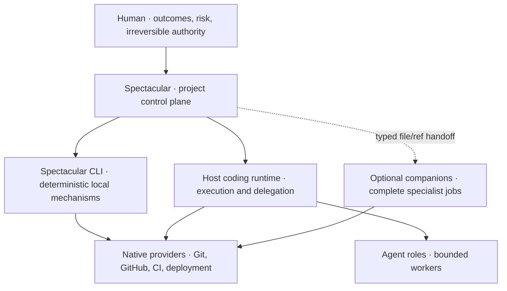

# Responsibility boundaries

This audit separates product responsibilities before any code or files move. It is a working
recommendation for decision sessions, not an approved ecosystem design.

The current refactor now serves as a live placement test: the need for cross-session decomposition,
typed handoffs, central checkpoint review, and cold resumption is an owner requirement. S07 still
decides whether high-ambiguity exploration belongs in Spectacular core or an optional companion;
the orchestration task remains authoritative while the evidence is gathered.

## Classification rule

A responsibility becomes a standalone **skill** only when it owns a coherent job, a stable trigger,
its own state or output contract, and useful standalone behavior. Otherwise classify it as:

- an **agent role** when it is a bounded worker with no independent durable lifecycle;
- a **mode/profile** when it changes how an existing Mission is executed;
- an **adapter** when it translates to an external provider or storage mechanism;
- a **deterministic mechanism** when code can validate or mutate it without product judgment.

Reducing `SKILL.md` size is not sufficient evidence for extraction.

## Verified current mismatch

The current PRD defines Spectacular as a lightweight Markdown/Git operational workspace and
explicitly excludes ticketing, documentation, Git replacement, and multi-agent orchestration.
The shipped system nevertheless owns substantial debugging, document-authoring, verification,
discovery, AFK/Git, policy, and agent-fleet behavior. Pageworks already proves that a responsibility
can leave Spectacular behind a sharp, optional, standalone file handoff. Git-ops proves that native
Git/GitHub workflow and safety do not need to be reimplemented inside Spectacular.

## Recommended responsibility stack



| Owner | Owns | Must not own by implication |
|---|---|---|
| Human | Product outcomes, business rules, risk appetite, irreversible authorization, accepted trade-offs | Mechanical bookkeeping or routine execution |
| Spectacular core | Project Anchors, accepted contracts, bounded work intent, decisions, lifecycle, evidence requirements, reconciliation, status/resume, responsibility routing | A model host, generic scheduler, public docs, Git client, ticket tracker, deployment platform |
| Spectacular CLI | Deterministic projections, schema validation, local lifecycle mutations, scaffolding, migration mechanics, generated help | Architectural judgment, semantic approval, hidden provider mutation |
| Host coding runtime | Repository inspection, planning the current attempt, edits, tests, bounded retries, optional delegation | Canonical lifecycle promotion or product-decision authority |
| Native providers/tools | Branches, commits, worktrees, issues, PRs, checks, merge, deployment and provider permissions | Spectacular's accepted meaning or durable project rationale |
| Companion skill | One complete specialist job and its own substrate/output | Direct mutation of Spectacular lifecycle or duplicated canonical truth |
| Agent role | One closed brief and bounded result | Independent product surface, durable collection, or lifecycle authority |

## Spectacular's proposed protected responsibility

Spectacular is the **project control plane**, not the executor or every specialist:

1. establish the bounded authoritative project context;
2. turn accepted intent into a contract delta and evidence requirement;
3. route work to the host runtime, a companion, an agent role, or a native provider;
4. preserve authority, scope, status, blockers, decisions, and resume state;
5. reconcile accepted evidence back into current contracts and records.

This boundary preserves the trustworthy loop without turning Spectacular into an agent platform.

## MVP companion recommendation

**No companion is mandatory.** A Spectacular workspace must remain complete and operable without
installing another skill. Companions are discovered and offered only when their job appears.

| Candidate | MVP classification | Responsibility | Integration boundary | Recommendation |
|---|---|---|---|---|
| pageworks | Proven optional companion | Public `docs/` authoring, schema, renderers, drift | Spectacular emits a source-change hint; pageworks owns `docs/` | Keep boundary; use as reference architecture |
| decision multiplexer | Leading in-session companion experiment | Classify impact/reversibility, map tensions/uncertainties, select evidence artifacts, stress alternatives, return a consequence-aware decision brief | Spectacular supplies decision need, refs, authority, scope; human disposes; companion never promotes | Run one manual S01–S03 experiment before designing the skill; prefer one deep engine with domain profiles |
| AI UX stress tester | First domain-profile candidate | UX tension axes, parametric states, resilience patterns, adversarial persona lenses, consequence audit | Profile reuses multiplexer handoff and returns UX evidence/hypotheses, never usability proof | Start as a profile/preset; split only if it earns distinct substrate, tools, and users |
| specwright | Shared-engine extraction candidate | Generic Markdown interview/refine/review engine and templates | Caller supplies document schema/rubric; result is a validated file plus report | Validate after decision boundaries; do not make mandatory until Spectacular and pageworks consume it cleanly |
| bugworks | First domain companion candidate | Hypothesis-driven diagnosis, traces, external-bug research, reusable fix signatures | Bug signal/brief in; diagnosis/fix evidence out; owning Mission closes in Spectacular | Validate after the Mission/evidence contract; companion owns its namespace, not `.spectacular` internals |
| verifyworks | Deferred extraction | Generic evidence execution and claim checking | Would return typed evidence without lifecycle authority | Keep verification/closure in core MVP; extract only after two unrelated consumers need the engine |
| wayfinder | Deferred product fork | Pre-commitment discovery and dependency resolution | Would emit a decision packet or draft contract, never call internal promotion | Decide Vision/Mission semantics first; current need can remain a Spectacular discovery mode |
| AFK/autonomy | Not a standalone skill | Authorization, stop conditions, resume manifest are core; Git execution belongs to runtime/git-ops | Manifest and permissions out; checkpoints/evidence back | Split responsibility instead of extracting the current subsystem wholesale |
| glossary | Not a skill | Vocabulary registry or document metadata | Owned by the contract/doc system that uses it | Keep as a small shared artifact; no independent lifecycle |

### Decision-work boundary

| Layer | Owns |
|---|---|
| Spectacular | Why the decision exists, authoritative inputs, human authority, dependencies, accepted disposition, durable record, and promotion |
| Decision multiplexer | Tension and uncertainty map, artifact selection, variants/harnesses, boundary stress, consequence comparison, and decision brief |
| AI UX profile | UX-specific axes, states, resilience patterns, heuristic persona lenses, and accessibility questions |
| Specwright | Authoring/refining/reviewing the accepted contract into a valid Markdown artifact |
| Human | The value trade-off, accepted risk, and final disposition |

## Named candidate placement

| Candidate | Recommended placement | Reason |
|---|---|---|
| spec-architect | Risk-triggered agent role under Spectacular design assurance | Produces a bounded contract/design review; no independent substrate |
| schema-designer | Specialist agent role invoked by spec-architect or host runtime | A technical lens, not a project lifecycle |
| issue-triage | Spectacular routing recipe plus GitHub adapter | GitHub owns the job card; Spectacular decides `direct | mission | spec-first` |
| roadmap-planner | Defer; later planning mode if roadmaps survive | Must follow the chosen work hierarchy rather than create one |
| drift-detector | Validator capability owned by each truth boundary | Docs drift belongs to pageworks; contract drift belongs to Spectacular |
| feature-runner | Mission execution profile in the host runtime | Feature is a contract-expanding Mission, not a product |
| refactor-pilot | Mission execution profile | Refactor preserves contracts and changes implementation |
| migration-runner | Mission profile plus deterministic migration adapter | Needs extra rollback/evidence gates, not a separate workspace |
| request-auditor | Core read-only verification agent role | Compares lifecycle claims with evidence; no mutation authority |
| policy-enforcer | Deterministic gate plus human escalation | Enforcement belongs at the operation boundary, not in another conversational skill |
| security/threat auditor | Risk-triggered independent reviewer role | A lens selected by touched boundaries; may later become a domain product |
| memory-curator | Core record-curation mode | Memory meaning and retention are project-control-plane concerns |
| session-handoff | Core run/resume contract | Continuity is part of Spectacular's central promise |
| retrospective | Core closure phase or optional report | Lessons reconcile into decisions, contracts, and memory |
| bidirectional bridge | Deferred provider adapter | Auto-sync risks two authorities; start read-only/reconcile and explicit one-way promotion |

## Companion handoff contract

A companion integration must cross one explicit edge:

```yaml
handoff:
  job: <bounded outcome>
  source_refs: [<stable refs>]
  authority: <who approved what>
  scope: <included and excluded boundaries>
  impact: <affected users, systems, contracts, and providers>
  reversibility: <rollback path, migration cost, and external commitments>
  uncertainty: <facts, feasibility, state, experience, or value>
  required_evidence: [<claims to prove>]
  permissions: [<allowed effects>]
  stop_conditions: [<when to return control>]
result:
  status: succeeded | blocked | failed
  artifact_refs: [<companion-owned files or provider refs>]
  evidence_refs: [<proof>]
  assumptions: [<remaining uncertainty>]
  next_action: <one concrete continuation>
```

The companion never edits Spectacular's lifecycle directly. Spectacular validates the returned
contract and performs any approved reconciliation.

## Extraction acceptance test

Before creating a companion:

1. demonstrate one standalone use without `.spectacular/`;
2. demonstrate one Spectacular handoff using only the declared contract;
3. prove canonical truth is not copied into two stores;
4. prove failure returns a usable blocked packet and does not strand lifecycle state;
5. measure total context and maintenance cost across both products;
6. keep the integration optional and discoverable;
7. reject the extraction if it only relocates files or requires private Spectacular knowledge.

## Decisions still required

- Whether the decision-multiplexer job remains coherent outside this refactor and which artifacts it owns.
- Whether AI UX is a multiplexer profile, a pack, or an independently valuable skill.
- Whether generic internal-document authoring is essential Spectacular behavior or a specwright
  service it consumes.
- Whether bugworks may apply code changes or only deliver diagnosis and repair evidence to a Mission.
- Where companion-owned state lives and how it is retained or archived.
- Whether independent verification needs a separate runtime identity before it needs a separate skill.
- Which discovery behavior is core intent formation versus optional Wayfinder exploration.

No extraction is approved by this audit.
