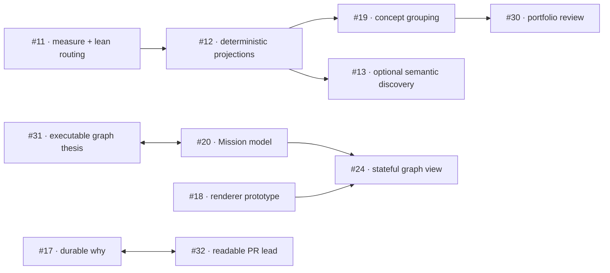

# Source 011 — GitHub open-issue corpus

## Corpus boundary

The GitHub connector returned all 23 open issues in `alexsmedile/spectacular` on
2026-08-07, including their complete bodies and all issue comments. This is a
time-bound backlog snapshot, not an instruction to implement every issue. Bodies and
comments are owner-authored proposals, audits, corrections, and maintainer reframes.

## Focus map

| Lane | Issues | Focus |
|---|---|---|
| Retrieval and prompt cost | [#11](https://github.com/alexsmedile/spectacular/issues/11), [#12](https://github.com/alexsmedile/spectacular/issues/12), [#13](https://github.com/alexsmedile/spectacular/issues/13) | measure-first lean routing, deterministic projections, optional advisory semantics |
| Goal and presentation contracts | [#17](https://github.com/alexsmedile/spectacular/issues/17), [#18](https://github.com/alexsmedile/spectacular/issues/18), [#19](https://github.com/alexsmedile/spectacular/issues/19), [#26](https://github.com/alexsmedile/spectacular/issues/26), [#32](https://github.com/alexsmedile/spectacular/issues/32), [#33](https://github.com/alexsmedile/spectacular/issues/33) | durable why, visual structure, concept batches, readable leads, concrete continuation |
| Mission and graph execution | [#20](https://github.com/alexsmedile/spectacular/issues/20), [#24](https://github.com/alexsmedile/spectacular/issues/24), [#31](https://github.com/alexsmedile/spectacular/issues/31) | portfolio Missions, graph supervision, executable node claiming and fan-out |
| GitHub and delivery | [#29](https://github.com/alexsmedile/spectacular/issues/29), [#30](https://github.com/alexsmedile/spectacular/issues/30), [#35](https://github.com/alexsmedile/spectacular/issues/35), [#36](https://github.com/alexsmedile/spectacular/issues/36) | AFK commits, portfolio issue review, repo scaffolding, conventional-commit enforcement |
| Guidance and metadata | [#37](https://github.com/alexsmedile/spectacular/issues/37), [#38](https://github.com/alexsmedile/spectacular/issues/38), [#39](https://github.com/alexsmedile/spectacular/issues/39), [#40](https://github.com/alexsmedile/spectacular/issues/40), [#41](https://github.com/alexsmedile/spectacular/issues/41) | quality rubric, Dublin Core, ADR lifecycle/accountability, optional debt scoring |
| Lifecycle entry and capture | [#42](https://github.com/alexsmedile/spectacular/issues/42), [#53](https://github.com/alexsmedile/spectacular/issues/53) | proportional Vision entry, correct Vision→SPC handoff, proposal-only capture surface |

## Dependency and collision chains

## Actionability summary

- **Decision-ready or narrowly scoppable:** #17, #18, #32, #33, #39, #40, #53.
- **Needs one scope/owner decision:** #11, #12, #19, #26, #35, #36, #37, #38.
- **Needs joint grilling:** #20 with #31; #24's model binding waits on them.
- **Deliberately deferred:** #13 until deterministic retrieval is stable; #29 until AFK/
  execution ownership settles; #41 until pack demand is demonstrated.
- **Needs user evidence:** #42 must distinguish discoverability from fit mismatch.
- **Already prototyped by this refactor:** #19 and #30—the concept database, collision
  matrix, maps, and portfolio synthesis exercise their central behavior.

## Cross-source convergence

- #11/#12 strengthen Sources 001, 005, and 009: lean routing and measurable projections.
- #13 converges with Sources 007–010 but preserves deterministic authority more clearly.
- #20/#31 collide with Source 006's single-agent MVP and amplify Sources 008–010.
- #18/#24 support PZL-120 while distinguishing proposal diagrams from live state views.
- #30 describes the exact portfolio-ingestion workflow being prototyped in this Vision.
- #37 supports anti-slop intent but risks loading generic model knowledge into project context.
- #42 provides real usage evidence that existing Vision ceremony may have a fit problem.

## Issue evidence cards

Individual snapshots live under [`issues/`](issues/) and link back to GitHub for full
bodies and comments. They preserve problem, proposal, relationships, and actionability;
atomic PZL cards remain the comparison and decision units.

## New concept pieces

Source 011 adds PZL-128 through PZL-149. The issue corpus is evidence for those pieces,
not approval of their implementation.
