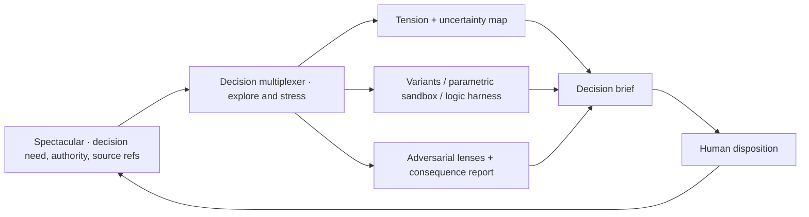

# Source 013 — AI UX stress testing and decision-space multiplexing

## Thesis

Use AI as a design stress-test engine: expose contradictions, build extreme or parametric interaction
models, simulate adversarial user lenses, and condense consequences into a decision brief. The source
packages this as an AI UX skill pack. The owner extends it into a broader companion hypothesis: a
decision multiplexer that maps possibilities and uncertainties, selects evidence artifacts, and
accelerates design decisions alongside Spectacular.

## What is new beyond Source 012

1. **Tension-first framing:** explicitly name opposing goals before producing layouts or code.
2. **Parametric boundary-state sandboxes:** vary latency, confidence, autonomy, volume, and failure
   conditions within one artifact rather than only comparing discrete designs.
3. **Synthetic persona review:** use contrasting user lenses as adversarial prompts before human
   research, with strict limits on evidentiary authority.
4. **Consequence-first UX auditing:** require failure mode, irreversible consequence, fallback, and
   retained user control for AI-mediated actions.
5. **AI interaction resilience patterns:** intent previews, graceful structured degradation,
   user-visible context steering, and mixed-initiative control.
6. **A general companion boundary:** one decision-space multiplexer with domain profiles may be
   deeper and more reusable than many shallow command skills.

## Corrections and evidence limits

| Proposal | Intake correction |
|---|---|
| Four to six variants and five or ten personas | Counts are arbitrary; use the fewest contrasts that expose material boundaries. |
| Synthetic user cohort “testing” | LLM personas are adversarial heuristic lenses, not user research, accessibility validation, or evidence of real behavior. |
| Cognitive Friction Score, Misinterpretation Risk, Time-to-Trust | These are undefined unless tied to observable rubrics or real measurements; generated numbers would be pseudo-precision. |
| TRIZ resolves UX contradictions | A tension matrix structures alternatives; it cannot decide value trade-offs or prove usability. |
| Skip static design tools | Interactive artifacts help dynamic uncertainty, while static diagrams remain cheaper for hierarchy, language, and early structure. |
| One automated pipeline resolves 10–20 questions | Correlated generator/evaluator models can share blind spots; human authority and bounded review remain necessary. |
| Three core skills plus orchestrator | Tool calls do not establish product boundaries; responsibility, substrate, and standalone value do. |

## Proposed decision-multiplexer boundary

The companion does not approve a choice, mutate Spectacular lifecycle, or author final canonical
contracts. It returns evidence and an option/consequence brief. Spectacular records authority,
disposition, dependencies, and promotion. Specwright may later author the accepted contract.

## Skill-shape recommendation

Validate one **deep general companion** manually before creating several skills:

- core engine/profile: tension mapping, uncertainty tree, artifact selection, option matrix,
  boundary stress, consequence synthesis;
- first domain profile: AI UX stress testing with UX axes, failure states, accessibility lenses,
  and resilience patterns;
- later domain profiles only after real repeated use: architecture, schema/state machines,
  migrations, security threat choices, or operational workflows.

## Foundation Plan impact

The decision order remains unchanged. Source 013 strengthens S07's companion question and gives the
current refactor a direct prototype opportunity: run one manual decision-multiplexer pass during a
real session, measure retained decisions and artifact cost, then decide whether the job earns a skill.

## New concept pieces

Source 013 adds PZL-157 through PZL-166 and reinforces PZL-112, PZL-115, and PZL-150–156. Its
repetition of Source 012 is clarification, not independent empirical corroboration.
