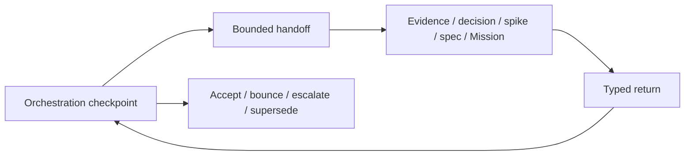

# Synthesis 012 — distributed refactor orchestration

## Owner requirement added

This refactor is not only planning a product capability; it is a live stress test of it. The
required capability is to assemble a large, contradictory corpus into decisions and contracts,
distribute bounded work across context windows and agents, and preserve enough durable state for a
fresh session to resume safely. Whether all of that belongs in Spectacular core or partly in an
optional decision/refactor companion remains an S07 product decision.

## Control-plane split

The current task becomes the program orchestration and checkpoint-review session. It owns the whole
dependency graph, accepted upstream contracts, handoff design, traffic control, return review,
owner dispositions, reconciliation, and one safe next action. Side sessions own bounded evidence,
decision grilling, spikes, specifications, implementation Missions, or fresh-context review. They
return typed packets and never promote themselves or authorize successors.

## Boundary rules clarified

- A session is a context boundary; a Mission is a durable outcome; an agent is a role; a run is an
  attempt; a branch isolates mutations.
- Read-only work creates no branch. Concurrent writes need disjoint scopes, separate worktrees, an
  exact baseline, and a designed join.
- One implementation Mission owns one branch and one reviewable PR. Shared CLI, schema, registry,
  lifecycle, canonical-contract, and test surfaces are serialized.
- The program branch is planning state, not an implementation branch. Merge, deployment, PR-ready,
  destructive cleanup, and remote deletion remain separately authorized human/provider actions.

## First constitutional dispatch

1. H01 audits current product claims, actual responsibilities, load-bearing behavior, and
   contradictions without deciding the future product. In parallel, H04 uses a different model and
   fresh context to attack the method, decision order, responsibility boundaries, and execution
   guardrails.
2. This task dispositions H04's blocking findings and corrects the program before constitutional
   grilling begins.
3. H02 runs S01 Product Constitution through owner-directed, one-decision-at-a-time grilling.
4. H03 independently checks the draft for contradiction, hidden expansion, and premature
   architecture or authority commitments.
5. This task accepts, bounces, or escalates the packet before S02 begins.

Product identity now precedes the success rubric: metrics cannot judge a refactor coherently until
the product promise and protected loop are known. S01 and S02 were reordered accordingly.

## Current state

- Sources ingested: 14.
- Atomic concepts: 171.
- GitHub issue evidence cards: 23.
- Human dispositions: 0.
- Promoted specifications: 0.
- Product decisions approved: 0.
- Planning baseline still requires a focused commit before independent tasks rely on it.

This checkpoint changes the operating method and session order. It does not approve the product
constitution, companion topology, implementation architecture, or any subsystem deletion.
