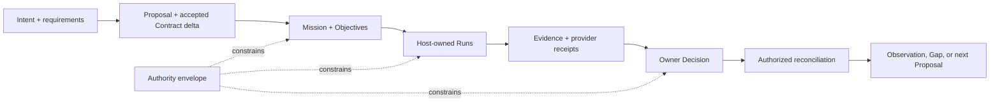

# Synthesis 025 — SDLC coherence audit before S10

## Central assessment

Source 016 does not supply reversal-grade evidence. Its value is a completeness lens over the eleven
accepted contracts: Spectacular must support projects whose work passes through conventional SDLC
concerns without owning a coding runtime, deployment provider, organization backlog, or universal
phase sequence.

## Current coherent mapping

Requirements and design may be developed through Proposals, Gaps, decisions, prototypes, or linked
technical material. Implementation and testing occur in host-owned Runs. Deployment and production
effects remain provider-owned. Evidence and owner disposition authorize reconciliation. Operational
observations can expose a contract violation, Gap, or new Proposal without rewriting completed
history.

## Four questions for adversarial review

1. **Coverage:** Is any consequential SDLC claim left without an authority, durable pointer, or
   safe continuation path?
2. **Feedback:** Can material learning revise direction without mutating an active Mission's accepted
   scope or creating a second progress authority?
3. **Operations:** Can deployment, observation, incident repair, and maintenance be represented
   honestly while providers remain authoritative for their effects?
4. **Coordination ceiling:** Can multiple actors and concurrent Missions orient and exchange work
   safely without Spectacular becoming a scheduler, Scrum simulator, or project-management suite?

## Preliminary judgment

- The accepted model is deliberately **method-neutral hybrid governance**: invest and lock according
  to consequence/reversibility, then execute iteratively inside the accepted envelope.
- The core should model authoritative transitions and evidence, not Scrum ceremonies, sprint
  cadence, specialist personas, or fixed SDLC stages.
- Completion boundaries already admit deployment and observed-environment claims; H16 should test
  concrete maintenance and incident scenarios rather than inventing a new lifecycle.
- Portfolio WIP limits and staffing priority remain organizational/provider concerns unless H16 can
  show that their absence breaks Mission accountability, cold recovery, or safe concurrency.

## Gate

H16 is a read-only, fresh-context skeptical review. It must return either:

- `coherent`: no missing Type-1 foundation; proceed to S10 with named S10/S11 checks; or
- `gap`: one or more precise foundational omissions, affected accepted contracts, cheapest
  decision question, and downstream impact.

It cannot authorize S10. Central orchestration must accept, bounce, or escalate its return first.
