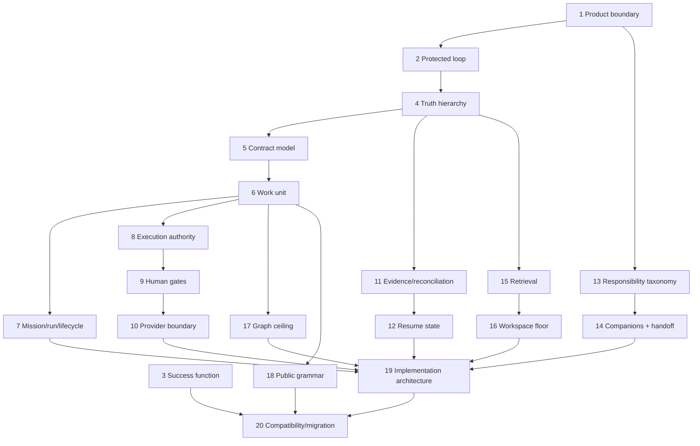

# Top 20 foundational refactor decisions

## Ranking method

These are ranked by combined product blast radius, dependency fan-out, cost of later reversal, and
long-term maintenance effect—not by ease, novelty, or current line count. Recommendations are
starting hypotheses for the named decision sessions, not defaults. H02 has supplied owner
dispositions for S01, but they remain pending H03 and central acceptance; all other rows remain
undisposed. Every session must include a credible narrower alternative and must not inherit another
row's working answer as authority.

| Rank | Foundational decision | Working recommendation | Why a wrong choice is expensive | Session |
|---:|---|---|---|---|
| 1 | Product promise and boundary | Spectacular is a Markdown/Git-native project control plane for durable intent, work coherence, evidence, and continuity—not an agent host, PM suite, docs system, Git client, or scheduler | Every feature, extraction, command, and metric depends on this identity | S01 |
| 2 | Protected behavioral loop | Protect `understand → accept contract delta → execute bounded work → prove → reconcile → resume` | Cutting any link makes the product either a prompt pack or a record archive | S01 |
| 3 | Refactor success function | Weight correctness/continuity first, then adoption simplicity, retrieval cost, maintainer cost, compatibility, and validated decisions per human-attention unit; classify impact/reversibility and benchmark retention and reversal | Otherwise every subsystem or workflow is judged by whichever raw metric favors it | S02 |
| 4 | Truth and authority hierarchy | Code/tests and observed behavior describe implementation reality; accepted contracts describe intended truth; evidence authorizes reconciliation; records preserve why | Confused authority creates silent drift and unsafe automation | S03 |
| 5 | Contract information model | Capability-first contracts with embedded component/interface/state/policy sections; promote typed nodes only when repeated complexity earns them; graph is derived initially | Schemas and cross-links are costly to migrate once users build workspaces around them | S03 |
| 6 | Canonical work unit | Use Mission as one bounded approved contract delta; do not add a portfolio Mission layer to MVP until linked goals prove insufficient | Work identity determines every lifecycle, path, command, and integration | S04 |
| 7 | Mission, run, and lifecycle separation | Mission is durable intent; a run is a resumable attempt; use one compact Mission lifecycle with orthogonal blocked/aborted state | Combining attempts with intent or multiplying state machines makes retries, resumption, and audit history incoherent | S04 |
| 8 | Execution authority | Spectacular compiles scope, permissions, context, and gates; the host coding runtime executes | Building another model host/scheduler is a product rewrite and permanent maintenance obligation | S05 |
| 9 | Human authority model | Use consequence-based gates and an accountable advice process: one legitimate owner consults affected experts and decides or escalates; routine bounded execution does not repeatedly stop | Too many gates destroy autonomy; too few or ambiguous owners destroy trust | S05 |
| 10 | Side-effect and provider boundary | CLI mutations are deterministic and local; Git/GitHub/CI/deployment mutations use native providers with explicit flags; no hidden network writes | Provider duplication produces security, compatibility, and stale-state failures | S05 |
| 11 | Evidence and reconciliation contract | Define required evidence before execution, map proof to contract clauses, and reconcile only after the evidence gate | Closure without this contract institutionalizes intent/code drift | S06 |
| 12 | Durable resume state | Persist minimal authoritative checkpoints, blockers, evidence pointers, baseline, and one next action; keep raw logs separate | Continuity is the core long-running-agent promise and hard to retrofit across workflows | S06 |
| 13 | Responsibility taxonomy | Distinguish core capability, companion skill, agent role, Mission profile, adapter, and deterministic mechanism using explicit qualification tests | Misclassification creates shallow products, circular dependencies, and duplicated state | S07 |
| 14 | Companion ecosystem and handoff | No mandatory companions; keep pageworks optional; validate the decision multiplexer manually with AI UX as its first profile, then validate specwright and bugworks; companions own results and return typed refs/evidence without mutating Spectacular lifecycle | Packaging, namespaces, discovery, and shared writable state become extremely costly to unwind | S07 |
| 15 | Retrieval and instruction architecture | Lean domain router, CLI-owned command help, one registry authority, tiered references, deterministic projections, measured cold-start budget | Routing is loaded constantly; mistakes compound in every task and every release | S08 |
| 16 | Minimum workspace and growth rule | Scaffold only universal context and the first work entry; create optional collections on first write; kits offer presets, not mandatory endpoints | The initial file contract becomes the long-lived migration burden and adoption experience | S08 |
| 17 | Graph and multi-agent ceiling | Adopt explicit relationships, objective dependencies, derived maps, and bounded attempts; defer scheduler/concurrent node execution until a thin slice proves need | Premature orchestration changes the product category and introduces distributed-state complexity | S03/S04/S10 |
| 18 | Public vocabulary and interface grammar | Choose one neutral canonical model and one command path per concept; use metaphor only as optional presentation; generate help/deprecations from authority | Public nouns, IDs, paths, and commands create ecosystem-wide compatibility obligations | S04/S09 |
| 19 | Target implementation architecture | Modularize behind deep command/domain interfaces and earned seams at demonstrated volatile boundaries while preserving one portable distribution artifact; rewrite only with measured proof | The wrong module seams merely distribute the monolith, create speculative indirection, or lock in a second implementation | S11 |
| 20 | Compatibility and migration strategy | Stabilize safety defects, freeze contracts, mechanically check declared interface compatibility, ship warnings and exact replacements, preserve recovery refs, then remove at an explicit major-version boundary | Big-bang removal or indefinite aliases can respectively destroy trust or preserve permanent bloat | S11 |

## Dependency spine

## What is intentionally below the top 20

Vocabulary details, exact command names, individual collection cuts, hook counts, agent roster,
Dublin Core, debt scoring, semantic retrieval, visualization syntax, and exact language/runtime
choice matter—but they are downstream of the decisions above. They should not be allowed to lock
the architecture prematurely.

The two verified safety defects remain urgent stabilization work even though they are not strategic
architecture decisions.
