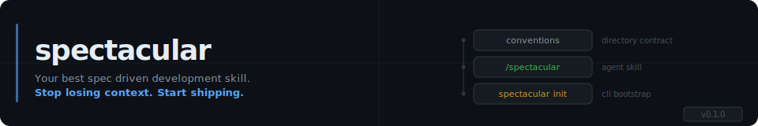
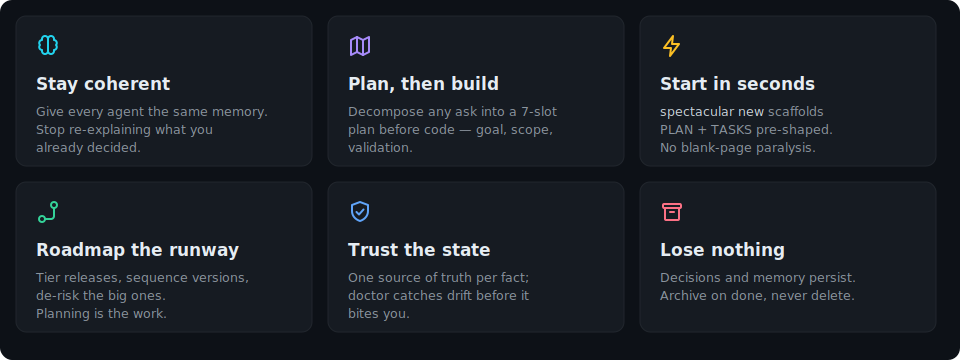
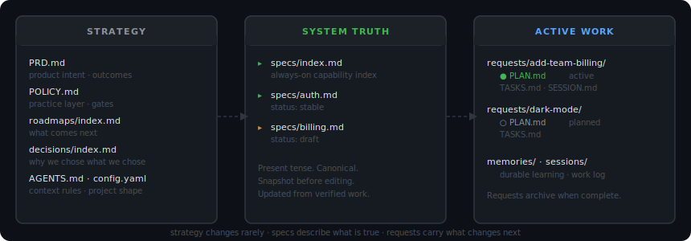
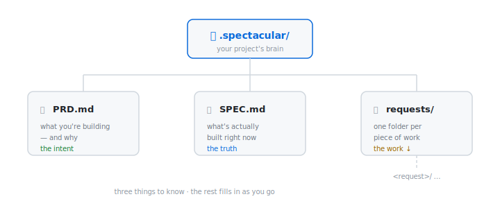
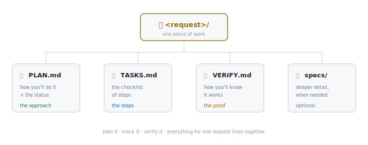

<div align="center">




</div>

---

## No spec. No plan. No clue.

**Agents act before they understand.**

AI agents act on the first thing they find. Hand one a request and it starts coding immediately — without a spec, without a plan, without knowing *what* the project is or *why* the work matters. It can't see what was decided, what phase you're in, or what comes next.

The bottleneck isn't writing code. It's giving agents — and yourself — the context to write the *right* code. That context has to be planned, not assumed.

---

## A spec-driven protocol for agents

Spectacular is a spec-driven protocol for ideating, planning, scaffolding, and acting on projects with AI agents — keeping track of the changes, phases, tasks, and decisions so agents always know *what* they're doing and *why*. Drop a `.spectacular/` directory in any repo and it becomes the spec and shared context every agent works from.

Strategic context is split across seven focused canonical docs (PRD / PRINCIPLES / ARCHITECTURE / ROADMAP / STACK / DECISIONS / AGENTS) so agents load only what each task needs, not the entire repo.

It ships as three layers:

- **Convention** — a structured directory contract separating strategy, current truth, and active work
- **Skill** — a `/spectacular` Claude Code slash command that reads state, proposes actions, scaffolds files, and manages lifecycle transitions
- **CLI** — `spectacular init` bootstraps the workspace in any project in seconds

The skill is the primary interface. The CLI runs once.

> **Agents build. Humans decide.** Agents are made for building — humans, for deciding what's worth building.

In short, here's how spectacular helps you build your projects:



---

## Quick start

```bash
# Install the CLI
curl -fsSL https://raw.githubusercontent.com/alexsmedile/spectacular/main/cli/install.sh | bash

# Bootstrap any project
cd your-project
spectacular init

# Open Claude Code or Codex and run
/spectacular
```

> [!TIP]
> `spectacular init` scaffolds the `.spectacular/` directory and installs the `/spectacular` skill into `.agents/skills/spectacular/` (source) and `.claude/skills/spectacular/` (symlink). After init, `/spectacular` is immediately available to Codex and Claude Code.

> [!NOTE]
> `spectacular init` is zero-prompt by default. It infers the project name from the folder slug and uses `AGENTS.md` as the primary agent context file. Pass `-i` for interactive setup, or use flags: `--name`, `--summary`, `--agents-file`, `--skill-scope <project\|global\|none>`. If spectacular is already installed (globally, upstream, or as a plugin) init detects it, warns, and skips the redundant skill install.

---

## The shape of it

### The three layers



**Strategy** — changes rarely. Split across focused canonical docs:
- `PRD.md` — *what* the product is and *why*
- `PRINCIPLES.md` — operating principles + runtime enforcement hooks
- `ARCHITECTURE.md` — the workspace structure itself
- `roadmaps/index.md` — versioned future work
- `STACK.md` — host project's tech choices
- `decisions/index.md` — ADR-style decision log
- `AGENTS.md` — onboarding doc for any agent landing in `.spectacular/`

Agents load only what the current task needs (planning loads PRD + PRINCIPLES + decisions/index.md; implementation loads STACK + PLAN + TASKS).

**Current truth** — `specs/index.md` is the cheap, always-on index of what the system does now; promote a dense bullet to a flat `specs/<capability>.md` only when it earns the detail. Never overwrite either in place — snapshot before editing.

**Active work** — temporary. Each request gets a folder with `PLAN.md` (intent + 7-slot decomposition: goal, constraints, milestones, tasks, dependencies, validation, deliverables) and `TASKS.md` (execution checklist). Archived on completion, not deleted.

---

### The lifecycle


State lives in `PLAN.md` frontmatter. The skill reads it on every invocation and surfaces the highest-priority next action. When all tasks are checked, it proposes moving to `review`. When the checklist passes, it proposes `archived` — and offers to update `specs/index.md` and any affected capability specs.

---

### The workspace

New here? Two things to understand. First, what lives at the top of `.spectacular/`:

<picture>
  <source media="(prefers-color-scheme: dark)" srcset="docs/assets/workspace-tree-dark.svg" />
  
</picture>

And second, what's inside any one request:

<picture>
  <source media="(prefers-color-scheme: dark)" srcset="docs/assets/request-tree-dark.svg" />
  
</picture>

That's the whole idea. The full layout, once a project fills in:

```
.spectacular/
├── PRD.md              # product intent — what & why & for whom
├── POLICY.md           # practice layer / merged policy contract
├── config.yaml         # naming, kit identity, agent file overrides
├── AGENTS.md           # onboarding doc for agents working in this folder
├── requests/           # active and planned work
├── specs/              # per-capability specs + index.md system spec
 
│   ── opt-in (scaffolded by kit declaration or --with flag) ──────────
├── PRINCIPLES.md       # operating principles + enforcement hooks
├── ARCHITECTURE.md     # .spectacular/ structure, frontmatter, lifecycle, versioning
├── roadmaps/           # roadmaps/index.md + shipped v*.md files
├── STACK.md            # host project's tech choices
├── decisions/          # ADR decision index + D*.md files
 
│   ── created on demand ─────────────────────────────────────────────
├── memories/           # long-term operational learning (git-committed)
├── feedbacks/          # prototyping-mode feedback entries (v1.6.0+)
├── ideas/              # thinking scratchpad — not acted on automatically (v1.7.0+)
├── debugs/             # live debug-job traces — one folder per bug (v1.26.0+)
├── audits/             # diagnostic examinations earned at resolution (v1.25.0+)
├── fixes/              # reusable verified-fix library, greppable (v1.25.0+)
├── sessions/           # work time-log sessions/index.md + S*.md files
└── archive/            # completed requests (never deleted)
```

A typical coding project (`spectacular init --kit coding`) scaffolds the always-set + `STACK.md` + `ARCHITECTURE.md`. A doc-only or research project (`spectacular init --kit research` or `--kit blank`) gets only the always-set. Smart-init never overwrites existing files — re-running is always safe.

`.spectacular.local/` — personal overrides, always gitignored.

---

### The agent fleet (v1.30.0)

Spectacular ships a fleet of focused subagents the skill delegates to — so heavy, self-contained work runs in its own context window instead of crowding the main thread. Every agent obeys one boundary: **a closed handoff in, findings / a diff / a pass-fail out — and the orchestrator is the only thing that mutates state** (ticks a checkbox, moves lifecycle, writes the ledger). Agents propose; the orchestrator decides and records.

The fleet is a **discover → apply → review → verify** grid across the two directions of work — fixing a bug and building a milestone — plus specialists:

| | **discover** | **apply** | **review** |
|---|---|---|---|
| **fix a bug** | `debug-investigator` — where + why | `debug-fixer` — a closed fix → diff | `code-reviewer` — a diff, 5 lenses |
| **build a milestone** | `repo-explorer` — map the subsystem | `spec-builder` — a closed milestone → diff | `spec-reviewer` — a spec vs. the code |

Plus **`debug-researcher`** (is this a known *external* bug?) and **`test-verifier`** (independently run a check or write a test → honest pass/fail). The two reviewers are read-only and never fix what they find; `code-reviewer` guards code, `spec-reviewer` guards the spec files — checking each claim in `specs/` still matches what the code actually does.

Agent definitions live in `agents/` at the repo root (the source of truth); the skill dispatches them through its bug- and build-workflow arcs, always as **optional, judgment-gated** steps — a trivial change never pays for a review it doesn't need.

---

## Skill commands

| Command | What happens |
|---|---|
| `/spectacular` | Project briefing — active requests, draft capabilities, next action |
| `spectacular status` | Same as no-arg invocation |
| `spectacular new <slug>` | Scaffold a new request (PLAN.md + TASKS.md) |
| `spectacular advance <slug>` | Advance lifecycle: `planned → active → review → verified` (`promote` remains a deprecated alias) |
| `spectacular snapshot <file>` | Snapshot a canonical document before editing |
| `spectacular touch <file>` | Bump `updated:` on a canonical doc |
| `spectacular archive <slug>` | Archive a completed request; propose `specs/index.md` sync + memory entries |
| `spectacular remember this` | Write an insight to `memories/` immediately |
| `spectacular decide "<decision>"` | Append an ADR entry; `--context`/`--consequences` fill the other sections (v1.8.4+) |
| `spectacular feedback-loop` | Prototyping-mode human-feedback loop — pick target, craft proposal, ask user, capture, decide (v1.6.0+) |
| `spectacular idea` | Thinking-scratchpad ideas — `new\|list\|promote`. Promotion scaffolds a request + archives the idea (v1.7.0+) |
| `spectacular summary` | One-page workspace overview: counts of requests/decisions/memories/sessions/ideas/feedback (v1.8.0+) |
| `spectacular requests` | List requests; filter with `--status`, `--active`, `--since`; `--json` for agents (v1.8.0+) |
| `spectacular request <slug>` | Skim view of one request (frontmatter + outline + milestone progress); `--full` for raw (v1.8.0+) |
| `spectacular decisions` / `decision <slug>` | List/inspect decisions (v1.8.0+) |
| `spectacular memories` / `memory <slug>` | List/inspect memories (v1.8.0+) |
| `spectacular sessions` / `sessions show <slug>` | List/inspect sessions read-only (v1.8.0+) |
| `spectacular show <doctype>` | Dump canonical doc (`prd\|spec\|principles\|...`); `--section <h2>` filters (v1.8.0+) |
| `spectacular progress <slug>` | Milestone tick rate from TASKS.md (v1.8.0+) |
| `spectacular paths` | JSON map of conventional workspace paths (v1.8.0+) |
| _(bug report to `/spectacular`)_ | Debug agent fleet — the skill checks prior `fixes/`, decides audit-first vs just-fix, delegates to read-only `debug-investigator` / apply-only `debug-fixer` / `debug-researcher`, then graduates a verified fix to the library. Traces land in `debugs/`; reusable remedies in `fixes/` (v1.26.0+) |
| `spectacular fix new` / `audit new` | Log a verified fix / open a diagnostic audit (the debug-fleet library verbs); `fix new --debug-job <slug>` back-links the trace (v1.25.0+, `--debug-job` v1.26.0) |

> [!NOTE]
> **`spectacular docs *` verbs were removed in v1.17.0.** Public-facing documentation work lives in the standalone [pageworks](https://github.com/alexsmedile/pageworks) skill. `doctor docs` (discovery-only) remains. Install pageworks via its own one-liner.

---

## CLI reference

```
spectacular init                              # always-set + blank kit (5 files only)
spectacular init -i                           # interactive — kit menu + per-doc prompts
spectacular init --kit coding                 # always-set + coding kit's STACK + ARCHITECTURE
spectacular init --with principles,roadmap   # additive — those two on top of always-set
spectacular init --kit coding --minimal       # always-set only; kit identity preserved
spectacular init --name my-app
spectacular init --agents-file CLAUDE.md      # use CLAUDE.md instead of AGENTS.md
spectacular init --skill-scope global         # install skill to ~/.agents/ and ~/.claude/
spectacular init --skill-scope none           # scaffold only; skip skill install (already installed elsewhere)
spectacular init --update                     # re-download latest skill release

spectacular doctor                            # substrate self-check (all areas)
spectacular doctor <area>                     # scoped: skill | workspace | frontmatter | snapshots | links | lifecycle | kits | conventions | specs | docs | personas | memory | sessions | feedback | ideas | debug | policies | vision | decisions | roadmap
spectacular doctor --fix                      # apply mechanical fixes (gitignore, missing dirs, dangling symlinks, pack drift, legacy current/ migration)
spectacular doctor --format json              # JSON report for the skill or other tools

spectacular feedback-loop new <target>        # scaffold a feedback entry (status: open); --request <slug> to scope
spectacular feedback-loop list                # list entries across .spectacular/feedbacks/ + per-request folders
spectacular feedback-loop resolve <slug> --next-action <a>   # close with a decision (required flag)
spectacular feedback-loop archive <slug>      # move to .spectacular/archive/feedback/<year>/

spectacular idea new <slug>                   # scaffold idea entry (status: parked); --hypothesis, --origin, --priority
spectacular idea list                         # list ideas; --status parked|exploring|promoted|all
spectacular idea promote <slug>               # scaffold request from idea + move source to archive/ideas/

spectacular summary                           # one-page workspace overview (v1.8.0+)
spectacular requests --active                 # list active requests (table + --json)
spectacular requests --status review --since 7d --limit 10
spectacular request <slug>                    # skim view (frontmatter + outline + progress); --full for raw
spectacular decisions [--tag t] [--since 30d] [--json]
spectacular decision <slug>                   # skim view of one decision
spectacular memories [--tag t] [--since 7d] [--json]
spectacular memory <slug>                     # skim view of one memory
spectacular sessions [--status open|closed|all] [--since 24h]
spectacular sessions show <slug>              # detail subverb (avoids `session start|end` collision)
spectacular show <doctype>                    # prd|spec|principles|architecture|roadmap|stack|agents|...
spectacular show <doctype> --section <name>   # filter to one H2 section
spectacular progress <slug>                   # M1: 8/8 ✓, M2: 3/5, ... (parses TASKS.md ticks)
spectacular paths                             # JSON map of workspace paths

spectacular migrate                           # apply pending workspace schema migrations
spectacular migrate --dry-run                 # preview the migration plan
spectacular migrate --list                    # show all available migrations + current schema version

spectacular pack list                         # show installed packs (bundled + app-store + user + project-local)
spectacular pack install <name>               # install pack to ~/.spectacular/packs/<name>/
spectacular pack install <name> --from <path> # install from arbitrary local folder
spectacular pack show <name>                  # print scope + pack.md frontmatter
spectacular pack remove <name>                # remove user-scope pack (--force for bundled/app-store/project-local)
```

### Convention packs (v0.4.0)

Packs encode opt-in repo-shape opinions — naming rules, folder taxonomy, gitignore baseline, README contract, file-placement rules, project-type scaffolds. Two ship out of the box:

- **`minimal`** (bundled) — README contract + safe gitignore baseline. The default.
- **`alex-default`** (app-store) — fully-opinionated: kebab-case naming with role suffixes, mono-collection detection, 8 project-type scaffolds, language-specific gitignore blocks.

Activate a pack per-repo by adding to `.spectacular/config.yaml`:

```yaml
convention_pack:
  source: alex-default
  mode: scaffold     # suggest | scaffold | enforce
```

| Mode | Init behavior | Doctor behavior |
|---|---|---|
| `suggest` | Pack read, not applied | Reports pack active, no drift checks |
| `scaffold` | Appends pack gitignore entries | Warnings on drift (exit 1) |
| `enforce` | Same as scaffold | Errors on drift (exit 2); `--fix` repairs |

Full schema in [`skills/spectacular/references/packs-contract.md`](skills/spectacular/references/packs-contract.md). App-store packs live in [`packs/`](packs/).

> [!TIP]
> Init scaffolds the **6-file always-set** by default (`PRD.md`, `POLICY.md`, `config.yaml`, `<agents-file>`, `requests/`, `specs/index.md`). Kits add docs they need. Use `--with` for explicit extras. Use `--minimal` to ignore the kit's defaults. (v0.4.x scaffolded `current/` instead of `specs/index.md` + `specs/` — see [CHANGELOG](CHANGELOG.md) for the migration.)

> [!TIP]
> Claude-only team? Use `--agents-file CLAUDE.md`. Multi-tool team? Keep `AGENTS.md` as primary and add `tool_overrides.claude: CLAUDE.md` to `config.yaml` — the skill will surface both.

---

## Works well with

Spectacular owns one thing — `.spectacular/`: strategy, current truth, active work. It composes with focused sibling tools rather than absorbing their jobs.

### Best with — pageworks

**Public-facing documentation (the `docs/` surface) is owned by [pageworks](https://github.com/alexsmedile/pageworks)**, a sibling skill extracted in v1.2.0. The two compose: when a SPEC-touching request archives, spectacular asks whether `docs/` should be updated and hands off to pageworks if you confirm. `spectacular doctor docs` reports discovery only (folder + manifest presence; install hint if pageworks missing) — never validates schema. There is no automatic invocation across the boundary.

```bash
curl -fsSL https://raw.githubusercontent.com/alexsmedile/pageworks/main/cli/install.sh | bash
```

### Also pairs with

- **Claude Code / Codex / Cursor** — the agents that read `.spectacular/` and act on it. Spectacular is the protocol; these are the runtimes.
- **Git** — `.spectacular/` is fully committed, so phases, decisions, and changelogs version alongside your code. `.spectacular.local/` stays gitignored.

> Building a tool that composes with the `.spectacular/` contract? [Open an issue](https://github.com/alexsmedile/spectacular/issues) — this list is meant to grow.

---

## Built for

- Solo developers using Claude Code, Codex, or Cursor on projects that span weeks or months
- Small teams where AI agents need to share operational context
- Anyone who has re-explained the same architectural decision to an agent more than twice

## Not built for

- Projects that live and die in a single session — the structure has no value at that scale
- Teams that already have a working context management system
- Non-technical users — this is a developer-facing directory convention, not a GUI tool

---

## Install

**CLI** — curl one-liner, installs `spectacular` to `~/.local/bin/`:

```bash
curl -fsSL https://raw.githubusercontent.com/alexsmedile/spectacular/main/cli/install.sh | bash
```

**Claude Code plugin** — from Claude Code:

```text
/plugin marketplace add alexsmedile/spectacular
/plugin install spectacular@spectacular
/reload-plugins
```

You can also use the Claude Code CLI:

```bash
claude plugin marketplace add alexsmedile/spectacular
claude plugin install spectacular@spectacular
```

**Codex plugin** — add the marketplace, then install the plugin:

```bash
codex plugin marketplace add alexsmedile/spectacular
codex plugin add spectacular@spectacular
```

To update an existing install, refresh its marketplace snapshot, then install the refreshed plugin:

```bash
codex plugin marketplace upgrade spectacular
codex plugin add spectacular@spectacular
```

If adding the marketplace fails after a previous install, remove its stale local registration and add it again:

```bash
codex plugin marketplace remove spectacular
codex plugin marketplace add alexsmedile/spectacular
codex plugin add spectacular@spectacular
```

You can also manage the marketplace and plugin from Codex's `/plugins` screen.

**Skill only** (no CLI, no plugin marketplace):

```bash
# manual
cp -r skills/spectacular ~/.claude/skills/
mkdir -p ~/.agents/skills
cp -r skills/spectacular ~/.agents/skills/
```

**Skill install locations:**

| Scope | Source | Claude symlink |
|---|---|---|
| Project-local (default) | `.agents/skills/spectacular/` | `.claude/skills/spectacular/` → above |
| Global (`--skill-scope global`) | `~/.agents/skills/spectacular/` | `~/.claude/skills/spectacular/` → above |

---

---

## Documentation

| Doc | What it covers |
|---|---|
| [docs/workflow.md](docs/workflow.md) | Practical end-to-end usage loop — init, briefing, requests, lifecycle, archive, current sync, memory |
| [docs/commands.md](docs/commands.md) | CLI command reference and agent skill triggers, including the boundary between shell commands and skill commands |
| [docs/troubleshooting.md](docs/troubleshooting.md) | Common setup, install, skill discovery, update, symlink, and workspace state issues |
| [docs/configuration.md](docs/configuration.md) | `config.yaml`, agent files, tool overrides, request naming, and `.spectacular.local/` |
| [docs/scaffold.md](docs/scaffold.md) | Complete `.spectacular/` directory spec — every file, frontmatter schema, creation rules, versioning |

---

<div align="center">

Built with [Claude Code](https://claude.ai/code)

</div>
