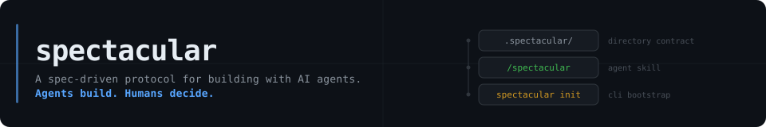
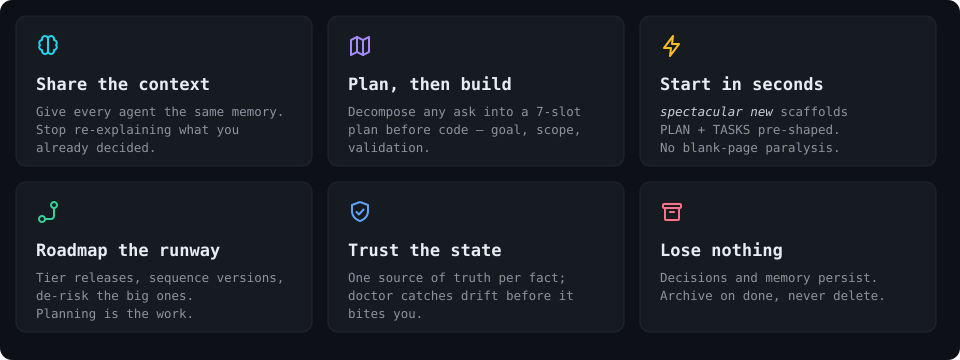
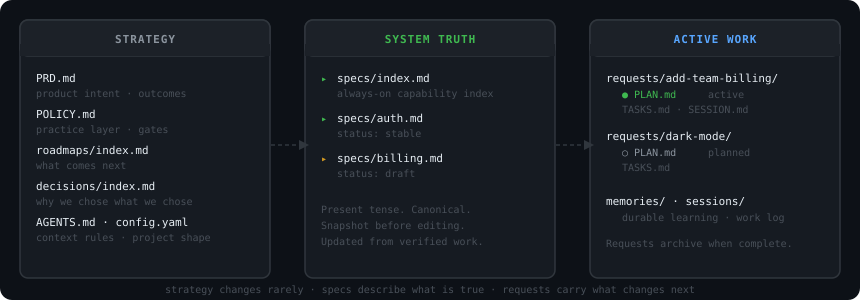
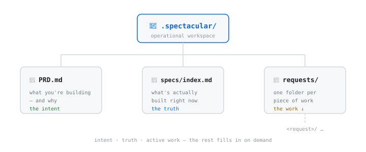
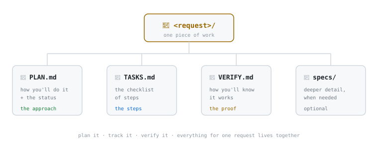

<div align="center">




</div>

---

## No spec. No plan. No Problem.

**Agents act before they understand.**

AI agents act on the first thing they find. Hand one a request and it starts coding immediately — without a spec, without a plan, without knowing *what* the project is or *why* the work matters. It can't see what was decided, what phase you're in, or what comes next.

The bottleneck isn't writing code. It's giving agents — and yourself — the context to write the *right* code. That context has to be planned, not assumed.

---

## A spec-driven protocol for agents

Spectacular is a spec-driven protocol for ideating, planning, scaffolding, and acting on projects with AI agents — keeping track of the changes, phases, tasks, and decisions so agents always know *what* they're doing and *why*. Drop a `.spectacular/` directory in any repo and it becomes the spec and shared context every agent works from.

Strategic context is split across seven focused canonical docs (PRD / PRINCIPLES / ARCHITECTURE / ROADMAP / STACK / DECISIONS / AGENTS) so agents load only what each task needs, not the entire repo.

It ships as three layers:

- **Convention** — a structured directory contract separating strategy, current truth, and active work
- **Skill** — a `/spectacular` Claude Code slash command that reads state, proposes actions, scaffolds files, and manages lifecycle transitions
- **CLI** — `spectacular init` bootstraps the workspace in any project in seconds

The skill is the primary interface. The CLI runs once.

> **Agents build. Humans decide.** Agents are made for building — humans, for deciding what's worth building.

In short, here's how spectacular helps you build your projects:



---

## Quick start

Choose how Spectacular should be available before bootstrapping:

1. **Plugin or files?** Use a plugin for the smoothest agent experience, or install the skill as plain files.
2. **Which agents?** Choose Claude Code, Codex, or both.
3. **Which scope?** Keep skill files project-local, or install them globally for every repository.

```bash
# Install the CLI
curl -fsSL https://raw.githubusercontent.com/alexsmedile/spectacular/main/cli/install.sh | bash

# Bootstrap the project interactively
cd your-project
spectacular init -i

# Open Claude Code or Codex and run
/spectacular
```

Plugins are installed through their platform marketplace; file installs use `spectacular init --skill-scope project|global`. See [Installation](docs/installation.md) for the exact Claude Code, Codex, local, and global paths. Plain `spectacular init` remains the zero-prompt project-local default.

Heavy engineering projects can optionally reserve specialist evidence stores without adding them to the default scaffold:

```bash
spectacular init --with findings,fixes,bugs,security,benchmarks
```

These paths reserve future `FND`, `FIX`, `BUG`, `SEC`, and `BMK` records; they do not activate unfinished workflows or migrate existing fix IDs.

> [!TIP]
> `spectacular init` scaffolds the `.spectacular/` directory and installs the `/spectacular` skill into `.agents/skills/spectacular/` (source) and `.claude/skills/spectacular/` (symlink). After init, `/spectacular` is immediately available to Codex and Claude Code.

> [!NOTE]
> `spectacular init` is zero-prompt by default. It infers the project name from the folder slug and uses `AGENTS.md` as the primary agent context file. Pass `-i` for interactive setup, or use flags: `--name`, `--summary`, `--agents-file`, `--skill-scope <project\|global\|none>`. If spectacular is already installed (globally, upstream, or as a plugin) init detects it, warns, and skips the redundant skill install.

---

## The shape of it

### The three layers



**Strategy** — changes rarely. Split across focused canonical docs:
- `PRD.md` — *what* the product is and *why*
- `PRINCIPLES.md` — operating principles + runtime enforcement hooks
- `ARCHITECTURE.md` — the workspace structure itself
- `roadmaps/index.md` — versioned future work
- `STACK.md` — host project's tech choices
- `decisions/index.md` — ADR-style decision log
- `AGENTS.md` — onboarding doc for any agent landing in `.spectacular/`

Agents load only what the current task needs (planning loads PRD + PRINCIPLES + decisions/index.md; implementation loads STACK + PLAN + TASKS).

**Current truth** — `specs/index.md` is the cheap, always-on index of what the system does now; promote a dense bullet to a flat `specs/<capability>.md` only when it earns the detail. Never overwrite either in place — snapshot before editing.

**Active work** — temporary. Each request gets a folder with `PLAN.md` (intent + 7-slot decomposition: goal, constraints, milestones, tasks, dependencies, validation, deliverables) and `TASKS.md` (execution checklist). Archived on completion, not deleted.

---

### The lifecycle


State lives in `PLAN.md` frontmatter. The skill reads it on every invocation and surfaces the highest-priority next action. When all tasks are checked, it proposes moving to `review`. When the checklist passes, it proposes `archived` — and offers to update `specs/index.md` and any affected capability specs.

Three guards keep the spine honest:

- **Policy gates** — every transition injects that work-phase's policies from `POLICY.md` (nine `@`-hooks), each led by a one-sentence directive; `block` policies refuse the move, `warn` policies advise.
- **The verify walk** — `review → verified` only happens through an interactive walk of the request's checks (each verified by its own authority: a command's exit code, an assertion, a judgment, or your evidence), recorded to an append-only `VERIFY-LOG.md` with `against:`-stamps so old evidence is never mistaken for current proof.
- **The sweep** *(v1.35.0)* — `spectacular sweep` audits the whole fleet read-only: a small fast `request-auditor` agent per request cross-checks claimed state vs actual code, tests, and evidence, and flags planned work that duplicates something already shipped. It feeds the walk; it never promotes.

---

### The workspace

New here? Two things to understand. First, what lives at the top of `.spectacular/`:

<picture>
  <source media="(prefers-color-scheme: dark)" srcset="docs/assets/workspace-tree-dark.svg" />
  
</picture>

And second, what's inside any one request:

<picture>
  <source media="(prefers-color-scheme: dark)" srcset="docs/assets/request-tree-dark.svg" />
  
</picture>

That's the whole idea. The full layout, once a project fills in:

```
.spectacular/
├── PRD.md              # product intent — what & why & for whom
├── POLICY.md           # practice layer / merged policy contract
├── config.yaml         # naming, kit identity, agent file overrides
├── AGENTS.md           # onboarding doc for agents working in this folder
├── requests/           # active and planned work
├── specs/              # per-capability specs + index.md system spec
 
│   ── opt-in (scaffolded by kit declaration or --with flag) ──────────
├── PRINCIPLES.md       # operating principles + enforcement hooks
├── ARCHITECTURE.md     # .spectacular/ structure, frontmatter, lifecycle, versioning
├── roadmaps/           # roadmaps/index.md + shipped v*.md files
├── STACK.md            # host project's tech choices
├── decisions/          # ADR decision index + D*.md files
 
│   ── created on demand ─────────────────────────────────────────────
├── memories/           # long-term operational learning (git-committed)
├── feedbacks/          # prototyping-mode feedback entries (v1.6.0+)
├── questions/          # active ambiguities that need a human answer
├── research/           # sourced evidence that clears discovery fog
├── spikes/             # authorized feasibility experiments + prototype evidence
├── ideas/              # parked inspiration — not acted on automatically
├── debugs/             # live debug-job traces — one folder per bug (v1.26.0+)
├── audits/             # diagnostic examinations earned at resolution (v1.25.0+)
├── fixes/              # reusable verified-fix library, greppable (v1.25.0+)
├── sessions/           # work time-log sessions/index.md + S*.md files
└── archive/            # completed requests (never deleted)
```

Wayfinding records use stable canonical IDs: `DEC-001`, `QUE-001`, `IDEA-001`, `RES-001`, `SPK-001`, and `SPC-001`; `PRT-001` remains reserved. You can speak in compact aliases such as `D1`, `Q1`, `I1`, `R1`, or `S1`; persisted cross-references always use the canonical form.

Discovery is progressive: inspect code/tests/docs or ask directly first, use `RES` for a bounded fact gap, `SPK` for disposable technical feasibility work, and an attached prototype only when human interaction is the evidence. A tracer bullet is retained production execution from an approved spec, not a prototype. Artifacts inherit their owner, and technical debt stays in requests, roadmap candidates, ideas, or linked decisions instead of a parallel backlog.

Artifact freshness is lifecycle-derived: live state stays synchronized at named checkpoints; stale-safe history remains retrievable but must be checked against code before reuse; temporary context closes with its owner; throwaway branches/mocks are deleted only after their learning and recovery pointer survive. Open human questions surface before every session briefing. Resolved questions and implemented/rejected detailed specs archive out of active context. The live roadmap is `.spectacular/roadmaps/index.md`; shipped prose compacts into per-version files.

The on-demand folders (`memories/`, `decisions/`, `questions/`, `research/`, `spikes/`, `sessions/`, `feedbacks/`, `ideas/`, `audits/`, `fixes/`) keep durable Markdown records in git, so humans and agents can inspect the same project state without a service or database.

A typical coding project (`spectacular init --kit coding`) scaffolds the always-set + `STACK.md` + `ARCHITECTURE.md`. A doc-only or research project (`spectacular init --kit research` or `--kit blank`) gets only the always-set. Smart-init never overwrites existing files — re-running is always safe.

`.spectacular.local/` — personal overrides, always gitignored.

---

### The agent fleet (v1.30.0)

Spectacular ships a fleet of focused subagents the skill delegates to — so heavy, self-contained work runs in its own context window instead of crowding the main thread. Every agent obeys one boundary: **a closed handoff in, findings / a diff / a pass-fail out — and the orchestrator is the only thing that mutates state** (ticks a checkbox, moves lifecycle, writes the ledger). Agents propose; the orchestrator decides and records.

The fleet is a **discover → apply → review → verify** grid across the two directions of work — fixing a bug and building a milestone — plus specialists:

| | **discover** | **apply** | **review** |
|---|---|---|---|
| **fix a bug** | `debug-investigator` — where + why | `debug-fixer` — a closed fix → diff | `code-reviewer` — a diff, 5 lenses |
| **build a milestone** | `repo-explorer` — map the subsystem | `spec-builder` — a closed milestone → diff | `spec-reviewer` — a spec vs. the code |

Plus **`debug-researcher`** (is this a known *external* bug?), **`test-verifier`** (independently run a check or write a test → honest pass/fail), and **`request-auditor`** *(v1.35.0)* — the sweep's small-model auditor: one request's claimed state vs its actual evidence. The two reviewers are read-only and never fix what they find; `code-reviewer` guards code, `spec-reviewer` guards the spec files — checking each claim in `specs/` still matches what the code actually does.

Agent definitions live in `agents/` at the repo root (the source of truth); the skill dispatches them through its bug- and build-workflow arcs, always as **optional, judgment-gated** steps — a trivial change never pays for a review it doesn't need.

---

## Everyday commands

| Command | Purpose |
|---|---|
| `/spectacular` | Brief the project and surface blockers |
| `spectacular request new --from SPC-001` | Create implementation work from an approved spec |
| `/spectacular act SPC-001` | Start gated implementation |
| `spectacular request <slug> --brief -m2` | Retrieve the smallest useful implementation prompt |
| `spectacular wayfind next` | Select the dependency-ready next step |
| `spectacular doctor` | Check workspace integrity |

The shell CLI handles deterministic file and lifecycle operations; the `/spectacular` skill handles interviews, judgment, planning, and implementation. See the [complete command reference](docs/commands.md), [installation choices](docs/installation.md), and [convention-pack contract](skills/spectacular/references/packs-contract.md).

---

## Works well with

Spectacular is agent-agnostic: Claude Code, Codex, Cursor, and other agents can share the same committed `.spectacular/` workspace. Git preserves its operational history; [pageworks](https://github.com/alexsmedile/pageworks) can own public-facing `docs/`. See [Integrations](docs/integrations.md) for responsibilities and setup.

---

## Built for

- Solo developers using Claude Code, Codex, or Cursor on projects that span weeks or months
- Small teams where AI agents need to share operational context
- Anyone who has re-explained the same architectural decision to an agent more than twice

## Not built for

- Projects that live and die in a single session — the structure has no value at that scale
- Teams that already have a working context management system
- Non-technical users — this is a developer-facing directory convention, not a GUI tool

---

## Install

**CLI** — curl one-liner, installs `spectacular` to `~/.local/bin/`:

```bash
curl -fsSL https://raw.githubusercontent.com/alexsmedile/spectacular/main/cli/install.sh | bash
```

**Claude Code plugin** — from Claude Code:

```text
/plugin marketplace add alexsmedile/spectacular
/plugin install spectacular@spectacular
/reload-plugins
```

You can also use the Claude Code CLI:

```bash
claude plugin marketplace add alexsmedile/spectacular
claude plugin install spectacular@spectacular
```

**Codex plugin** — add the marketplace, then install the plugin:

```bash
codex plugin marketplace add alexsmedile/spectacular
codex plugin add spectacular@spectacular
```

To update an existing install, refresh its marketplace snapshot, then install the refreshed plugin:

```bash
codex plugin marketplace upgrade spectacular
codex plugin add spectacular@spectacular
```

If adding the marketplace fails after a previous install, remove its stale local registration and add it again:

```bash
codex plugin marketplace remove spectacular
codex plugin marketplace add alexsmedile/spectacular
codex plugin add spectacular@spectacular
```

You can also manage the marketplace and plugin from Codex's `/plugins` screen.

**Skill only** (no CLI, no plugin marketplace):

```bash
# manual
cp -r skills/spectacular ~/.claude/skills/
mkdir -p ~/.agents/skills
cp -r skills/spectacular ~/.agents/skills/
```

**Skill install locations:**

| Scope | Source | Claude symlink |
|---|---|---|
| Project-local (default) | `.agents/skills/spectacular/` | `.claude/skills/spectacular/` → above |
| Global (`--skill-scope global`) | `~/.agents/skills/spectacular/` | `~/.claude/skills/spectacular/` → above |

---

---

## Documentation

| Doc | What it covers |
|---|---|
| [docs/workflow.md](docs/workflow.md) | Practical end-to-end usage loop — init, briefing, requests, lifecycle, archive, current sync, memory |
| [docs/installation.md](docs/installation.md) | Plugin vs. files, Claude Code vs. Codex, and project-local vs. global installation |
| [docs/commands.md](docs/commands.md) | CLI command reference and agent skill triggers, including the boundary between shell commands and skill commands |
| [docs/integrations.md](docs/integrations.md) | How agent runtimes, Git, and pageworks compose with the operational workspace |
| [docs/troubleshooting.md](docs/troubleshooting.md) | Common setup, install, skill discovery, update, symlink, and workspace state issues |
| [docs/configuration.md](docs/configuration.md) | `config.yaml`, agent files, tool overrides, request naming, and `.spectacular.local/` |
| [docs/scaffold.md](docs/scaffold.md) | Complete `.spectacular/` directory spec — every file, frontmatter schema, creation rules, versioning |

---

<div align="center">

Built with [Claude Code](https://claude.ai/code)

</div>
