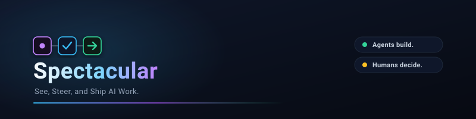

# Spectacular — Keep AI work clear after the chat ends.

Spectacular gives you and your AI agent a shared place to record the goal, the
boundaries, the work done, and the next safe step.

*Agents build. Humans decide.*

[Quick start](#quick-start) · [See it in action](#see-it-in-action) · [How it works](#how-it-works) · [Documentation](docs/README.md)

---

## The problem

An AI agent can make fast progress in one conversation. The trouble starts when
the conversation ends. The next agent has to work out the goal, what you
approved, what changed, and what it is allowed to do.

Spectacular keeps those answers in version-controlled Markdown files. It keeps
an idea separate from an approved decision, a bounded piece of work separate
from an open-ended request, and test results separate from your decision to
call the work done.

The result is not a longer chat history. It is a shared record of the work and
one justified next action.

Agents follow links to the few records they need for the current task. Chat
history and generated views are useful, but the files are the source of truth.

## See it in action

```text
You:     I want to explore a safer release flow for our CLI.

Agent:   I will orient from the project Anchor, inspect the current Mission,
         and identify what is known, open, or blocked.

You:     Good. Propose a bounded first slice.

Agent:   Here is a Proposal: scope, non-goals, assumptions, evidence needed,
         and a reversible completion boundary. Do you accept this Mission?

You:     Yes. Keep provider publishing out of scope.

Agent:   The Mission is active. I will implement only the approved local work,
         keep checkpoints and evidence current, and stop if authority drifts.

         … later …

Agent:   The work is complete. Here is the evidence, the independent
         assessment, remaining Gaps, and the owner decision needed to
         reconcile or close it.
```

The agent can explore freely. Before consequential work, it brings you a
bounded Mission. You retain the decisions that change product direction,
authority, risk, or irreversible effects.

## What Spectacular keeps visible

| Instead of relying on… | Spectacular keeps… |
| --- | --- |
| A chat's fading context | A project **Anchor**: direction, boundaries, constraints, and current truth |
| A vague request | A **Mission** that says what is in scope, what to avoid, and how to know it is done |
| “The agent said it worked” | **Evidence** you can inspect, plus an **Assessment** |
| A lost terminal or replacement agent | A **Handoff** that says where to restart and what to do next |
| A guess about what to do next | One safe next step—or one decision for you |

## Keep context small

Giving an agent every project file can make it lose track of the task.
Spectacular gives each role only the records it needs. A Runner gets its
assigned work, boundaries, and named inputs; it asks for a specific source when
blocked instead of reading the whole workspace.

> [!NOTE]
> A passing check, a generated view, a handoff, or an archive is not acceptance
> by itself. Spectacular keeps evidence, assessment, owner disposition,
> reconciliation, and closure distinct.

## The Core Model: Human + Agent Collaboration

Spectacular splits responsibilities clearly:

> - **The CLI** checks rules and safely updates records.
> - **The Skill** helps an agent plan, work, and ask the right questions.
> - **The files** stay readable in Git; there is no separate database to run.


### Turning a request into checked work

The CLI checks the parts a computer can check: identities, fingerprints,
dependencies, and completion boundaries. Markdown explains the why and the
trade-offs that need human judgment.


The skill helps turn your request into two useful records:

- **Contract (`contracts/`)**: what the product should do.
- **Mission (`missions/`)**: the approved work, its limits, and how to tell it is done.

The skill manages the work flow; the CLI checks the records and prevents invalid updates.

## How it works

```text
Orient
  │  start from the project Anchor and current truth (PROJECT.md)
  ▼
Explore / propose
  │  turn an idea into an explicit, reviewable change (Proposal)
  ▼
Prepare a Mission
  │  agree what the work includes, what to avoid, and what success means
  ▼
Execute
  │  work within the approved envelope on a dedicated branch; checkpoint safely
  ▼
Assess & Review
  │  inspect earned evidence, run tree gates, and execute independent review
  ▼
Complete
     record your decision to close the Mission
```

The skill makes recommendations and asks for decisions. The CLI checks and
updates records. Spectacular never assumes it may publish, deploy, send a
message, or change an external service.

Agents use role-scoped context: Orchestrators plan from Anchors and optional
Campaign maps; Runners read only their Objective, Run, Handoff, and named
inputs; Reviewers assess frozen claims and evidence. A Runner requests a named
source when blocked rather than loading the whole workspace.

## Quick start

### Install the CLI

Spectacular v2's CLI is installed from a **locally verified release directory**.
It does not fetch a binary, require Go on the consuming machine, or publish a
release on your behalf.

Download the archive and `SHA256SUMS` for your platform from the
[latest release](https://github.com/alexsmedile/spectacular/releases/latest),
then install from the directory holding them:

```sh
install/install.sh install \
  --prefix "$HOME/.local" \
  --source "$PWD" \
  --runtime claude \
  --version "$VERSION"
```

Set `VERSION` to the release you downloaded, e.g. `2.8.2`. `--source` is the
directory that **contains** the archive, not an unpacked
tree — the installer verifies the checksum and extracts it itself. This places
the native binary at `$HOME/.local/bin/spectacular`, already on `PATH` on most
systems. Use `--runtime codex` for a Codex-targeted release.

The release also contains the matching plugin files, but **installing the CLI
does not by itself activate the agent skill in Codex or Claude**. The CLI reads
and validates canonical workspace records; the skill guides an agent through
the human decisions around them.

### Consumer Execution Tiers

Spectacular adapts to the tools available in the host repository:

| Tier | Runtime | Capabilities |
|---|---|---|
| **CLI** | `spectacular` | Starts and updates Missions, while checking the records are valid. |
| **Node fallback** | Node.js helpers | Reads, checks, and shows records when the CLI is unavailable. |
| **Shell fallback** | Shell helpers | Read-only status and record lookup in limited environments. |

### Install the skill

For development from this checkout, `skills/spectacular/` is the skill source
of truth. From the repository root, link it into your agent's skill
directories:

```sh
mkdir -p .claude/skills .agents/skills
ln -s ../../skills/spectacular .claude/skills/spectacular
ln -s ../../skills/spectacular .agents/skills/spectacular
```

This makes both `.claude/skills/spectacular` and `.agents/skills/spectacular`
point at `skills/spectacular/`; it does **not** install the CLI. For a release
installation, register the runtime-specific plugin directory shipped in the
release archive under `plugins/spectacular/` with the target runtime.

From a project containing an explicit v2 `.spectacular/` workspace, inspect
the starting context:

```sh
cat .spectacular/index.md
/absolute/prefix/bin/spectacular mission show M<N> --json  # when the guide names an active Mission
```

Then open your agent and use the Spectacular workflow to orient, explore, or
prepare a Mission. The guide is compact routing only; the agent follows its
pointers to canonical records rather than treating a projection as authority.

## What it is—and is not

Spectacular is a workspace and agent skill for work that needs to survive new
chats, new agents, or a handoff.

It is not:

- a hosted project-management dashboard;
- a transcript store or generic agent-memory database;
- an autonomous agent company that silently gains provider access; or
- a replacement for the owner who accepts the work's direction and
  consequential decisions.

## Use it with your agent

The installed skill routes work by intent:

| You want to… | The workflow does… |
| --- | --- |
| `orient` | Reads the Anchor, Missions, Gaps, conflicts, freshness, and next owner gate |
| `propose` or `define` | Explores intent and drafts a base-bound Proposal and capability change |
| `decide`, `start`, or `resume` | Prepares or re-enters a Mission with its approved authority and stop conditions |
| `handoff` or Autopilot | Creates an explicit, bounded runtime charter; accountability stays with the owner |
| `assess`, `reconcile`, or `resolve` | Examines evidence, updates accepted truth, and closes or recovers deliberately |
| `audit` | Independently checks canonical sources, fingerprints, evidence, and claimed state |

Autopilot is explicit and non-default. It can perform only actions inside its
Mission envelope; it expires, stops at its chartered conditions, and returns a
bounded result. It never transfers Mission accountability.

### Adopt structure as work earns it

Spectacular does not require a full multi-stage process for every task. Start
small and promote structure only when the work needs it:

| Level | Shape |
| --- | --- |
| Orient | Read Anchors and answer a question; no Mission is needed. |
| Bounded task | One compact Mission, inline Objective, one Run, and focused checks. |
| Build | Earned Objectives, dependency edges, Evidence, and review. |
| Delegated build | Promoted Objectives, recorded Handoffs, and isolated worktrees. |
| Autopilot | An explicit charter bound to a Mission fingerprint, with limits, checks, stops, expiry, and a return path. |

Folder-native workflows remain useful at every level. Spectacular supplies the
accountability layer when frozen scope, evidence, review, handoffs, or
owner-gated effects become necessary.

Campaigns are optional, durable planning maps above Missions. They sequence
roadmap blocks and candidate Missions but grant no execution authority; see
`.spectacular/campaigns/`. When a Campaign uses the optional frontmatter map,
`spectacular campaign check <path>` validates its order and renders a Mermaid
projection without changing any record.

## The workspace

### Canonical v2 workspace layout

Spectacular stores its working files under `.spectacular/`. Each file has a
small YAML section the CLI checks and Markdown that explains the work.

```text
.spectacular/
├── PROJECT.md           # Root Anchor: project direction, boundaries, current_truth
├── ARCHITECTURE.md      # Architecture Anchor
├── PRODUCT.md           # Product Anchor
├── STACK.md             # Technology stack Anchor
├── GUARDRAILS.md        # Standing constraints on agent authority
├── campaigns/           # Optional strategic roadmap maps; non-governing
├── contracts/           # Accepted specifications, each with its Gaps and amendment history
├── missions/            # Bounded execution plans, one bundle per Mission
│   └── M12-<slug>/
│       ├── M12-<slug>.md          # the Mission record, named by its own ref
│       ├── objectives/            # earned expansion, one file per Objective
│       ├── runs/R1-<slug>/R1-<slug>.md
│       ├── evidence/  reviews/  handoffs/  decisions/  gaps/
├── proposals/           # Open explorations only (P5, P8, P10, ...)
├── decisions/           # Durable decision records (D1 ... D11)
├── archive/             # Retired records: completed Missions, absorbed Proposals
├── index.md             # Generated compact routing guide; non-authoritative
└── catalog.md           # Generated complete record inventory; non-authoritative
```

Every governed record is named by its own reference, so a file is identifiable
without its parent directory. A record that is finished does not disappear: a
completed Mission and an absorbed Proposal move to `archive/` carrying the Decision
that authorized the move and a fingerprint of what was archived.

The CLI checks how the records fit together and points back to the source files.
There is no hidden database—just Markdown in Git.

## For—and not for

**Spectacular is for:**

- solo builders and teams directing AI agents over days, weeks, or longer;
- work that needs shared context, traceable decisions, and safe continuation;
- exploration that must turn into an approved, testable Mission before it has
  consequential effects; and
- projects that need a clear owner boundary around risk, authority, and proof.

**It is not for:**

- a throwaway prompt or a one-session change with no need to resume;
- teams seeking a general task tracker or hosted agent dashboard; or
- workflows that require agents to infer or acquire external permissions.

## Documentation

- [Installation](docs/installation.md) — the Skill and the CLI install separately; how to do both, and how to update.
- [Quickstart](docs/quickstart.md) — run one Mission end to end.
- [Architecture](docs/architecture.md) — the surfaces, the record types, and what the CLI refuses to decide.
- [Process](docs/process.md) — the Mission lifecycle and its gates.
- [All documentation](docs/README.md) — index.

## Reference

- [Spectacular skill](skills/spectacular/SKILL.md) — operating guidance and workflow routing.
- [Mechanical interface](skills/spectacular/generated/mechanical-interface.md) — generated CLI catalog; do not edit by hand.
- [Release recovery manifest](docs/recovery.md) — v2 cutover baseline and v1 recovery point.
- [Contributor guide](AGENTS.md) — live product surface and required verification.

## Release status

Spectacular v2 is released. The current version is in [`VERSION`](VERSION), with
per-release notes in [`CHANGELOG.md`](CHANGELOG.md). The root module,
`cmd/spectacular`, `skills/`, `install/`, and `.spectacular/` are the live product
surface.

## License

[MIT](LICENSE)
