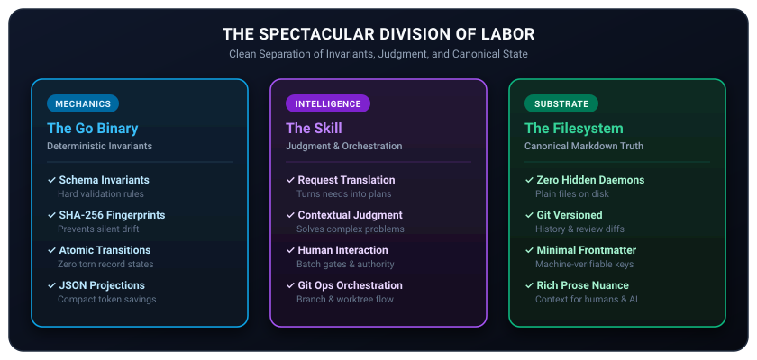
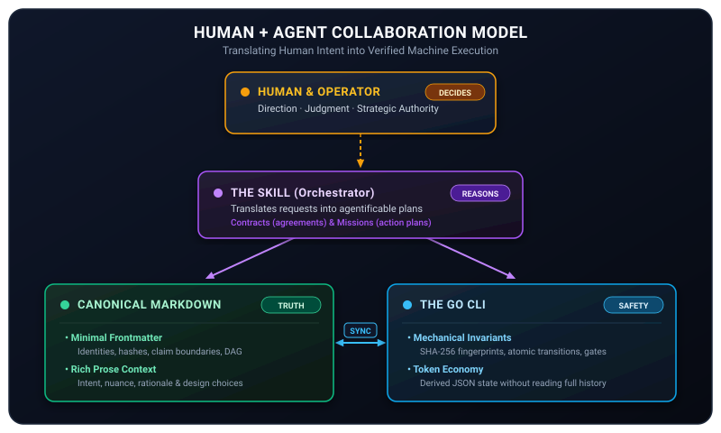

# Spectacular — See, Steer, and Ship AI Work.

AI work that outlives the chat: a governed workspace for exploring ideas,
setting missions, recording evidence, and carrying the next safe action forward.

*Agents build. Humans decide.*

[Quick start](#quick-start) · [See it in action](#see-it-in-action) · [How it works](#how-it-works) · [Reference](#reference)

---

## The problem

An AI agent can make fast progress in a single conversation. The work starts to
drift when the conversation ends: the next agent has to reconstruct the goal,
what was approved, what changed, which evidence still counts, and whether it
may act at all.

Spectacular gives that work a durable, inspectable home. It separates an idea
from an accepted decision, a Mission from an unbounded request, evidence from a
claim, and a handoff from a transfer of accountability.

The result is not a longer chat history. It is a shared record of the work and
one justified next action.

## See it in action

```text
You:     I want to explore a safer release flow for our CLI.

Agent:   I will orient from the project Anchor, inspect the current Mission,
         and identify what is known, open, or blocked.

You:     Good. Propose a bounded first slice.

Agent:   Here is a Proposal: scope, non-goals, assumptions, evidence needed,
         and a reversible completion boundary. Do you accept this Mission?

You:     Yes. Keep provider publishing out of scope.

Agent:   The Mission is active. I will implement only the approved local work,
         keep checkpoints and evidence current, and stop if authority drifts.

         … later …

Agent:   The work is complete. Here is the evidence, the independent
         assessment, remaining Gaps, and the owner decision needed to
         reconcile or close it.
```

The agent can explore freely. Before consequential work, it brings you a
bounded Mission. You retain the decisions that change product direction,
authority, risk, or irreversible effects.

## What Spectacular keeps visible

| Instead of relying on… | Spectacular keeps… |
| --- | --- |
| A chat's fading context | A project **Anchor**: direction, boundaries, constraints, and current truth |
| A vague request | A bounded **Mission** with Objectives, scope, authority, budget, stops, and a completion boundary |
| “The agent said it worked” | Attributable **Evidence**, freshness, and an **Assessment** |
| A lost terminal or replacement agent | A scoped **Handoff** with a recovery point and return destination |
| A guess about what to do next | One compiled, safe continuation—or a specific owner gate |

> [!NOTE]
> A passing check, a generated view, a handoff, or an archive is not acceptance
> by itself. Spectacular keeps evidence, assessment, owner disposition,
> reconciliation, and closure distinct.

## The Core Model: Human + Agent Collaboration

Spectacular is designed around a strict division of responsibilities:

> - **The Go binary** handles invariants, hashes, transitions, and JSON projections.
> - **The Skill** handles judgment, planning, problem-solving, and human interactions.
> - **The filesystem (Canonical Markdown)** remains human-readable without running proprietary daemons or databases.



### Translating Intent into Verified Execution

We do not attempt to 100% schemify or machine-check every piece of context. Frontmatter is kept minimal for the fundamental verifiable boundaries (identities, fingerprints, completion boundaries, dependencies), while rich Markdown prose carries the rationale, design intent, and nuance.



The primary role of the **Skill** is to turn the user's request into an agentificable plan through two primary instruments:
- **Contract (`contracts/`)**: The accepted specification and product behavior agreement.
- **Mission (`missions/`)**: The frozen action plan, execution boundaries, failable completion claims, and run state.

Git branching, worktrees, and execution flow are managed by the Skill orchestrator, while the CLI mechanically catches drift and prevents errors.

## How it works

```text
Orient
  │  start from the project Anchor and current truth (PROJECT.md)
  ▼
Explore / propose
  │  turn an idea into an explicit, reviewable change (Proposal)
  ▼
Prepare a Mission
  │  bind scope, authority, failable completion claims, and stop conditions
  ▼
Execute
  │  work within the approved envelope on a dedicated branch; checkpoint safely
  ▼
Assess & Review
  │  inspect earned evidence, run tree gates, and execute independent review
  ▼
Complete
     reconcile truth, close atomically with owner attribution (--by <owner>)
```

The human-guided skill makes judgments and presents decisions. The native CLI
performs deterministic validation and record transitions. External providers
remain their own authority: Spectacular never assumes permission to publish,
deploy, message, or mutate them.

## Quick start

### Install the CLI

Spectacular v2's CLI is installed from a **locally verified release directory**.
It does not fetch a binary, require Go on the consuming machine, or publish a
release on your behalf.

```sh
install/install.sh install \
  --prefix /absolute/prefix \
  --source /absolute/release \
  --runtime codex
```

This verifies the selected archive and checksum, then places the native
`spectacular` binary at `/absolute/prefix/bin/spectacular`. Use
`--runtime claude` for a Claude-targeted release.

The release also contains the matching plugin files, but **installing the CLI
does not by itself activate the agent skill in Codex or Claude**. The CLI reads
and validates canonical workspace records; the skill guides an agent through
the human decisions around them.

### Install the skill

For development from this checkout, `skills/spectacular/` is the skill source
of truth. In a Codex or Claude conversation at this repository root, run:

```text
/skizl sym init
```

This creates portable relative links from `.claude/skills/spectacular` and
`.agents/skills/spectacular` to `skills/spectacular/`; it does **not** install
the CLI. For a release installation, register the runtime-specific plugin
directory shipped under `plugins/spectacular/` with the target runtime.

From a project containing an explicit v2 `.spectacular/` workspace, inspect
the starting context:

```sh
/absolute/prefix/bin/spectacular workspace context project --event @Orient --json
```

Then open your agent and use the Spectacular workflow to orient, explore, or
prepare a Mission. The agent follows source pointers from the compiled context
rather than treating the projection as the canonical record.

## What it is—and is not

Spectacular is a canonical, pointer-first workspace and an agent skill for
governed work that crosses sessions, runtimes, and handoffs.

It is not:

- a hosted project-management dashboard;
- a transcript store or generic agent-memory database;
- an autonomous agent company that silently gains provider access; or
- a replacement for the owner who accepts the work's direction and
  consequential decisions.

## Use it with your agent

The installed skill routes work by intent:

| You want to… | The workflow does… |
| --- | --- |
| `orient` | Reads the Anchor, Missions, Gaps, conflicts, freshness, and next owner gate |
| `propose` or `define` | Explores intent and drafts a base-bound Proposal and capability change |
| `decide`, `start`, or `resume` | Prepares or re-enters a Mission with its approved authority and stop conditions |
| `handoff` or Autopilot | Creates an explicit, bounded runtime charter; accountability stays with the owner |
| `assess`, `reconcile`, or `resolve` | Examines evidence, updates accepted truth, and closes or recovers deliberately |
| `audit` | Independently checks canonical sources, fingerprints, evidence, and claimed state |

Autopilot is explicit and non-default. It can perform only actions inside its
Mission envelope; it expires, stops at its chartered conditions, and returns a
bounded result. It never transfers Mission accountability.

## The workspace

### Canonical v2 workspace layout

Spectacular v2 stores a compact, clean set of canonical Markdown documents under `.spectacular/`. Each document contains minimal, typed YAML frontmatter for machine-verifiable integrity (identities, hashes, claim boundaries, bindings) and rich Markdown prose for human and agent understanding.

```text
.spectacular/
├── PROJECT.md           # Root Anchor: project direction, boundaries, current_truth
├── ARCHITECTURE.md      # Architecture Anchor
├── PRODUCT.md           # Product Anchor
├── STACK.md             # Technology stack Anchor
├── contracts/           # Accepted specifications, plus an append-only amendment log per Contract
├── missions/            # Bounded execution plans (M<N>-<slug>.md, reviews, evidence)
├── proposals/           # Optional candidate explorations (P1, P2, ...)
├── decisions/           # Durable architectural decision records (ADRs)
└── index.md             # Generated, non-authoritative workspace index
```

The CLI validates the record graph, fingerprints the sources, and emits projections with pointers back to the authoritative records. There is no opaque database or proprietary daemon—just git-versioned Markdown.

## For—and not for

**Spectacular is for:**

- solo builders and teams directing AI agents over days, weeks, or longer;
- work that needs shared context, traceable decisions, and safe continuation;
- exploration that must turn into an approved, testable Mission before it has
  consequential effects; and
- projects that need a clear owner boundary around risk, authority, and proof.

**It is not for:**

- a throwaway prompt or a one-session change with no need to resume;
- teams seeking a general task tracker or hosted agent dashboard; or
- workflows that require agents to infer or acquire external permissions.

## Reference

- [Spectacular skill](skills/spectacular/SKILL.md) — operating guidance and workflow routing.
- [Mechanical interface](skills/spectacular/generated/mechanical-interface.md) — generated CLI catalog; do not edit by hand.
- [Release recovery manifest](RECOVERY.md) — v2 cutover baseline and v1 recovery point.
- [Contributor guide](AGENTS.md) — live product surface and required verification.

## Release status

This repository contains the Spectacular v2 release candidate,
`2.0.0-rc.1`. The root module, `cmd/spectacular`, `skills/`, `install/`, and
`.spectacular/` are the live v2 surface.

## License

[MIT](LICENSE)
