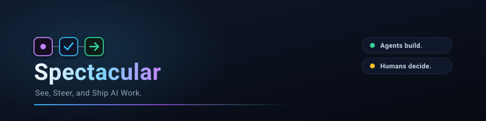

# Spectacular — durable context for AI work

Keep the project understandable after the chat ends. Spectacular stores goals,
domain objects, relationships, choices, and work plans in small linked Markdown
files that people and agents can navigate.

Start from an anchor, a raw draft, or a plan and do the authorized work. Use
mechanically governed Missions when freezing scope and collecting formal proof
helps. Contracts retain their validation and amendment process.

[Quickstart](docs/quickstart.md) · [Installation](docs/installation.md) · [Documentation](docs/README.md)

## A minimal workspace

```text
.spectacular/
├── PROJECT.md              # purpose and current project truth
├── ONTOLOGY.md           # domain objects, terms, and relationships, when useful
├── INDEX.md                # optional authored navigation
├── raw/                    # freeform captures and quick-start drafts
├── atlas/                  # lasting maps and explanations
├── decisions/              # choices and rationale
└── plans/                  # intended work, approach, progress, and results
```

A useful reading route is INDEX → PROJECT → relevant Requirement → Spec → Plan,
with Ontology, Atlas, and Decisions consulted as needed. See the
[naming and navigation guide](skills/spectacular/references/navigation.md).

Create only what the project needs. Each folder is a Markdown knowledge
container, with agreed metadata and extensible types. Raw has no obligations.
`sketch/` and `scratchpad/` are equivalent roles used by other tools; keep one
established home instead of duplicating it.

## Plan mode with a durable home

Ask `/spectacular plan <outcome>` or `$spectacular plan <outcome>` through the Skill.
The host owns native plan-mode controls; Spectacular keeps the project copy in
`.spectacular/plans/` when writing is permitted. Reuse the file through planning,
implementation, and delivery. There is no new binary plan command or Mission gate.

Use optional `requirements/` to distribute a PRD into linked needs and acceptance
criteria. Keep behavior in `specs/` and delivery in `plans/`; existing requirements
in specs remain valid. Skeletons and anatomy guides are optional drafting aids.
See [linked requirements](skills/spectacular/references/requirements.md) and
[drafting methods](skills/spectacular/references/drafting-methods.md).

See the [active-workspace tree](docs/human-workspace-contract.md) for optional
specs/audits and Mission-owned reviews, evidence, and handoffs.

## Small files, useful links

Prefer one coherent object, question, or outcome per file, often 50–120 lines.
Split by domain, module, independent lifetime, working phase, or delivered tranche
when the pieces are useful independently. Link reusable context instead of copying
it into every plan. Relative Markdown links and Obsidian wikilinks are supported
as agent navigation conventions.

Maintained context carries `type`, document `version`, `created`, and `updated`.
Compact is the default metadata profile: add a useful description to those basic
fields. Minimal remains valid; extended metadata is optional and does not activate
governance. See the [profile guide](skills/spectacular/references/profiles.md).
Preserve creation dates and unknown fields. Git supplies edit history. Agents
choose placement, update existing topic owners, and repair links when files move.

Product documentation stays in root `docs/`; implementation plans belong in
`.spectacular/plans/`. Documentation tools can manage `docs/` independently.

## Choose the amount of governance

| Work | Default approach |
|---|---|
| Capture or sketch | Write freely in `raw/` |
| Implement an authorized change | Work directly from linked context or a plan |
| Record a choice | Use a soft Decision; mechanical validation is recommended |
| Maintain an agreed Contract | Use mechanical validation, amendment, and versioning |
| Freeze scope and collect formal evidence | Explicitly select a governed Mission |

A folder does not activate governance. A missing CLI or unrelated Mission drift
does not block ordinary work. Existing governed records retain their identities,
freeze points, and mutation rules. A `schema` field claims mechanical governance;
ordinary context uses folder agreements instead.

## Install

The Skill and CLI install separately. The Skill provides the context workflow;
the CLI supplies governed validation and atomic writes. See
[Installation](docs/installation.md) for host setup, verified archives, updates,
and rollback. Work with ordinary context can start with the Skill alone.

## Mechanical interface and development

The CLI retains 26 public commands. The
[generated reference](skills/spectacular/generated/mechanical-interface.md)
defines exact flags and governed schemas. Product v3 retains the v2 Go module and
mechanical record schema identities; there is no automatic historical migration.

Contributor rules live in [AGENTS.md](AGENTS.md). After code changes, use
`bash test/verify.sh quick`; before releasing, use `bash test/verify.sh all`.
See [Testing](docs/testing.md) for the verification boundaries.

## Milestones and readiness

Plan delivery around the first usable end-to-end workflow. Define its audience,
environment, prerequisites, and observable completion evidence. Alpha, beta,
and pilot labels follow the project’s own exposure and exit criteria.

Spectacular distinguishes technical correctness, distribution, operation, MVP
value validation, and publication authority. Passing tests proves only their
covered behavior; validating user value requires a representative experiment.
Keep these facts in the existing plan and requirements, with proportional gates
and explicit limitations. See [Architecture](docs/architecture.md).
