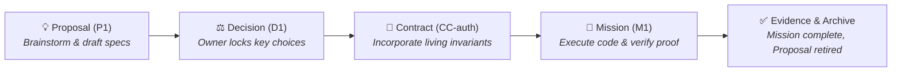

# Architecture

Spectacular keeps five kinds of information in separate places. That makes it
clear what people read, what agents follow, and what the CLI can change.

| Surface | Audience | What it is |
|---|---|---|
| `.spectacular/` | governance | The records: Missions, Proposals, Decisions, Evidence |
| `.spectacular/raw/` | thinking | Unstructured sketchpad; gitignored, skip-listed, no frontmatter and no entity |
| `.spectacular/atlas/` | planning | Optional outcome and system maps; explanatory, mutable, and non-authoritative |
| `.spectacular/campaigns/` | planning | Optional durable roadmap maps; excluded from the record graph and CLI lifecycle |
| `skills/` | agents at runtime | Executable guidance the CLI and Skill load |
| `cmd/` + `internal/` | the machine | A typed CLI that validates and mutates records atomically |
| `docs/` | humans | What you are reading |

## Why files, not a database

Every record is a Markdown file stored in Git. There is no separate service or
hidden database. The small YAML section holds details the CLI checks; the prose
explains the decision to people and agents.

Because the records are files, you can review a change in a pull request and
recover the exact text that was approved at the time.

## The record types

Thirteen types, in two groups.

**Top-level** — they exist independently:

- **Proposal (`P<N>`)** — *"What could we do?"* Optional, mutable exploration. Carries no authority; the cheapest place to be wrong during brainstorming.
- **Decision (`D<N>`)** — *"Which path did we choose?"* Durable, immutable record of an owner choice and its rationale. Recorded atomically via `spectacular decide`.
- **Contract (`CC-<name>`)** — *"What does the system guarantee right now?"* Living, versioned specification of observable capabilities and invariants.
- **Mission (`M<N>`)** — *"What are we building and proving right now?"* Bounded, frozen agreement with execution authority, exact git baseline, and failable proof.

### The 4 Governance Primitives

| Primitive | Core Question | Lifecycle State | Authority Level | Location |
|---|---|---|---|---|
| **Proposal (`P<N>`)** | *"What could we do?"* | **Mutable & Exploratory** | **Zero Authority** (ideas, draft specs, open questions) | `.spectacular/proposals/` |
| **Decision (`D<N>`)** | *"Which path did we choose?"* | **Immutable & Permanent** | **Attributable Ruling** (owner choice, rationale, trade-offs) | `.spectacular/decisions/` |
| **Contract (`CC-<name>`)** | *"What does the system guarantee right now?"* | **Living Truth** (versioned) | **Governing Specification** (system invariants, behaviors, gaps) | `.spectacular/contracts/` |
| **Mission (`M<N>`)** | *"What are we building and proving right now?"* | **Frozen Execution Envelope** | **Execution Authority** (atomic claims, proof, reviews) | `.spectacular/missions/` |



**Mission-scoped** — they live inside a Mission bundle and have no meaning
outside it: Objective, Run, Checkpoint, Evidence, Assessment, Review, Handoff,
Gap, and Mission-local Decisions.

That split is why archiving a Mission archives its whole bundle: an Evidence
record separated from its Mission is not evidence of anything.

## Campaigns are plans, not records

A Campaign is an optional Markdown planning map in `.spectacular/campaigns/`.
It can sequence independent roadmap blocks and link candidate or active
Missions, but it grants no authority and is intentionally excluded from typed
CLI validation, identities, fingerprints, and lifecycle transitions. Campaigns
are mutable; a Mission's frozen envelope remains the execution authority.

A Mission may cite Campaign context in its Markdown body. Do not bind a Mission
to a Campaign in frozen frontmatter: roadmap edits must not create Mission drift.

## Atlases connect value to structure

An Atlas is an optional Markdown map for a coherent product-value slice. Its
outcome board shows the actor, journey steps, desired result, and success
signal. Its system board shows the capabilities, ownership boundaries,
dependencies, risks, and proof that make the result possible.

```text
desired future → journey step → capability → architecture boundary → proof
                              ↘ Campaign block → Mission
```

An Atlas makes this chain legible, but it is not a second source of execution
authority. Campaigns sequence potential work; Contracts state accepted behavior;
Missions freeze and authorize one implementation slice.

## The mechanical interface

The CLI command reference is generated into
[`mechanical-interface.md`](../skills/spectacular/generated/mechanical-interface.md).
The catalog is generated from the command registry, so it cannot drift from what
the binary does. When a document and the generated interface disagree, the
interface wins and the document is stale.

Commands are either `read-only` or `mutating`, and every mutating command is a
transaction: it either fully applies or fully rolls back. The test suite proves
this by injecting a fault at every write boundary and asserting the workspace is
unchanged.

Adding or changing a command requires owner approval.

## Give each agent only what it needs

Agents should not have to read the entire workspace to do one task. Spectacular
gives workers a short handoff with the approved work, allowed files, and named
sources. Larger details stay in linked files until they are needed.

## What the machine does and does not do

The CLI performs only the mechanics that are safer or cheaper done mechanically
than by an agent: validating a record graph, computing fingerprints, writing
atomically, resolving paths, and reporting drift.

It does not decide anything. It cannot complete a Mission, accept a Proposal,
grant authority, or judge whether work is good. Those are owner acts, and the
system's value comes from refusing to blur that line.

```text
        agent proposes and builds
                  │
                  ▼
    ┌─────────────────────────────┐
    │  CLI: validate, fingerprint │  mechanical — no judgment
    │  write atomically, report   │
    └─────────────────────────────┘
                  │
                  ▼
          owner decides at a gate     ← authority lives here
```

## Authority and gates

Authority is explicit and narrow. A Mission's frontmatter names what the
operator may do — inspect, edit in scope, run checks, generate derived files.
Anything outside that list requires an owner gate.

Three gates matter most:

1. **Activation** — freezes the agreement. Everything after is judged against it.
2. **Review** — proof is recorded as a record, with a verdict.
3. **Completion** — only the owner, and only when declared Gaps are closed.

A Gap is a stated limit, not a defect. It is never closed by deletion: its entry
survives with a written resolution, so the reason something was impossible stays
recoverable.

## Freeze points

A completed Mission's contract fingerprint is a freeze point, not a stale
pointer. It records which agreement that Mission was executed against.
Amendments re-point only the live Mission; a completed one keeps its binding
forever. `mission check` reporting drift on a completed Mission is a notice, not
an error — the Mission stays valid.

This is the same instinct as the archive: a finished record is kept as it was,
not updated to match the present.


## See also

- [Quickstart](quickstart.md) — run one Mission end to end.
- [Process](process.md) — the lifecycle and its gates in detail.
