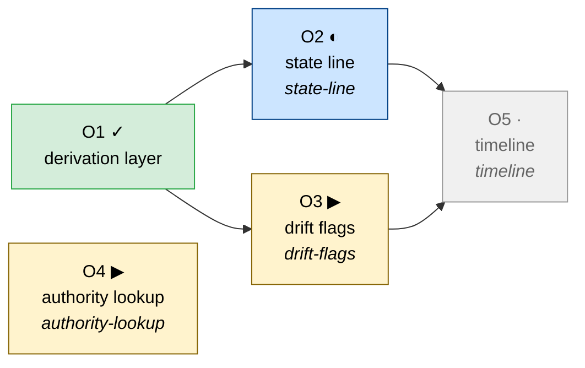
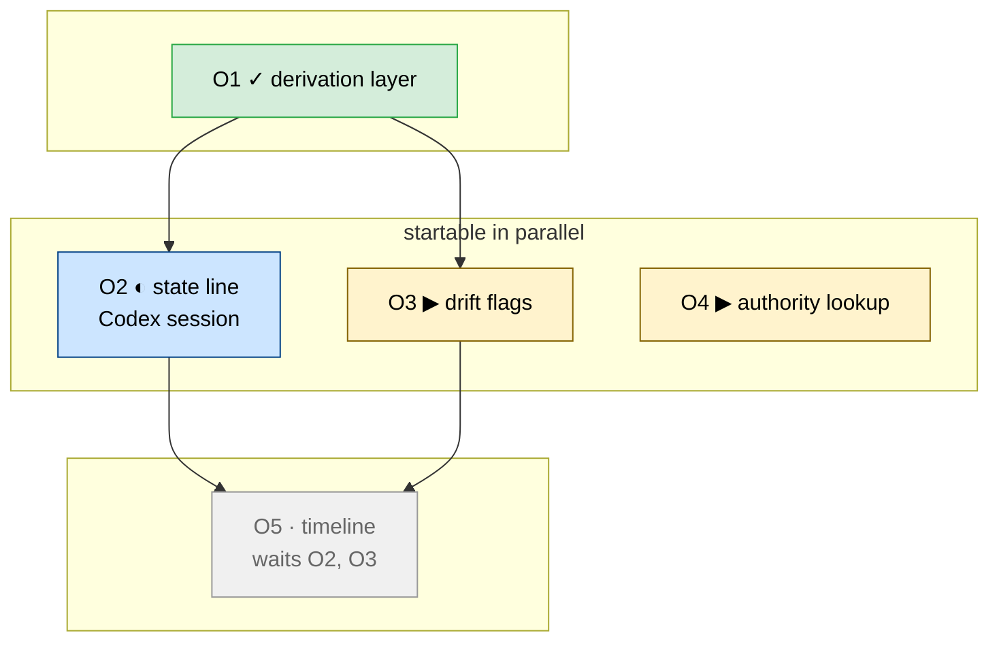
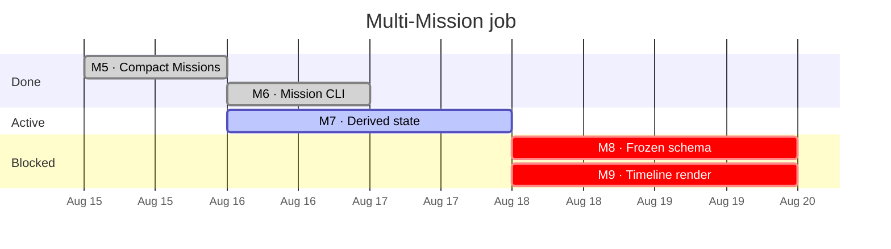
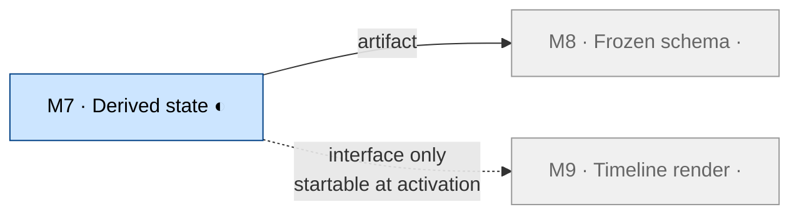

# Mermaid Views

Mermaid renderings for Spectacular Mission and Objective views. ASCII is the default
surface and carries the straightforward case; mermaid is for graphs ASCII cannot render
legibly.

**M2 and M4 are approved.** M1 and M3 are declined, because the ASCII Objective graph
and ASCII timeline read better for their cases. All four are kept here so the decision
is judged from rendered output rather than description.

The approved ASCII views (Mission timeline, compact chain, Objective graph, Objective
level sets) and the signals that justify escalating to mermaid are specified in
`.spectacular/contracts/CC-projsurf-derived-state-and-dependency-shape.md`.

Everything below is an example of a notation, not a fixed template. Where a Mission's
shape is not served well by these drawings, adapt the layout to communicate that
Mission clearly. The glyph vocabulary stays stable; layout does not have to.

All examples below are drawn from a real fixture bundle:

| Ref | Outcome | Status | After | Claims |
|---|---|---|---|---|
| O1 | Extract the shared derivation layer over the typed bundle. | implemented | — | — |
| O2 | Render the compact state line and NEXT line. | in-progress | O1 | state-line |
| O3 | Compute per-claim drift flags and default the audit target. | planned | O1 | drift-flags |
| O4 | Answer authority questions by lookup. | planned | — | authority-lookup |
| O5 | Render the multi-Mission timeline. | planned | O2, O3 | timeline |

Derived readiness: `O3` and `O4` are startable, `O5` is blocked on `O2, O3`.

## M1 — Objective graph, status by colour, claims per node — DECLINED

Colour carries status and claim names sit inside the node, which the ASCII graph cannot
show without a second block. Declined because the ASCII Objective graph already reads
well for this case, and the extra information does not justify a second surface.

## M2 — Grouped by level, parallel work enclosed — APPROVED

One subgraph per level. The band of independent Objectives is visually enclosed and
labelled rather than inferred from spacing, which is what ASCII level sets cannot do.
Use when the graph branches or runs deeper than about two levels.

## M3 — Mission timeline as a native Gantt — DECLINED

Mermaid resolves `after m7` itself, so ordering is declared rather than positioned by
hand. Declined because the ASCII timeline reads better for this case and needs no
duration for an active Mission, which the Gantt does.

## M4 — Mission edges by kind — APPROVED

Solid means the Mission needs the produced artifact. Dotted means it needs only the
frozen interface and is therefore startable at activation. Use when a Mission splits
into related Missions that follow it, or wherever both edge kinds appear together —
the distinction is clearer here than as `╌╌╌` in ASCII.

## Open questions

- Colour and glyph both encode status in M2. Keeping both is redundant but survives
  monochrome rendering and copy-paste into plain text; dropping glyphs is cleaner and
  fails silently where colour is lost.
- M4 presumes the artifact-versus-interface edge split, which is M8 work. It cannot be
  built before that lands.
- These are emitted by flags on existing commands, never by a new one. CC-missioncli
  freezes a ten-command surface and M6 stops on a growing surface, so views arrive as
  `mission show <ref> --graph` and `mission show <ref> --timeline`.
- Views are written to stdout and never cached in the workspace, because `show` and
  `check` are read-only. A rendered graph is a projection, not an artifact.
- Rendering must be byte-identical whether an Objective is inline or promoted. The two
  decode paths differ, and a graph is where that difference would surface quietly.
