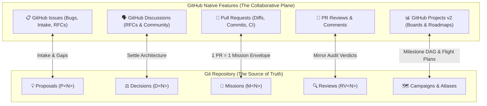

# GitHub Native Integration & Communication Layer

Spectacular coordinates work through local Markdown records in Git, while GitHub provides the collaborative web interface where teams manage issues, review pull requests, and track project boards.

This document defines how Spectacular's governance primitives map to GitHub native features, when to use each surface, and how autonomous agents leverage the `gh` CLI.

---

## 1. Core Architecture: Authority vs. Projection



- **Git is the durable authority**: If GitHub is down, airgapped, or migrated, all decisions, contracts, missions, reviews, and test proofs remain 100% intact, readable, and mechanically checkable via `spectacular`.
- **GitHub is the interactive projection**: GitHub enables team discussion, sprint planning, pull request approvals, and visual roadmaps without proprietary database lock-in.

---

## 2. The Spectacular $\leftrightarrow$ GitHub Mapping Matrix

| Spectacular Primitive | GitHub Feature | Interaction Pattern |
|---|---|---|
| **Proposal (`P<N>`)** | **GitHub Issue (RFC / Idea)** | An Issue captures user feedback or feature ideas. When non-trivial, an exploratory Proposal draft (`.spectacular/proposals/P<N>.md`) is linked in the issue. |
| **Gap (`G<N>`)** | **GitHub Issue (Bug / Tech Debt)** | A known limitation or unmet invariant in a Contract is tracked as a GitHub Issue citing the Gap ID. |
| **Decision (`D<N>`)** | **GitHub Discussions / PR Citations** | Architectural rulings settled via `spectacular decide` are cited in Discussions and PRs to halt bikeshedding. |
| **Mission (`M<N>`)** | **GitHub Pull Request (or Issue)** | A Mission is the exact execution envelope for a branch. **1 PR = 1 Mission**. Merging the PR completes the Mission. |
| **Review (`RV<N>`)** | **GitHub PR Review** | Audits recorded in `.spectacular/reviews/` are posted to the GitHub PR review timeline via `gh pr review`. |
| **Campaign (`campaigns/`)** | **GitHub Projects v2 (Roadmap & Board)** | Multi-session flight plans map directly to GitHub Project Iterations and Roadmap Milestones. |
| **Retrospective (`retrospectives/`)** | **GitHub Milestone Post-Mortem** | Freeform sprint post-mortems committed to Git and linked to closed milestones. |
| **`test/verify.sh`** | **GitHub Actions (CI/CD)** | Deterministic preflight and acceptance gates run automatically on every pull request. |

---

## 3. When Best to Use Each Surface: The Decision Heuristic

How does an operator or agent know whether to use a GitHub feature or a Spectacular record?

```text
┌─────────────────────────────────────────────────────────────────────────────┐
│ 🧭 WHEN TO USE GITHUB VS. SPECTACULAR                                        │
├────────────────────────────────┬────────────────────────────────────────────┤
│ Situation                      │ Where it belongs                           │
├────────────────────────────────┼────────────────────────────────────────────┤
│ User bug report or feedback    │ GitHub Issue                               │
│ Cross-team sprint planning     │ GitHub Projects v2 (Kanban / Roadmap)      │
│ Code diff discussion           │ GitHub Pull Request comments               │
│ Architectural choice or ruling │ Spectacular Decision (spectacular decide)  │
│ Bounded coding execution scope │ Spectacular Mission (.spectacular/missions)│
│ Contract drift or audit proof  │ Spectacular Review (.spectacular/reviews)  │
│ Freeform team scratchpad       │ .spectacular/raw/ (optional to commit)     │
└────────────────────────────────┴────────────────────────────────────────────┘
```

### Golden Rules:
1. **Never store architectural decisions solely in GitHub Issue comments**: Issues get closed, buried, and forgotten across model context windows (Context Amnesia). Settle the choice with `spectacular decide` so it lives in `.spectacular/decisions/`.
2. **Never rely on GitHub Projects for execution authority**: A card moved to "In Progress" on a board conveys intent, but does not bound code modification. A Spectacular Mission defines the exact failable test boundary and blast radius.
3. **Use GitHub for human interaction, Git for machine enforcement**: Use GitHub Issues to understand user needs; use `verify.sh` in GitHub Actions to stop broken code before merge.

---

## 4. End-to-End Workflow with the `gh` CLI

Agents equipped with terminal access can leverage the GitHub CLI (`gh`) seamlessly throughout the lifecycle:

### Step 1: Intake from an Issue
When an operator says *"Work on issue #142"* or provides an issue URL:
```bash
# Agent inspects the issue
gh issue view 142 --json title,body,labels

# Agent drafts a minimal Mission plan referencing the issue
cat << 'EOF' > plan.md
ref: M14
title: Fix race condition in token refresh
issue: 142
contract: CC-auth
completion:
  - claim: concurrent-refresh-safe
    pass_boundary: Concurrent token refresh calls return identical valid session.
    proof_requirement: go test -race ./internal/auth exits 0.
EOF

spectacular mission start plan.md
```

### Step 2: Branching and Pull Request Creation
```bash
git checkout -b m14-token-refresh
# ... Agent implements code, verifies tests pass with exit 0 ...
git commit -m "feat(auth): M14 — Fix token refresh race condition

Closes #142"

# Agent opens the GitHub PR linking the Mission
gh pr create \
  --title "feat(auth): M14 — Fix token refresh race condition" \
  --body "### Summary
Implements and proves **M14**.

- Closes #142
- Mission record: [.spectacular/missions/M14-token-refresh/M14-token-refresh.md](.spectacular/missions/M14-token-refresh/M14-token-refresh.md)
- Verified with \`bash test/verify.sh quick\` (exit 0)."
```

### Step 3: Continuous Integration (GitHub Actions)
Add a lightweight workflow `.github/workflows/spectacular.yml`:
```yaml
name: Spectacular Verification
on: [push, pull_request]

jobs:
  verify:
    runs-on: ubuntu-latest
    steps:
      - uses: actions/checkout@v4
      - uses: actions/setup-go@v5
        with:
          go-version: '1.24'
      - name: Tier 0 + Tier 1 Preflight
        run: bash test/verify.sh preflight
      - name: Tier 2 Quick Suite
        run: bash test/verify.sh quick
```

### Step 4: PR Review & Audit Mirroring
When an independent reviewer or auditor agent inspects the PR:
```bash
# 1. Record the formal Review in Spectacular
spectacular review record M14 review.md --status passed

# 2. Mirror the review to GitHub's PR timeline
gh pr review --approve --body-file .spectacular/missions/M14-token-refresh/reviews/RV1-independent-audit.md
```

---

## 5. GitHub Projects (v2) Integration

You can organize Spectacular work in GitHub Projects using custom fields:

- **Board Columns**: `Backlog` (Proposals) $\to$ `Ready` (Approved Plans) $\to$ `In Flight` (Active Missions) $\to$ `Under Review` (PR Open) $\to$ `Done` (Archived).
- **Custom Field `Spectacular Type`**: Single select: `Mission`, `Decision`, `Proposal`, `Review`, `Retrospective`.
- **Custom Field `Ref`**: Text: `M14`, `D10`, `P3`, `RV1`.
- **Roadmap View**: Map `.spectacular/campaigns/` milestone blocks to GitHub Project Iterations/Milestones to visualize the multi-week timeline.
