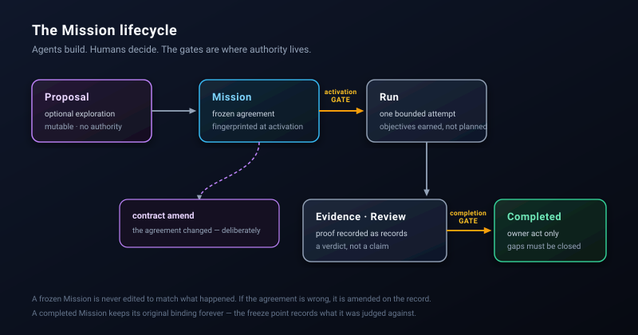

# Process

How work moves through Spectacular, and why each gate exists.



## One Mission at a time

Spectacular deliberately permits exactly one live Mission. This is a constraint,
not a limitation to be worked around. A second concurrent Mission would mean two
frozen agreements competing over the same workspace, and no way to say which one
a change was made under.

If a Mission is too big, the answer is a smaller Mission, not a parallel one.

## Intake and probes

Unbounded ideas, requests, and experiments do not need a Mission. Keep them in
an issue tracker, `TODO.md`, or `scratch/`; these are mutable intake surfaces,
not governed records. A probe may test a hypothesis in `scratch/` or on a
disposable branch when it is time-boxed, reversible, and has no provider,
destructive, production-data, or acceptance effect.

Promote the result when it becomes durable work: use a Proposal for a
consequential unresolved choice, or a compact Mission when the work has a
bounded outcome and needs authority, evidence, or review. Do not run an
unbounded intake queue on Autopilot.

## Campaigns: optional roadmap maps

A Campaign is one Markdown file in `.spectacular/campaigns/` for a genuinely
independent strategic arc. It maps 4–10 roadmap blocks, their dependencies,
candidate or active Missions, and an exit condition. It is a planning map, not
an automation queue or execution authority. Campaigns are optional: use one
only when several Missions need a shared roadmap.

## Explore: the Proposal and Starter Inputs

When starting a project or capability, an initial PRD or starter input (e.g. `./PRD.md`, `scratch/PRD.tmp.md`, or output from the `write-prd` skill) serves as an ephemeral launchpad. Spectacular's One-Shot Genesis distills its 8 foundational dimensions losslessly into the Core Triad (`PROJECT.md`, `STACK.md`, `ARCHITECTURE.md`), On-Demand Anchors, and the `M1-bootstrap` Mission plan.

A Proposal is optional. Write one when the approach is genuinely unclear and you
want to argue with it before committing.

It is mutable, carries no authority, and its status is an owner assertion rather
than a derived fact. Nothing about a Proposal grants permission to act — that is
the point. It is the cheapest place to be wrong.

When a Proposal's work ships, it is **retired**: it names the Mission that
absorbed it in `resolved_by:` and moves to `.spectacular/archive/proposals/`. A
Proposal is absorbed when the question it asked was answered, not when most of it
was.

## Prepare and freeze: the Mission

A Mission plan states an outcome, a stop condition, and the claims that must
hold. Activation freezes it and fingerprints the text.

**What freezing means:** the Mission is judged against what it said at
activation. It is not edited later to match what actually happened. If the
agreement turns out to be wrong, that is a real event worth recording — amend it
through `contract amend`, which rewrites the Gap and re-points the live Mission
as one recoverable transaction.

**Branch before activating.** A Mission that runs on `main` has destroyed the
review and isolation boundary it depends on before it starts.

## Execute: Runs, Objectives, and Model Profiles

A Run is one bounded attempt at the frozen Mission.

Missions, Objectives, and Handoffs declare abstract **Model Profiles** (`reasoning` for orchestrators/audits, `fast-code` for worker implementation sweeps, `strict-verifier` for adversarial review), allowing skills to dispatch the right model tier on any host harness.

Objectives are **earned, not planned**. Expand one when the work is real, rather
than enumerating a full tree upfront that will be wrong by the second Objective.
Dependencies come in two kinds:

- `after:` — this Objective needs the produced artifact, and is genuinely sequential.
- `after_interface:` — it needs only the contract shape, which exists the moment
  the plan freezes, so it can start at activation.

That split is what lets proof Objectives begin immediately instead of queueing
behind implementation.

`mission check` reports per-claim drift at any point: which claims are repaired,
how stale the evidence is, and where the next flag is.

### Checkpoints are planned Run-body gates

A checkpoint is an optional, planned point in a Run for reviewing progress,
running a check, collecting a decision, or choosing whether to resume. It is
not automatically a human-review gate and does not carry authority by itself.
Record the planned checkpoints in the Run body at activation, then update the
same section as the Run progresses.

Use the durable record that matches what happened at a checkpoint:

| If the checkpoint produces… | Record it as… |
| --- | --- |
| an owner choice or changed direction | a Decision |
| an observation or test result | Evidence |
| a verdict on the work | Review or Assessment |
| a transfer to another operator or runtime | Handoff |
| none of the above | a concise Run-body checkpoint note |

The Run-body note names the trigger, what was reviewed, the result, and the
next action. It supports a cold resume without creating a new record for every
ordinary progress check.

## Prove: Evidence, Reviews, Handoffs

Proof is a record, not a message.

A **Review** carries a verdict. An **Assessment** carries a judgment. **Evidence**
carries what was observed. None of them is a claim that something works — they
are the artifact a later reader uses to decide whether to trust it.

Independent review supports a **dual-path workflow**:
1. **In-Harness Subagents**: A clean-slate child agent is dispatched with the commit SHA and FROST criteria, writing `ReviewDraft` directly to `reviews/`.
2. **External Model / Human Handoff**: A copy-pasteable review prompt is generated in `handoffs/review-handoff-prompt.md` to run against external models (e.g. OpenAI o3, DeepSeek-R1) or peer reviewers, returning the verdict into `spectacular review record`.

A **Handoff** binds the exact commit and tree it was sent against, verified
against the repository, and splits what the sender knows into two lists:

- `asserted` — what the sender verified themselves
- `assumed` — what they are carrying on trust

Neither is scored. The split exists so the receiver knows exactly what to
re-verify before acting. A recorded Handoff is frozen; correcting one means
recording a new Handoff that carries `supersedes:`, and the original survives as
what its sender believed at the time.

## Close: completion is an owner act

```sh
spectacular mission complete M12 --by alex
```

An agent cannot complete its own Mission. Completion refuses while a declared Gap
is still open, so "we shipped it but this is still broken" cannot be recorded as
success.

A **Gap** is a stated limit rather than a defect. It is never closed by deleting
it — the entry survives with a written resolution, so the reason something was
impossible stays recoverable years later.

## After: freeze points and the archive

A completed Mission keeps its original contract fingerprint forever. Amendments
re-point only the live Mission. When `mission check` reports contract drift on a
completed Mission, that is a **notice**, not an error: the Mission stays valid,
and `git log -S <fingerprint>` recovers the Contract text as it was.

Completed Missions and absorbed Proposals move to `.spectacular/archive/`,
carrying the Decision that authorized the move and a fingerprint of what was
archived. Archived records are kept machine-readable — mainly for their numbering
and their reasoning — not for routine reading.

## The rule underneath all of it

The system does not decide anything. It validates, fingerprints, writes
atomically, and reports. Every judgment — is this good, is this done, may this
proceed — is an owner act at a named gate.

That is what makes an agent's work resumable: not a longer chat history, but a
record of what was agreed, what was attempted, what was proven, and who said yes.

## See also

- [Quickstart](quickstart.md) — run one Mission end to end.
- [Architecture](architecture.md) — the surfaces and record types.
