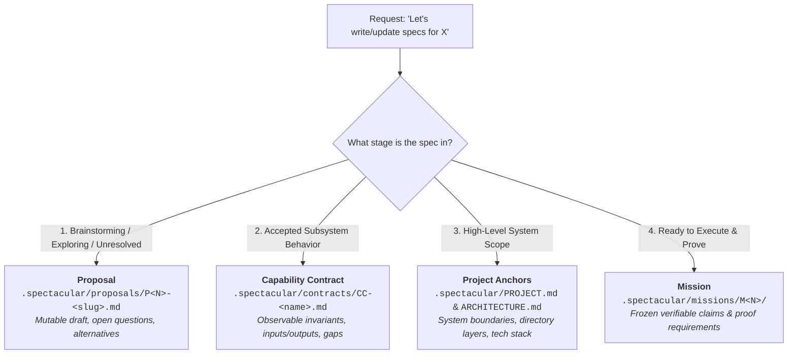

# Process

How a piece of work moves through Spectacular.


## The Lean 3-Layer Autopilot Model

Spectacular provides an ultra-lean, token-efficient execution lifecycle with minimal ceremony:

1. **Layer 1: Living Ground Truth & Decisions**: `PROJECT.md` (boundaries/non-goals) + `.spectacular/decisions/` (bulk-ideated architectural choices locked with `spectacular decide`).
2. **Layer 2: Topological Flight Plan**: Multi-session roadmap in `.spectacular/campaigns/flight-plan.md` (4–8 macro milestone blocks).
3. **Layer 3: Single-File Execution Envelopes**: Compact, self-contained Mission files (`missions/M<N>.md`, $\le 500$ tokens) with inline deliverables checklist and fail-fast stop triggers.

### Mission Layout & Sub-Folder Selection Protocol
- **Tier 1: Single-File (90% Default)**: `M<N>.md` only. Routine features, bug fixes, refactors where tests passing (`exit 0`) is the proof. Zero sub-folders.
- **Tier 2: Hybrid Earned (~8%)**: `M<N>.md` + 1 earned sub-record (e.g. `evidence/` for live third-party API receipts, or `objectives/` for parallel worktrees).
- **Tier 3: Full Governed Bundle (~2%)**: High-stakes zero-downtime DB cutovers, auth/crypto, or payments requiring formal checkpoints (`checkpoints/`) or independent adversarial audit (`reviews/`).

### Dual-Lane Orchestration: Supervised Dispatch vs. Full Handoff
- **Supervised Dispatch (90% Default)**: In-session subagent delegation. The Orchestrator retains Mission ownership, sends a $\le 300$-token charter, and waits reactively for completion (`worker_done`). Zero extra governance files written.
- **Full Ownership Handoff (10% Transfer)**: Explicit ownership transfers across distinct sessions, human engineers, or different AI harnesses recorded via `spectacular handoff record`.

### The 3-Tier Question Escalator
- **Tier 1: Optimistic Consent**: Non-blocking 1-line statement of defaults for low-risk implementation choices (`"Proceeding with X unless you prefer Y"`).
- **Tier 2: Structured Batch Cards**: Numbered questions with lettered options (`1. Question ➔ A, B, C (Recommended)`), adaptive context depth, batch shorthand replies (`A, B, A`, `all defaults`), and open write-in support.
- **Tier 3: Trade-off Spectrum & Interactive Modals**: Framing competing design axes for unpredictable exploration, or leveraging interactive UI modals (`ask_question`).

## Intake and probes

Ideas and small experiments do not need a Mission. Keep them in an issue,
`TODO.md`, or `scratch/`. A quick test is fine when it is time-boxed,
reversible, and does not touch external services, production data, or a release.

Promote the result when it becomes durable work: use a Proposal for a
consequential unresolved choice, or a compact Mission when the work has a
bounded outcome and needs authority, evidence, or review. Do not run an
unbounded intake queue on Autopilot.

## Campaigns: optional roadmap maps

A Campaign is one Markdown file in `.spectacular/campaigns/` for a genuinely
independent strategic arc. Aim for 4–10 roadmap blocks with their dependencies,
candidate or active Missions, and an exit condition; split an unwieldy map into
separate arcs. It is a planning map, not an automation queue or execution
authority. Campaigns are optional: use one only when several Missions need a
shared roadmap. Prefer a Mermaid dependency view when it makes order clearer.
`spectacular campaign check <path>` is read-only: it validates the optional
frontmatter map, resolves named Mission refs, detects cycles, and emits the
ordered Mermaid projection.

Campaign checking is an orchestration/planning action. Its `current` field is a
global map position, not a worker assignment; Mission workers normally follow
their Mission, Objective, and Run without loading a Campaign.

## Explore: the Proposal and Starter Inputs

When starting a project, use a short product brief or starter document. The
setup step turns it into the project files that describe the product, technical
stack, architecture, and first Mission.

### How Spectacular Disambiguates "Specs"

Because "spec" is an overloaded term, Spectacular routes specification work based on the maturity and intent of the request:



### Iterating on Specs During Brainstorming

When you and an agent brainstorm in chat:
1. **Iterate Freely in a Proposal**: Draft the candidate specification in `.spectacular/proposals/P<N>-<slug>.md`. Proposals are completely mutable and carry no execution authority—you can rewrite, expand, or pivot the spec across dozens of chat turns without causing contract drift or validation failures.
2. **Lock Key Trade-offs with Decisions**: When an architectural or policy fork is settled, record it via `spectacular decide` (`D<N>`) to capture the immutable rationale.
3. **Promote to Living Truth**: When the specification is finalized, incorporate the observable invariants into a Capability Contract (`.spectacular/contracts/CC-<name>.md`) or Project Anchor (`PROJECT.md` / `ARCHITECTURE.md`).
4. **Retire the Proposal**: Mark the Proposal `status: accepted` with `resolved_by:` and move it to `.spectacular/archive/proposals/`.
5. **Execute via Mission**: Launch a frozen Mission (`spectacular mission start`) with verifiable claims and proof requirements.

A Proposal is optional. Write one when the approach is genuinely unclear and you
want to argue with it before committing.

It is mutable, carries no authority, and its status is an owner assertion rather
than a derived fact. Nothing about a Proposal grants permission to act — that is
the point. It is the cheapest place to be wrong.

When a Proposal's work ships, it is **retired**: it names the Mission that
absorbed it in `resolved_by:` and moves to `.spectacular/archive/proposals/`. A
Proposal is absorbed when the question it asked was answered, not when most of it
was. See `D11-proposal-retirement`.

## Prepare and freeze: the Mission

A Mission plan states an outcome, a stop condition, and the claims that must
hold. Activation freezes it and fingerprints the text.

### Upfront Alignment: Pattern Pass & Domain Vocabulary

Before code is written or delegated to subagents:
1. **The Architectural Pattern Pass (D29)**: The Orchestrator surveys standard library idioms, RFC specifications, and battle-tested open-source reference implementations (e.g. `xterm.js`, standard AST parsers) rather than generating bespoke abstractions from scratch. A 3-line Pattern Census is frozen into the Mission body.
2. **Domain Ontology & Banned Synonyms (`VOCABULARY.md`)**: Ubiquitous language is maintained under single-writer authority (Owner/Orchestrator only). Explicit Banned Synonyms prevent LLMs across fresh context windows from drifting between ambiguous verbs and states.

**What freezing means:** the Mission is judged against what it said at
activation. It is not edited later to match what actually happened. If the
agreement turns out to be wrong, that is a real event worth recording — amend it
through `contract amend`, which rewrites the Gap and re-points the live Mission
as one recoverable transaction.

**Branch before activating.** A Mission that runs on `main` has destroyed the
review and isolation boundary it depends on before it starts.

## Execute: Runs, Objectives, and Model Profiles

A Run is one bounded attempt at the frozen Mission.

Missions and handoffs can name the kind of model work they need: careful
planning, fast implementation, or strict review. The host chooses the matching
model when it can.

Objectives are **earned, not planned**. Expand one when the work is real, rather
than enumerating a full tree upfront that will be wrong by the second Objective.
Dependencies come in two kinds:

- `after:` — this Objective needs the produced artifact, and is genuinely sequential.
- `after_interface:` — it needs only the contract shape, which exists the moment
  the plan freezes, so it can start at activation.

That split is what lets proof Objectives begin immediately instead of queueing
behind implementation.

`mission check` reports per-claim drift at any point: which claims are repaired,
how stale the evidence is, and where the next flag is.

### Checkpoints are planned Run-body gates

A checkpoint is an optional, planned point in a Run for reviewing progress,
running a check, collecting a decision, or choosing whether to resume. It is
not automatically a human-review gate and does not carry authority by itself.
Record the planned checkpoints in the Run body at activation, then update the
same section as the Run progresses.

Use the durable record that matches what happened at a checkpoint:

| If the checkpoint produces… | Record it as… |
| --- | --- |
| an owner choice or changed direction | a Decision |
| an observation or test result | Evidence |
| a verdict on the work | Review or Assessment |
| a transfer to another operator or runtime | Handoff |
| none of the above | a concise Run-body checkpoint note |

The Run-body note names the trigger, what was reviewed, the result, and the
next action. It supports a cold resume without creating a new record for every
ordinary progress check.

### Roles use bounded context

An Orchestrator uses Anchors and Campaign maps to plan. A Runner uses its
assigned Objective, current Run, Handoff, and explicitly named inputs. A
Reviewer uses frozen claims, the reviewed commit, Evidence, and review criteria.
An Autopilot receiver uses only its charter and allowed sources.

An independent Runner Handoff includes a short **Runner context contract** in
its body: `Read`, `Do not load`, and `If blocked`. If the contract does not
answer a needed question, the Runner requests one named authoritative source
from the Orchestrator rather than scanning the workspace. This preserves both
token efficiency and the boundary between roadmap context and execution
authority.

## Prove: Evidence, Reviews, Handoffs

Keep proof in records, not chat messages.

A **Review** carries a verdict. An **Assessment** carries a judgment. **Evidence**
carries what was observed. None of them is a claim that something works — they
are the artifact a later reader uses to decide whether to trust it.

Independent review supports a **dual-path workflow**:
1. **In-Harness Subagents**: A clean-slate child agent is dispatched with the commit SHA and FROST criteria, writing `ReviewDraft` directly to `reviews/`.
2. **External Model / Human Handoff**: A copy-pasteable review prompt is generated in `handoffs/review-handoff-prompt.md` to run against external models (e.g. OpenAI o3, DeepSeek-R1) or peer reviewers, returning the verdict into `spectacular review record`.

A **Handoff** binds the exact commit and tree it was sent against, verified
against the repository, and splits what the sender knows into two lists:

- `asserted` — what the sender verified themselves
- `assumed` — what they are carrying on trust

Neither is scored. The split exists so the receiver knows exactly what to
re-verify before acting. A recorded Handoff is frozen; correcting one means
recording a new Handoff that carries `supersedes:`, and the original survives as
what its sender believed at the time.

## Close: completion is an owner act

```sh
spectacular mission complete M12 --by alex
```

An agent cannot complete its own Mission. Completion refuses while a declared Gap
is still open, so "we shipped it but this is still broken" cannot be recorded as
success.

### The "Mistake Tax" & Guardrail Feedback Loop (D29)
When a Mission completes having consumed repair budgets, hit unexpected regressions, or resolved non-trivial review findings, the failure root cause is codified into permanent rules:
- **Domain & System Invariants** $\to$ Appended directly to `.spectacular/GUARDRAILS.md`.
- **Harness & Tooling Invariants** $\to$ Appended directly to `AGENTS.md`.
- **Architectural Trade-offs** $\to$ Recorded as atomic Decisions (`.spectacular/decisions/`).

Ad-hoc `LEARNINGS.md` or `FIXES.md` sprawl is forbidden, ensuring every lesson is routed to its single permanent home.

A **Gap** is a stated limit rather than a defect. It is never closed by deleting
it — the entry survives with a written resolution, so the reason something was
impossible stays recoverable years later.

## After: freeze points and the archive

A completed Mission keeps its original contract fingerprint forever. Amendments
re-point only the live Mission. When `mission check` reports contract drift on a
completed Mission, that is a **notice**, not an error: the Mission stays valid,
and `git log -S <fingerprint>` recovers the Contract text as it was.

Completed Missions and absorbed Proposals move to `.spectacular/archive/`,
carrying the Decision that authorized the move and a fingerprint of what was
archived. Archived records are kept machine-readable — mainly for their numbering
and their reasoning — not for routine reading.

## The rule underneath all of it

The system does not decide anything. It validates, fingerprints, writes
atomically, and reports. Every judgment — is this good, is this done, may this
proceed — is an owner act at a named gate.

That is what makes an agent's work resumable: not a longer chat history, but a
record of what was agreed, what was attempted, what was proven, and who said yes.

## See also

- [Quickstart](quickstart.md) — run one Mission end to end.
- [Architecture](architecture.md) — the surfaces and record types.
