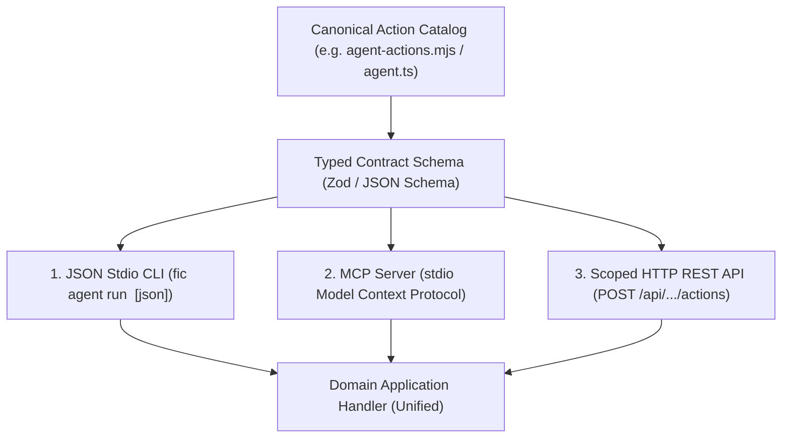

# Action Contracts

Design, audit, and govern rigorous, contract-driven Action Surfaces across headless CLIs, Model Context Protocol (MCP) servers, typed REST/RPC APIs, and autonomous agents.

---

## 1. Operating Principles

1. **Action-First, Not Control-First**:
   - External callers (AI agents, shell scripts, CI runners, third-party automations) must NEVER receive arbitrary execution authority, raw database access (`SELECT/UPDATE`), or unbounded shell execution.
   - Every system capability is projected as an item in a **Canonical Action Catalog** of discrete, atomic operations (e.g. `client.create`, `invoice.simulate`, `invoice.issue`, `receipt.record`).
2. **Parity Across Selected Transports (No Divergent Logic)**:
   - A single underlying business application handler powers every selected transport. Add a transport only for a demonstrated consumer need and within owner authorization; the following are alternatives or existing adapters:
     1. **CLI stdio** (`run <action> [inputJson]`)
     2. **MCP Tool** (`CallToolResult` via stdio or SSE)
     3. **HTTP REST/RPC Gateway** (`POST /api/actions/...`)
   - Selected adapters share business rules, authorization semantics, and typed errors. Test parity without introducing missing transports or altering an existing public command on inferred intent.
3. **Strict Perimeter Validation**:
   - Every action declares an explicit, exhaustive input schema (**Zod**, **JSON Schema**, or **OpenAPI**).
   - Validation occurs strictly at the perimeter before any domain transaction or repository read/write.
4. **Idempotency & Safe Retries**:
   - Mutating commands require caller-supplied `Idempotency-Key` contracts.
   - Handlers must implement atomic in-flight deduplication and cached response replay.
   - Network interruptions or uncertain state handoffs MUST NOT trigger blind retries. State machines must support provisional or uncertain states (e.g. `SEND_UNCERTAIN`).
5. **Capability-Based Permission Grants**:
   - Effective caller authorization is the strict intersection of:
     $$\text{Effective Rights} = \text{Token Scoped Actions} \cap \text{Caller Role} \cap \text{Active Workspace Modules}$$
   - Web browser cookies cannot invoke action routes, and service tokens cannot access interactive UI session routes.

---

## 2. Optional Transport Adapters

The diagram shows possible adapters sharing one handler; it does not require all
three. Preserve the project's existing catalog and generated interface authority.



| Transport | Invocation Interface | Primary Consumer | Return Envelope Contract |
|---|---|---|---|
| **JSON Stdio CLI** | `run <action> [inputJson]` | Shell scripts, cron jobs, headless runners | Standardized JSON on `stdout`: `{ "status": "ok", "data": ... }` |
| **Model Context Protocol (MCP)** | `mcp serve` (stdio server) | Claude Desktop, Cursor, Antigravity, local agents | Structured `CallToolResult` with formatted JSON text |
| **HTTP Action Gateway** | `POST /api/workspaces/:slug/actions` | Remote SaaS agents, external webhooks, frontend | HTTP status codes with normalized `{ "error": null, "data": ... }` |

---

## Module interface contracts

Record the owning capability, consumers, public operation semantics, effects,
transaction boundary, error behavior, and compatibility expectations. Expose
minimal inputs and detached read views, keeping ORM objects, mutable persistence
models, and implementation types private. Composition supplies concrete adapters;
pure policy does not import transports. Use consumer-defined ports where they
remove a real dependency.

These software contracts are distinct from governed Spectacular Contract records.
Reuse the existing interface owner; do not activate a Mission, create another
catalog, or add CLI/MCP/HTTP surfaces merely to document a module API. Ask
`test-sentinel` to prove parity and boundary refusal when executable proof is needed.

## 3. Standard Action Specification Template

When defining or auditing actions in `.spectacular/atlas/agent-action-surface.md` or domain action registries, follow this specification standard:

```markdown
### `domain.action_name`

- **Purpose**: Clear, 1-sentence description of the business action.
- **Side Effect**: `Read-Only (Query)` | `State Mutation (Command)` | `External Network Dispatch`.
- **Permission Scope**: Required capability grant (e.g. `invoices:issue`, `clients:write`).
- **Module Guard**: Optional module activation requirement (e.g. `customer_invoices`).
- **Idempotency**: `Required (Header: Idempotency-Key)` | `Natural (Safe Read)` | `Client UUID`.
- **Input Schema (Zod)**:
  ```typescript
  z.object({
    clientId: z.string().uuid(),
    issueDate: z.string().regex(/^\d{4}-\d{2}-\d{2}$/),
    lines: z.array(z.object({
      description: z.string().min(1).max(200),
      amount: z.number().positive(),
      vatRate: z.number().nonnegative()
    })).min(1)
  }).strict()
  ```
- **Output Schema**:
  ```typescript
  z.object({
    invoiceId: z.string().uuid(),
    documentNumber: z.string(),
    totalEur: z.number(),
    status: z.enum(['draft', 'issued'])
  })
  ```
- **Error Modes**:
  - `400 / VALIDATION_ERROR`: Malformed payload, invalid format, schema violation.
  - `401 / UNAUTHORIZED`: Missing or invalid Bearer authentication token.
  - `403 / FORBIDDEN`: Missing required action grant in token scopes.
  - `404 / NOT_FOUND`: Target resource does not exist in the caller workspace.
  - `409 / CONFLICT`: Idempotency collision, stale optimistic lock version, or duplicate numbering.
```

---

## 4. Idempotency Contract Pattern

For state-mutating actions, enforce the standard two-tier idempotency lifecycle:

```typescript
// 1. In-flight mutex claim
const claim = await persistence.claimIdempotencyKey(key, hash(payload), ttlMs);
if (claim.status === 'in_flight') {
  throw new ConflictError('Action is already executing under this idempotency key');
}
if (claim.status === 'completed') {
  return claim.cachedResponse; // Safe idempotent replay
}

// 2. Execute atomic domain handler
try {
  const result = await domainHandler(payload);
  await persistence.completeIdempotencyKey(key, result);
  return result;
} catch (err) {
  await persistence.releaseIdempotencyKey(key);
  throw err;
}
```

---

## Gates for the selected increment

Consult the applicable prompts in
[Spectacular readiness](../spectacular/references/milestone-readiness.md) when
planning a delivery or launch. Apply compatibility, authorization, idempotency, and uncertain-outcome gates to
the interfaces and effects actually exposed. Technical parity does not validate
user value or authorize additional transports/publication.

## 5. Negative Constraints (DO NOT)

- **DO NOT expose unrestricted CRUD or raw SQL**: Never implement generic `run_sql`, `db_execute`, or open `update_table` actions.
- **DO NOT fork business logic across transports**: CLI, MCP, and REST must share the exact same validator and application handler.
- **DO NOT return unstructured error strings to callers**: Error envelopes must include machine-readable codes and field paths (e.g. `{"code": "INVALID_POSTAL_CODE", "path": "client.postalCode"}`).
- **DO NOT perform blind retries on transmission drops**: When external RPC or network dispatch drops connection, state must transition to an uncertain state (`SEND_UNCERTAIN`) rather than auto-retrying.
- **DO NOT store plaintext secrets in token metadata**: Action tokens are authenticated via SHA-256 hashes (`authenticate_token`). Never log or persist plaintext keys.
