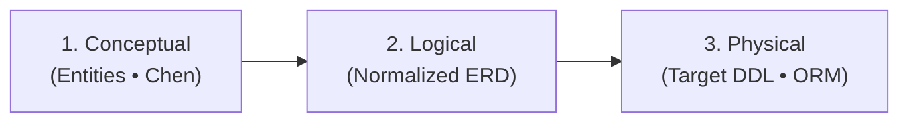

# Data Modeling & Database Engineering

Transform domain entities into high-performance database schemas with explicit relational integrity and zero-downtime migration paths.

## Ownership before schema

Start from the existing module ownership and consistency decisions. For each
data set, identify its authoritative writer, consumers, required transaction
invariants, and whether reads need current truth, historical snapshots, or
rebuildable projections. Consult `system-architecture` only when those boundaries
are unresolved.

Within one owner, use relational integrity and normalization as appropriate.
Across owners, communicate through stable IDs and explicit APIs or events; a
shared database or FK does not grant another module write authority. Explain
cross-owner joins, deletes, and migration coordination. Snapshot history-sensitive
values; define freshness and rebuild behavior for read projections. Do not split
an invariant across stores merely to make the schema look modular.

## 3-Tier Modeling Workflow



| Step | Focus | Deliverable & References |
| :--- | :--- | :--- |
| **1. Conceptual** | Identify entities, weak entities, attributes, and raw cardinality ($1:1$, $1:N$, $M:N$). | Entity list and domain relationship summary. |
| **2. Logical** | Normalize to 3NF/BCNF, resolve $M:N$ via junction entities, assign `PK`, `FK`, `UK`, `NN`. | Mermaid Crow's Foot ERD. Read [references/erd-patterns.md](references/erd-patterns.md). |
| **3. Physical DDL** | Map types to target engine (Postgres, MySQL, SQLite, Prisma, Drizzle), cascades, constraints. | Production-ready DDL / ORM schema. Read [references/schema-ddl-dialects.md](references/schema-ddl-dialects.md). |
| **4. Index Strategy** | Align indexes (B-Tree, GIN, composite column ordering) to access patterns. | Index creation script. Read [references/indexing-access-patterns.md](references/indexing-access-patterns.md). |
| **5. Migration** | Phased Expand/Contract rollout for live production workloads. | Rollout & rollback plan. Read [references/migration-safety.md](references/migration-safety.md). |

## Quick Reference: Crow's Foot ERD Syntax (Mermaid)

| Symbol (L) | Symbol (R) | Cardinality | Line Syntax | Meaning |
| :--- | :--- | :--- | :--- | :--- |
| `\|\|` | `\|\|` | Exactly one | `ENTITY_A \|\|--\|\| ENTITY_B : has` | 1:1 Mandatory |
| `\|o` | `o\|` | Zero or one | `ENTITY_A \|o--o\| ENTITY_B : optional` | 1:1 Optional |
| `\|\|` | `o{` | Zero or many | `CUSTOMER \|\|--o{ ORDER : places` | 1:N Optional |
| `\|\|` | `\|{` | One or many | `ORDER \|\|--\|{ ORDER_ITEM : contains` | 1:N Mandatory |
| `}o` | `o{` | Many to many | `STUDENT }o--o{ COURSE : enrolls` | M:N (Resolve with Junction) |

## Type Translation Matrix

| Logical Type | PostgreSQL | MySQL 8.0+ | SQLite | Prisma | Drizzle ORM |
| :--- | :--- | :--- | :--- | :--- | :--- |
| **UUID** | `UUID` | `VARCHAR(36)` | `TEXT` | `String @id @default(uuid())` | `uuid().primaryKey()` |
| **Auto-Int** | `BIGSERIAL` | `BIGINT AUTO_INCREMENT` | `INTEGER PRIMARY KEY` | `Int @id @default(autoincrement())` | `serial().primaryKey()` |
| **String** | `VARCHAR(n)` / `TEXT` | `VARCHAR(n)` / `TEXT` | `TEXT` | `String` | `varchar({ length: n })` |
| **Decimal** | `NUMERIC(12,2)` | `DECIMAL(12,2)` | `REAL` | `Decimal @db.Decimal(12,2)` | `decimal({ precision: 12, scale: 2 })` |
| **Timestamp** | `TIMESTAMPTZ` | `DATETIME(6)` | `TEXT` (ISO8601) | `DateTime @default(now())` | `timestamp({ withTimezone: true })` |
| **JSON** | `JSONB` | `JSON` | `TEXT` | `Json` | `jsonb()` |

## DDL Schema Scaffold Pattern

This example assumes one coordinated data owner. Reassess the FK and deletion
policy when customers and orders have independently owned models.

```sql
CREATE TABLE customers (
    id UUID PRIMARY KEY DEFAULT gen_random_uuid(),
    email VARCHAR(255) NOT NULL UNIQUE,
    created_at TIMESTAMPTZ NOT NULL DEFAULT now()
);

CREATE TABLE orders (
    id UUID PRIMARY KEY DEFAULT gen_random_uuid(),
    customer_id UUID NOT NULL REFERENCES customers(id) ON DELETE RESTRICT,
    total_amount NUMERIC(12, 2) NOT NULL CHECK (total_amount >= 0),
    created_at TIMESTAMPTZ NOT NULL DEFAULT now()
);
CREATE INDEX idx_orders_customer_id ON orders(customer_id);
```

## Gates for the selected increment

Consult the applicable prompts in
[Spectacular readiness](../spectacular/references/milestone-readiness.md) when
planning a delivery or launch. Apply migration, historical-data, recovery, and compatibility gates when the
increment introduces or changes persistent data. Scope proof to the actual engine,
data, and exposure; do not require a database for every MVP.

## Expansion Handoffs

| Out-of-Scope Need | Action / Delegate |
|---|---|
| Service boundaries, bounded contexts, C4 models | Invoke `system-architecture` companion skill |
| UI/UX prototype with multiple data layout options | Invoke `rapid-prototyping` companion skill |
| Executable ownership, compatibility, and rollback proof | Use `test-sentinel` with the relevant invariant |
| Durable rollout plan or explicitly requested governance | Use `spectacular` ordinary plans; Mission governance only on owner opt-in |

## Core Invariants & Negative Constraints

- **DO NOT leave relationships untyped or implicit.** Explicitly define `ON DELETE RESTRICT` (default) or `ON DELETE CASCADE` (dependent weak entities only).
- **DO NOT allow unresolved M:N relations in physical DDL.** Use an associative table with explicit relationship uniqueness; choose a composite key or a surrogate key plus the appropriate unique constraint.
- **DO NOT use local timezone timestamps.** Store all timestamps in UTC (`TIMESTAMPTZ` / ISO8601).
- **DO NOT execute blocking table locks on live workloads.** Choose an engine-appropriate non-blocking rollout. Use Expand/Contract when needed; dual-write only with explicit ownership, reconciliation, and rollback.
