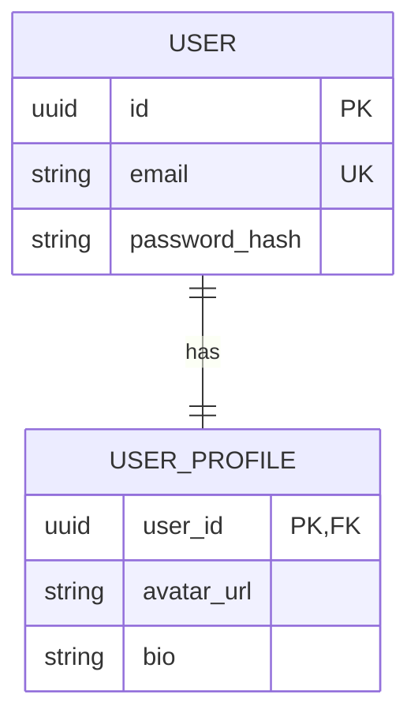
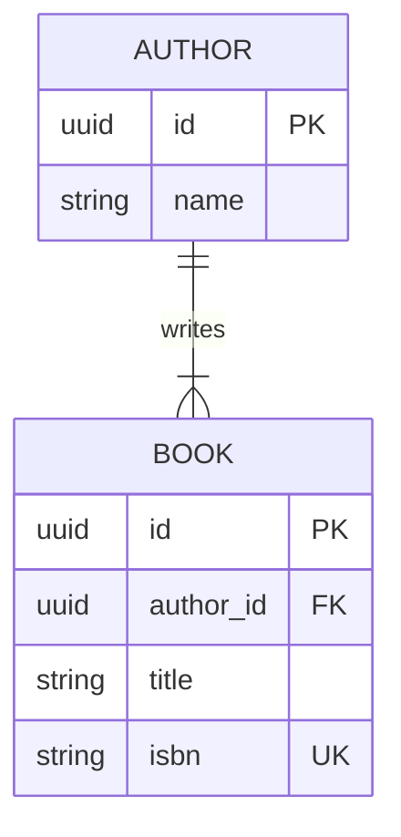
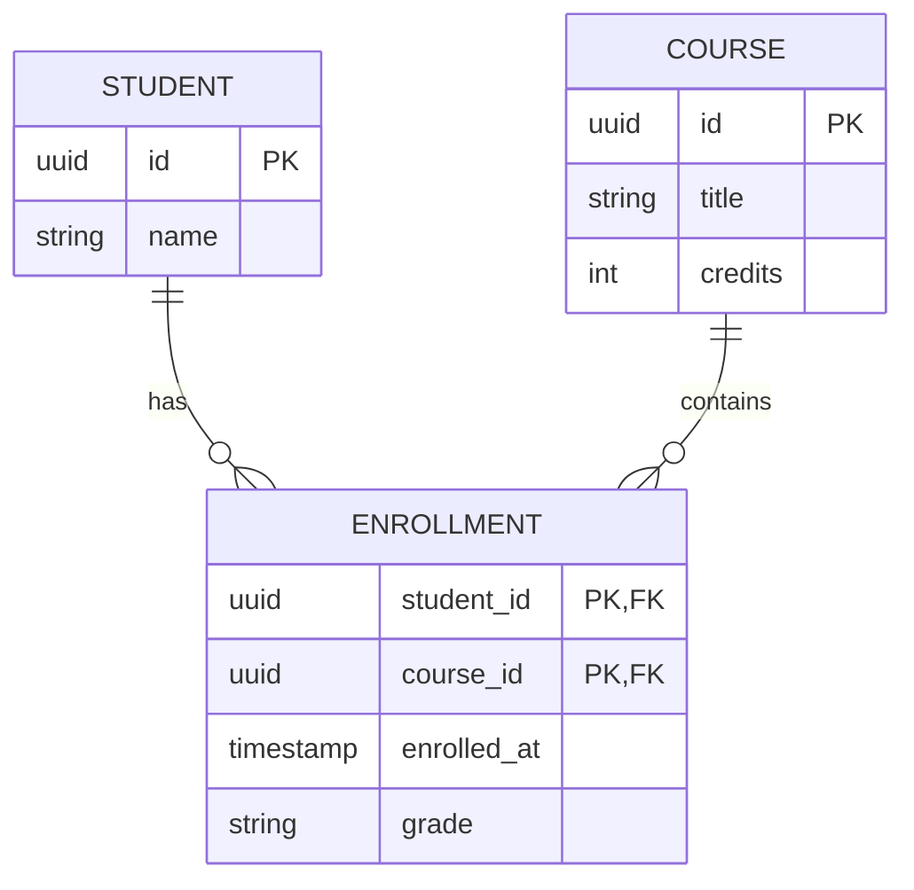

# ERD Patterns & Notations

Use this reference when generating Entity-Relationship diagrams, mapping business entities, or converting between conceptual, logical, and physical schemas.

---

## 1. Core Modeling Notations

### Chen's Notation (Conceptual Modeling)
Used for high-level business entity modeling:
- **Entities (Rectangles):** Independent domain objects (e.g. `Customer`, `Order`).
- **Weak Entities (Double Rectangles):** Dependent objects that cannot exist without an owner (e.g. `OrderItem` depends on `Order`).
- **Attributes (Ovals / Ellipses):**
  - *Key Attribute:* Underlined text (Primary Key identifier).
  - *Multivalued Attribute (Double Oval):* Can have multiple values (e.g. `phone_numbers`).
  - *Derived Attribute (Dashed Oval):* Computed dynamically (e.g. `age` from `date_of_birth`).
- **Relationships (Diamonds):** Verbs connecting entities (e.g. `Customer` -[places]-> `Order`).

### Crow's Foot Notation (Logical & Physical Modeling)
Standard industry notation representing tables, typed columns, keys, and relational cardinality symbols.

---

## 2. Mermaid.js ERD Syntax Guide

### Cardinality Indicators

| Symbol (Left) | Symbol (Right) | Meaning |
| :--- | :--- | :--- |
| `\|\|` | `\|\|` | Exactly one |
| `\|o` | `o\|` | Zero or one (Optional) |
| `}\|` | `\|{` | One or many (Mandatory) |
| `}o` | `o{` | Zero or many (Optional) |

### Relationship Connectors
- `--` : Non-identifying relationship (child entity has its own primary key).
- `..` : Identifying relationship (child primary key includes parent primary key).

---

## 3. Standard Patterns

### One-to-One (1:1)

### One-to-Many (1:N)

### Many-to-Many (M:N) with Associative Junction Entity
Always resolve M:N relationships into an explicit junction entity in logical and physical designs:

---

## 4. Attribute Constraints Reference

- `PK` : Primary Key
- `FK` : Foreign Key
- `UK` : Unique Key
- `NN` : Not Null / Mandatory

### Canonical Data Types:
- Numbers: `int`, `bigint`, `smallint`, `decimal(p,s)`, `numeric`
- Strings: `string`, `varchar(n)`, `text`, `char(n)`
- Temporal: `timestamp`, `timestamptz`, `date`, `time`
- Structured: `json`, `jsonb`, `uuid`, `boolean`, `bytea`
