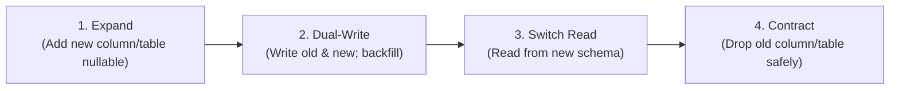

# Zero-Downtime Migration Safety Guide

Use this reference when designing schema changes, database migrations, backfills, or table refactorings for live production workloads.

---

## 1. The Expand / Contract (Parallel Run) Pattern

Never execute destructive or breaking schema changes in a single step on live databases. Always phase changes across deploy milestones:



### Safe vs Unsafe Operations

| Operation | Unsafe Approach (Locks/Breaks) | Safe 4-Phase Strategy |
| :--- | :--- | :--- |
| **Add Non-Null Column** | `ALTER TABLE t ADD col INT NOT NULL;` | Add nullable $\to$ backfill in batches $\to$ add `NOT NULL` constraint with validation. |
| **Rename Column** | `ALTER TABLE t RENAME COLUMN old TO new;` | Add `new` $\to$ Dual-write $\to$ Backfill $\to$ Switch reads $\to$ Drop `old`. |
| **Change Column Type** | `ALTER TABLE t ALTER COLUMN c TYPE bigint;` | Add `c_new` $\to$ Sync triggers/dual-write $\to$ Backfill $\to$ Swap. |
| **Drop Column** | `ALTER TABLE t DROP COLUMN c;` | Remove application code references $\to$ Wait 1 deploy cycle $\to$ Drop column. |
| **Add Index** | `CREATE INDEX idx ON t(c);` | `CREATE INDEX CONCURRENTLY idx ON t(c);` (Postgres). |

---

## 2. Lock Minimization Rules

1. **Explicit Lock Timeouts:** Always set a tight statement/lock timeout before running DDL:
   ```sql
   SET lock_timeout = '2s';
   SET statement_timeout = '10s';
   ```
2. **Concurrent Indexing:** Always use `CONCURRENTLY` in PostgreSQL to avoid write locks:
   ```sql
   CREATE INDEX CONCURRENTLY idx_users_active_email ON users(email) WHERE active = true;
   ```
3. **Chunked Backfills:** Migrate historical data in small, indexed batches with sleep pauses:
   ```sql
   UPDATE orders SET status_code = 1 WHERE id >= $batch_start AND id < $batch_end;
   ```
4. **NOT VALID Constraints:** Add foreign keys and checks as `NOT VALID`, then validate separately without table locks:
   ```sql
   ALTER TABLE orders ADD CONSTRAINT fk_orders_customer FOREIGN KEY (customer_id) REFERENCES customers(id) NOT VALID;
   ALTER TABLE orders VALIDATE CONSTRAINT fk_orders_customer;
   ```
