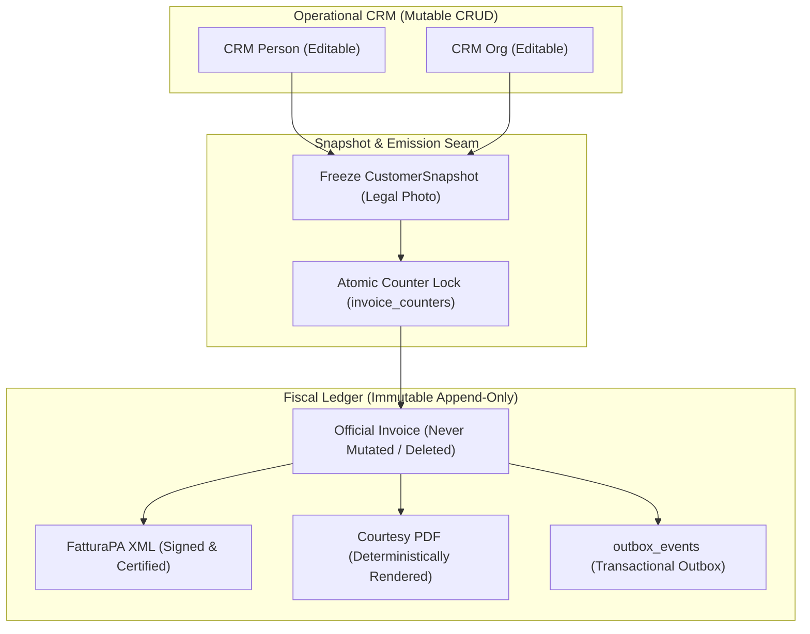

# Domain Invariants

Govern domain ontology, non-negotiable safety guardrails, the strict boundary between mutable CRUD entities and immutable legal ledgers, and customer snapshotting seams.

---

## 1. Operating Principles

1. **Foundational Anchors (Single Source of Domain Truth)**:
   - Follow existing project anchors. Prefer **`.spectacular/ONTOLOGY.md`** for a new domain-model anchor; retain an existing **`VOCABULARY.md`** without duplicating authority or rewriting historical bindings.
   - Record language, state transitions, and invariant owners in their existing homes. Reuse **`GUARDRAILS.md`** where present; folder presence or this skill does not activate governance. Accepted project constraints govern the work.
2. **The Mutable CRUD vs. Immutable Ledger Dichotomy**:
   - Distinguish operational mutation from historical truth when the domain requires it. The following ledger patterns apply to fiscal, legal, or audit-critical records; they are not a universal two-class model for all entities:
     - **Mutable Entities (CRUD)**: Operational records that evolve over time (e.g. CRM Contacts, Organizations, Draft Documents, Workspace Settings). Governed by optimistic concurrency versions (`version`, `ETag`).
     - **Immutable Records (Ledgers)**: Legal, financial, or historical audit records (e.g. Issued Invoices, Fiscal Journals, Purchase Snapshots, Pool Ledger Entries). Governed by append-only insertions and reversal entries (Credit Notes, balancing adjustments). NEVER updated or deleted in place.
3. **Snapshot Boundaries (Severing Foreign Key Risks)**:
   - When an immutable transaction occurs (issuing an invoice, locking an order, closing a fiscal period), the operational counterpart's identity MUST be captured into a frozen **Document Snapshot** (`customer_snapshot` / `counterpart_snapshot` JSON).
   - Subsequent changes to the CRM contact (e.g. renamed legal name, changed VAT ID, updated tax address, or entity deletion) MUST NOT retroactively alter historical tax documents.
   - An immutable ledger document MUST NEVER rely on live runtime foreign-key joins to resolve its fiscal counterparty details.
4. **Atomic Sequential Counters**:
   - Official sequential numbering (e.g. `2026/001`) must NEVER be calculated on the client, in memory without locks, or using naive `MAX(number) + 1` queries.
   - Sequential allocations must use atomic row-level locks on dedicated counter records (`SELECT ... FOR UPDATE` in PostgreSQL or serialized immediate transactions in SQLite) to prevent gaps or duplicate numbering collisions under concurrent load.
5. **Event Emission via Outbox**:
   - Keep immediate invariants in one coordinated transaction. Use synchronous calls for immediate decisions; consult `event-spine` only when durable asynchronous publication is required. Outbox or equivalent delivery is conditional on that requirement.

---

## Invariant ownership and applicability

For each rule, name its owner, affected state, enforcement point, and proof.
Extract pure transition decisions from storage/network effects; preserve coupled
writes under one coordinator. Do not equate every entity with a module.
Pass ownership to `system-architecture`, storage enforcement to `data-modeling`,
and executable failure cases to `test-sentinel`, loading only the relevant skill.
Ledger snapshots and sequential counters below are domain-specific examples;
choose concurrency controls from the actual invariant and contention model.

## 2. The Snapshot & Emission Architecture

Illustrative fiscal workflow; XML generation and durable event delivery apply
only where the product requires them.

---

## 3. Foundational Anchor Alignment in Spectacular

| Anchor | File Location | Responsibility |
|---|---|---|
| **Domain Ontology** | `.spectacular/ONTOLOGY.md` or existing `VOCABULARY.md` | Single source of truth for canonical business terms (e.g. *FatturaPA*, *Customer snapshot*, *Sequential invoice counter*, *SdI receipt outcome*). |
| **Safety Invariants** | `.spectacular/GUARDRAILS.md` | Non-negotiable safety rules that cannot be waived by operator preference or conversational prompts. |
| **Data Ownership Map** | `.spectacular/atlas/data-ownership-map.md` | Workspace isolation, tenant boundaries, and snapshot immutability seams. |

---

## 4. Entity Classification Matrix

For domains requiring historical ledgers, use this comparison where applicable:

| Dimension | Mutable Operational Entity (CRUD) | Immutable Ledger Record (Append-Only) |
|---|---|---|
| **Examples** | `contacts`, `organizations`, `invoice_drafts`, `workspace_settings` | `issued_invoices`, `fiscal_journals`, `pool_ledger_events`, `receipts` |
| **Database Privileges** | `SELECT`, `INSERT`, `UPDATE`, `DELETE` (or soft-delete) | `SELECT`, `INSERT` (Revoke `UPDATE` & `DELETE`) |
| **Modification Pattern** | In-place updates with optimistic locking (`version += 1`) | Append-only. Corrections require explicit compensating documents (e.g. Credit Note `TD04`) |
| **Identity Reference** | Normalized foreign keys (`client_id`) | Denormalized frozen snapshot (`customer_snapshot` JSON) + historical ID link |
| **Concurrency Control** | Optimistic locking (`ETag` / `WHERE version = :expected`) | Pessimistic counter lock (`SELECT ... FOR UPDATE`) |

---

## 5. Negative Constraints (DO NOT)

- **DO NOT execute SQL `UPDATE` or `DELETE` on issued ledgers**: Once a document transitions to `ISSUED` or `LOCKED`, database privileges and ORM layers must reject all in-place mutations.
- **DO NOT resolve counterparty details via live FK joins on historical documents**: Historical and fiscal views must read exclusively from the frozen snapshot.
- **DO NOT compute sequential invoice numbers via `MAX(number) + 1`**: Naive `MAX()` queries without pessimistic row locking cause race conditions and duplicate number collisions under concurrent requests.
- **DO NOT tolerate terminology synonyms in codebase and docs**: Follow the existing Ontology/Vocabulary owner and explicit mappings; preserve external compatibility rather than mass-renaming historical interfaces.
- **DO NOT mutate live customer entities during invoice issuance**: Invoicing reads customer profiles to construct the snapshot, but never mutates the operational customer record during the emission transaction.
