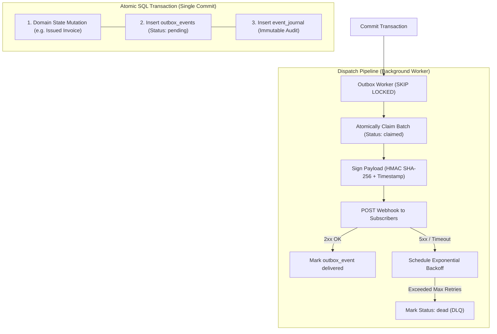

# Event Spine

Design, audit, and govern reliable Transactional Outbox systems, append-only Event Journals, concurrency-safe dispatch workers, and cryptographically signed Webhooks.

---

## Applicability and ownership

Use this skill when a workflow requires durable asynchronous delivery beyond a
local transaction. Keep immediate decisions synchronous and preserve invariants
inside their owning transaction. An event bus does not establish module ownership
and must not conceal an immediate dependency. For simple local callbacks, retain
the existing mechanism.

The producer owns the business fact and event schema; consumers own reactions
and derived projections. Expose stable IDs and the minimum necessary values,
including frozen snapshots only when historical meaning requires them. Declare
compatibility, duplicate handling, ordering, retry ownership, and replay behavior.
Use an outbox or equivalent atomic publication mechanism when durable state and
publication must be coordinated. Add a separate journal only for a stated audit
or replay need. Consult `system-architecture` for unresolved consistency boundaries
and `test-sentinel` for crash, duplicate-delivery, and rollback proof.

## 1. Operating Principles

1. **Zero Dual-Write Hazard (The Transactional Outbox)**:
   - Writing to a database and publishing to an external network service (e.g. HTTP Webhook, Kafka, SQS, Email) are two separate distributed operations.
   - Doing `await db.save(); await fetch(webhookUrl);` is a fatal distributed systems anti-pattern. If the server crashes or the network drops between them, the event is permanently lost, or repeated unpredictably.
   - **The Invariant**: Domain state changes and outbound event records (`outbox_events`) MUST commit within the exact same atomic database transaction.
2. **Append-Only Event Journal**:
   - When audit or replay requires retained business history, maintain a persistent, append-only **Event Journal** (`event_journal`) recording historical state transitions. Queue delivery state alone is not that history.
   - The journal serves as an audit ledger, supports time-travel debugging, and allows historical event replaying.
3. **Atomic Polling Worker with Concurrency Safety**:
   - Asynchronous dispatch workers poll pending outbox records using atomic concurrency locks:
     - PostgreSQL: `SELECT ... FOR UPDATE SKIP LOCKED`
     - SQLite / MySQL: State-claim update with unique worker lease: `UPDATE outbox_events SET status = 'claimed', worker_id = :id, claimed_at = :now WHERE id IN (SELECT id FROM outbox_events WHERE status = 'pending' LIMIT 10)`
   - Leased jobs must have an expiration threshold to recover orphaned jobs if a worker node crashes mid-execution.
4. **Cryptographic Webhook Security (HMAC SHA-256 & Anti-Replay)**:
   - Outbound webhook requests MUST be signed using HMAC SHA-256 over `timestamp + "." + rawBody`.
   - Headers sent to receivers:
     - `X-Webhook-ID`: Unique event UUID.
     - `X-Webhook-Timestamp`: Unix timestamp (seconds).
     - `X-Webhook-Signature`: `v1=hex(hmac_sha256(secret, "${timestamp}.${rawBody}"))`.
   - Inbound webhook receivers must verify the signature, enforce clock-skew tolerance (e.g. $\pm 300$ seconds) to prevent replay attacks, and deduplicate on `X-Webhook-ID`.
5. **Exponential Backoff & Dead Letter Queue (DLQ)**:
   - Webhook delivery failures (network drop, HTTP 5xx, timeouts) retry with exponential backoff (e.g. 15s, 1m, 5m, 30m, 2h).
   - After a configured maximum retry count (e.g. 5 attempts), the message transitions to `dead` (DLQ) with the exact HTTP status code and response body recorded for operator diagnosis.

---

## 2. The Transactional Outbox Architecture



---

## 3. Standard Event Envelope

Use the project's existing event schema and validator. The following envelope is
an illustrative shape; adapt it to producer ownership and consumer compatibility
rather than introducing a second canonical schema:

```json
{
  "id": "evt_01J9X4N8Y2B3K4P5Q6R7S8T9U0",
  "workspaceId": "ws_alpha",
  "eventType": "invoice.issued",
  "schemaVersion": "1.0",
  "occurredAt": "2026-10-08T16:30:00.000Z",
  "data": {
    "invoiceId": "inv_01J9X4N0Z",
    "documentNumber": "2026/042",
    "totalEur": 1500.00,
    "customer": {
      "id": "cli_999",
      "legalName": "Acme Srl"
    }
  }
}
```

---

## 4. Canonical Outbox SQL Schema (PostgreSQL Reference)

```sql
-- Outbox Queue for pending outbound dispatches
CREATE TABLE outbox_events (
  id TEXT PRIMARY KEY,
  workspace_id TEXT NOT NULL,
  event_type TEXT NOT NULL,
  payload JSONB NOT NULL,
  status TEXT NOT NULL DEFAULT 'pending' CHECK (status IN ('pending', 'claimed', 'delivered', 'dead')),
  retry_count INTEGER NOT NULL DEFAULT 0,
  max_retries INTEGER NOT NULL DEFAULT 5,
  next_retry_at TIMESTAMPTZ,
  claimed_at TIMESTAMPTZ,
  worker_id TEXT,
  last_error_code TEXT,
  last_error_message TEXT,
  created_at TIMESTAMPTZ NOT NULL DEFAULT NOW(),
  delivered_at TIMESTAMPTZ
);

CREATE INDEX idx_outbox_events_poll ON outbox_events (status, next_retry_at)
WHERE status IN ('pending', 'claimed');

-- Immutable Event Journal for auditing and replay
CREATE TABLE event_journal (
  id TEXT PRIMARY KEY,
  workspace_id TEXT NOT NULL,
  event_type TEXT NOT NULL,
  payload JSONB NOT NULL,
  occurred_at TIMESTAMPTZ NOT NULL DEFAULT NOW()
);

CREATE INDEX idx_event_journal_workspace_time ON event_journal (workspace_id, occurred_at);
```

---

## 5. Webhook Signature Verification Reference

```typescript
import crypto from 'node:crypto';

export function verifyWebhookSignature({
  secret,
  timestampHeader,
  signatureHeader,
  rawBody,
  maxToleranceSeconds = 300
}: {
  secret: string;
  timestampHeader: string;
  signatureHeader: string;
  rawBody: string;
  maxToleranceSeconds?: number;
}): boolean {
  const timestamp = parseInt(timestampHeader, 10);
  const now = Math.floor(Date.now() / 1000);

  if (isNaN(timestamp) || Math.abs(now - timestamp) > maxToleranceSeconds) {
    return false; // Anti-replay timestamp expired or out of tolerance
  }

  const expectedSignature = 'v1=' + crypto
    .createHmac('sha256', secret)
    .update(`${timestamp}.${rawBody}`)
    .digest('hex');

  return crypto.timingSafeEqual(
    Buffer.from(signatureHeader),
    Buffer.from(expectedSignature)
  );
}
```

---

## Gates for the selected increment

Consult the applicable prompts in
[Spectacular readiness](../spectacular/references/milestone-readiness.md) when
planning a delivery or launch. Apply duplicate delivery, crash recovery, retry, replay, and consumer compatibility
gates when durable delivery is part of the increment. Local callbacks do not imply
a broker/outbox milestone; publication and replay effects retain their permissions.

## 6. Negative Constraints (DO NOT)

- **DO NOT perform network I/O inside database transactions**: The SQL transaction coordinates domain changes and the corresponding outbox record (and journal when required). Never make external HTTP requests or publish to remote message brokers while holding SQL row locks.
- **DO NOT dispatch webhooks synchronously during user request handling**: Inbound API requests must return immediately after the transaction commits. All webhook deliveries belong to asynchronous workers.
- **DO NOT deliver webhooks without cryptographic signatures**: Sending unauthenticated webhook payloads exposes consumers to forgery, spoofing, and tampering. Always sign with HMAC SHA-256.
- **DO NOT retry indefinitely without backoff**: Rapid-fire retries overwhelm failing subscriber servers. Retries must strictly follow exponential backoff and cap out into a Dead Letter Queue (DLQ).
- **DO NOT discard raw failure responses on DLQ entries**: When a webhook permanently fails, record the final HTTP status code and truncated response body so developers can diagnose why the delivery failed.
