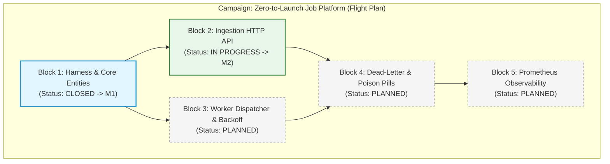

# Genesis and Kickoff Reference Examples

Concrete, production-grade examples for launching projects with zero file bloat.

---

## 1. Core Triad Examples

### `.spectacular/PROJECT.md` (What & Why)
```yaml
---
type: Anchor
id: 019fe381-5d61-7223-b362-03a5f99a7b13
human_ref: PROJECT
title: Background Job Platform
updated: "2026-08-17T00:00:00Z"
direction: Fast, reliable background task processing with exponential backoff and worker pools.
boundaries:
  - Core platform handles job scheduling, persistence, and worker execution.
  - Out of scope: UI dashboard (deferred to M4), third-party notification integrations.
constraints:
  - All operations must be crash-resilient and deterministic.
  - Pure open-source dependencies without proprietary SDKs.
current_truth:
  - Anchor:019fe381-5d61-7223-b362-03a5f99a7b15 # ARCHITECTURE
  - Anchor:019fe381-5d61-7223-b362-03a5f99a7b16 # STACK
freshness_checked_at: "2026-08-17T00:00:00Z"
freshness_valid_until: "2027-08-17T00:00:00Z"
---

# Background Job Platform

Core orchestrator for high-throughput background processing.
```

### `.spectacular/STACK.md` (What with)
```yaml
---
type: Anchor
id: 019fe381-5d61-7223-b362-03a5f99a7b16
human_ref: STACK
title: Technology Stack
direction: Native Go toolchain with SQLite/Postgres persistence and zero external runtime dependencies.
boundaries:
  - Language: Go 1.24+
  - Database: SQLite (via modernc.org/sqlite for test/local dev), PostgreSQL ready.
  - HTTP Router: Chi.
  - Logging: standard library `log/slog`.
constraints:
  - Baseline verification command: `make check` (must run linter, race detector, and unit tests).
---

# Stack

Standardized tooling and runtime dependencies.
```

### `.spectacular/ARCHITECTURE.md` (How)
```yaml
---
type: Anchor
id: 019fe381-5d61-7223-b362-03a5f99a7b15
human_ref: ARCHITECTURE
title: System Architecture & Boundaries
direction: Hexagonal layout isolating pure domain logic from database and network protocols.
boundaries:
  - `cmd/server`: Application entry point and dependency injection wiring.
  - `internal/domain`: Pure domain entities and job execution state machine (ZERO external imports).
  - `internal/store`: Database schema, migrations, and SQL repository adapter.
  - `internal/api`: HTTP router, request validation, and JSON handlers.
constraints:
  - `domain` must never import `store` or `api`.
  - Database interactions must pass through explicit domain repository interfaces.
---

# Architecture

Component layout and dependency directions for DB, Server, and API layers.
```

---

## 2. On-Demand Anchor Example

### `.spectacular/VOCABULARY.md` (Ubiquitous Language)
```yaml
---
type: Anchor
id: 019fe381-5d61-7223-b362-03a5f99a7b18
human_ref: VOCABULARY
title: Ubiquitous Language
direction: Unambiguous naming definitions for domain entities and lifecycle states.
---

# Vocabulary

| Term | Definition | Invariants / Restrictions |
|---|---|---|
| **Job** | An atomic unit of background work. | States: `PENDING` -> `RUNNING` -> `COMPLETED` \| `FAILED`. |
| **Worker** | A concurrent execution routine consuming jobs. | Must handle SIGTERM gracefully within a 5-second deadline. |
| **Payload** | Immutable JSON parameters passed to a Job. | Max size 64KB; validated on ingest. |
| **Attempt** | A single execution attempt of a Job. | Increments sequentially; triggers exponential backoff on error. |
```

---

## 3. Kickoff Mission: `M1-bootstrap/MISSION.md`

```yaml
---
type: Mission
ref: M1
title: Bootstrap Core Platform & Ingestion Engine
status: active
owner: Alex
authority:
  operator: [inspect, edit-in-scope, run-checks, bounded-repair, commit-local]
  requires_owner: [push, deploy, change-outcome-or-completion]
baseline:
  branch: m1-bootstrap
completion:
  - claim: project-harness
    pass_boundary: Linter, formatter, and race-detector test runner execute deterministically with a single command.
    proof_requirement: Running `make check` executes `golangci-lint` and `go test -race ./...` exiting with code 0.

  - claim: core-job-domain
    pass_boundary: Job domain entity encapsulates payload validation, state transitions, and retry interval calculation.
    proof_requirement: Table-driven unit tests in `internal/domain` verify state machine transitions and backoff calculations.

  - claim: persistence-and-api
    pass_boundary: POST /v1/jobs persists a pending Job and returns 202 Accepted with job UUID; GET /healthz returns 200 OK.
    proof_requirement: End-to-end integration tests spin up an in-memory SQLite store and HTTP server asserting response codes and DB records.

dependencies: []
gaps: []
---

# Bootstrap Execution Plan

Establish the modular foundation with strict test harnesses and zero technical debt.

## Execution Steps
1. Initialize Go module, Makefile, and CI verification scripts.
2. Implement `internal/domain/job.go` with domain validation and state transitions.
3. Implement `internal/store/sqlite` with schema migrations and repository interface.
4. Implement `internal/api` HTTP routes and payload decoding.
5. Run full verification ladder via `make check`.
```

---

## 4. Campaign Planning Example (Mini-Roadmap)

### Visual Flowchart (Mermaid Primary)


### CLI Terminal Output (ASCII Fallback)
```text
Campaign: Zero-to-Launch Job Platform
[Block 1: Harness & Core Entities] (CLOSED -> M1)
  ├──> [Block 2: Ingestion HTTP API] (IN PROGRESS -> M2) ──┐
  └──> [Block 3: Worker Dispatcher]  (PLANNED) ────────────┴──> [Block 4: Dead-Letter] (PLANNED) ──> [Block 5: Observability] (PLANNED)
```

