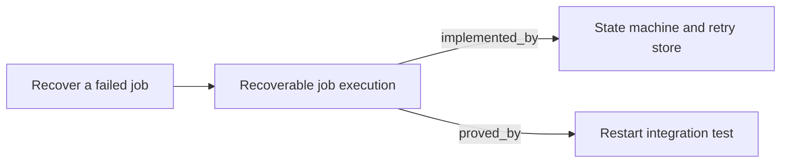
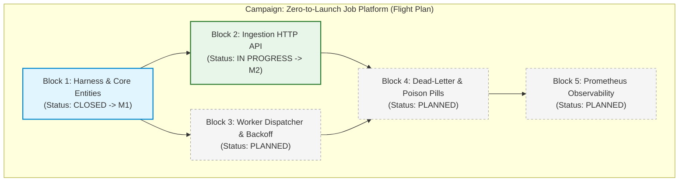

# Genesis and Kickoff Reference Examples

Use this when: Orchestrator authoring Core Anchors, bootstrap Missions, or Campaign diagrams during Genesis.

Concrete, production-grade examples for launching projects with zero file bloat.

---

## 1. Core anchors when useful

For new soft Anchors, use [profiles.md](profiles.md) and the folder agreement.
No emitting command is needed. Preserve existing governed Anchor identities;
use init only when choosing a governed workspace. Create only the concern whose
content needs an independent home.

| Anchor | Distinct purpose |
|---|---|
| PROJECT.md | Purpose, direction, boundaries, and non-goals |
| STACK.md | Languages, runtimes, dependencies, and verification tools |
| ARCHITECTURE.md | Components, dependencies, and system organization |

---

## 2. On-Demand Anchor Example

### `.spectacular/VOCABULARY.md` (Domain Ontology and Ubiquitous Language)

Use the sections that have independent meaning. When action vocabulary or state
ambiguity matters, include canonical actions, known banned synonyms, and permitted
entity states under Actions and events. These are body guidance, not mechanically
certified frontmatter or a mandatory structure for every soft document.

This is a body shape, not a frontmatter template. Preserve existing
Anchor metadata for governed history. For a new soft `VOCABULARY.md`,
follow the metadata agreement in [knowledge.md](knowledge.md); retain an existing
`ONTOLOGY.md` rather than creating a duplicate authority.

```md

# Domain ontology and ubiquitous language

## Glossary index

| Term | Definition | Invariants / Restrictions |
|---|---|---|
| **Attempt** | A single execution attempt of a Job. | Increments sequentially; triggers exponential backoff on error. |
| **Job** | An atomic unit of background work. | States: `PENDING` -> `RUNNING` -> `COMPLETED` \| `FAILED`. |
| **Payload** | Immutable JSON parameters passed to a Job. | Max size 64KB; validated on ingest. |
| **Worker** | A concurrent execution routine consuming jobs. | Must handle SIGTERM gracefully within a 5-second deadline. |

Keep this index alphabetical. Put the detailed model below, grouped by bounded
context rather than alphabetically:

## Bounded contexts

## Objects

## Relationships

| Relationship | Meaning | Context |
| --- | --- | --- |
| Job `1` `contains` `1..*` Attempt | Job owns its execution attempts; an Attempt belongs to one Job. | Execution tracking |

## Actions and events

## Invariants and policies

## Implementation mappings

## Semantic gaps and change history
```

---

## 3. Optional Atlas: `.spectacular/atlas/job-recovery.md`

Use an Atlas when several user journeys or system boundaries need a shared map.
It explains a value slice; it does not authorize work.

````md

# Atlas: Job recovery

## Outcome board

| Actor | Journey step | Desired outcome | Success signal |
| --- | --- | --- | --- |
| Operator | Recover a failed job | Resume with one safe next action | The retry state and owner gate are visible |

## System board

| Capability | Connection | Boundary | Proof |
| --- | --- | --- | --- |
| Recoverable job execution | serves `Recover a failed job` | Job state machine + retry store | Restart integration test |


```mermaid
flowchart LR
  J[Recover a failed job] --> C[Recoverable job execution]
  C -->|implemented_by| B[State machine and retry store]
  C -->|proved_by| E[Restart integration test]
```
````

## 4. Kickoff Mission: `M1-bootstrap/M1-bootstrap.md`

Retrieve frontmatter from the relevant governed command’s `--schema` output
and round-trip it through its validator. Use prose here to describe intent;
never fabricate an active record or its command-owned bindings.

---

## 5. Campaign Planning Example (Mini-Roadmap)

### Visual Flowchart Example (Mermaid)

```mermaid
flowchart TD
    classDef closed fill:#e1f5fe,stroke:#0288d1,stroke-width:2px;
    classDef inprogress fill:#e8f5e9,stroke:#2e7d32,stroke-width:2px;
    classDef planned fill:#f5f5f5,stroke:#9e9e9e,stroke-width:1px,stroke-dasharray: 4 4;

    subgraph Campaign["Campaign: Zero-to-Launch Job Platform (Flight Plan)"]
        B1["Block 1: Harness & Core Entities\n(Status: CLOSED -> M1)"]:::closed
        B2["Block 2: Ingestion HTTP API\n(Status: IN PROGRESS -> M2)"]:::inprogress
        B3["Block 3: Worker Dispatcher & Backoff\n(Status: PLANNED)"]:::planned
        B4["Block 4: Dead-Letter & Poison Pills\n(Status: PLANNED)"]:::planned
        B5["Block 5: Prometheus Observability\n(Status: PLANNED)"]:::planned

        B1 --> B2
        B1 --> B3
        B2 --> B4
        B3 --> B4
        B4 --> B5
    end
```

### Text Representation Example (ASCII)
```text
Campaign: Zero-to-Launch Job Platform
[Block 1: Harness & Core Entities] (CLOSED -> M1)
  ├──> [Block 2: Ingestion HTTP API] (IN PROGRESS -> M2) ──┐
  └──> [Block 3: Worker Dispatcher]  (PLANNED) ────────────┴──> [Block 4: Dead-Letter] (PLANNED) ──> [Block 5: Observability] (PLANNED)
```
