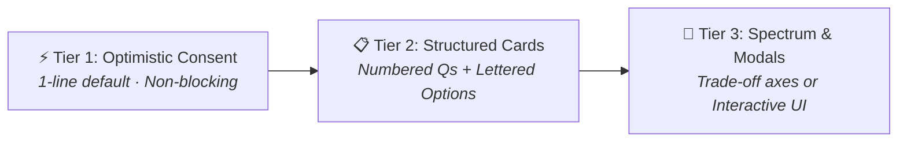

# Owner Interaction Guidance

Use this when: Orchestrator or operator approaches an owner gate, question, decision, or authority boundary.

## 1. When to Ask Owner Questions

Ask only when at least one of these is genuinely open:
- **Semantic fork**: Competing architectural or product directions with distinct trade-offs.
- **Mission boundary**: Scope expansion, modification of frozen completion criteria, or non-goal adjustments.
- **Authority gate**: Any action requiring `requires_owner` (e.g. `mission start`, `mission complete`, `contract amend`, `git push`, provider mutations).
- **Material risk / irreversible effect**: Destructive operations, data migrations, or external integrations.
- **Contract conflict**: Incompatibility with frozen capability specifications or upstream truth.

Do not run an interview when the Mission or project Anchors already answer the question. Carry accepted defaults forward.

### Assumption Calibration (Zero-Friction Progress)
- **Material / Semantic Assumptions**: If a choice affects user-visible behavior, public APIs, architectural boundaries, risk profile, or the completion claim, stop and present a four-part question or Gap.
- **Reversible Implementation Choices**: For low-level, reversible implementation choices strictly within authorized scope, choose the simplest path, state the assumption clearly in the handoff or Run body notes, and continue executing without interrupting the owner.

---

## 2. The 3-Tier Question Escalator

Match the question format to the risk, scope, and predictability of the decision:



### Tier 1: Optimistic Consent (Low-Risk & Reversible Defaults)
For standard implementation choices strictly within authorized scope, state the default and proceed without blocking the session:
> *"I will use pure Go `modernc.org/sqlite` to keep the binary CGO-free. Proceeding with this default unless you specify otherwise."*

---

### Tier 2: Structured Batch Cards (Numbered Questions + Lettered Options)

For architectural forks, kickoff decisions, and campaign planning.

**Format Standard**:
- **Questions are numbered** (`1.`, `2.`, `3.`)
- **Options are lettered** (`A`, `B`, `C`, with `(Recommended)` clearly marked).
- **Adaptive Context Depth**: Calibrate explanation depth to the domain:
  - *Compact inline* for straightforward library/tool choices.
  - *Deep consequence breakdown* (2-3 lines per option) for complex architectural trade-offs.

#### Example A: Compact Batch Card (Genesis Kickoff)
```markdown
### 🚀 Kickoff Decisions (3 Forks)

1. **Storage Engine**:
   - **A (Recommended)**: Embedded SQLite (`modernc.org/sqlite` pure Go)
   - **B**: PostgreSQL Container (Docker required)
   - **C**: Flat JSON files

2. **Session Authentication**:
   - **A (Recommended)**: Secure HTTP-only cookies
   - **B**: Bearer JWT tokens

3. **Background Job Queue**:
   - **A (Recommended)**: In-memory Go channels
   - **B**: Redis / Asynq

*Reply `all defaults`, shorthand picks (e.g. `A, B, A`), or write in custom alternatives.*
```

#### Example B: Deep Consequence Breakdown (High-Impact Domain)
```markdown
### ⚖️ Architectural Decision: SQL Migration Strategy

1. **Migration Execution Model**:
   - **A (Recommended) — Embedded Go strings**:
     - *Consequence*: Single portable binary; zero filesystem lookup failures at runtime; migrations version-controlled with Go AST.
   - **B — External `migrations/*.sql` directory**:
     - *Consequence*: Enables DBAs to edit SQL directly without recompiling, but requires directory path tracking in production deployments.
   - **C — Manual SQL scripts**:
     - *Consequence*: Zero automated tooling; requires manual administrator execution on schema drift.

*Reply `A`, `B`, `C`, or write in an alternative.*
```

---

### Tier 3: The Trade-off Spectrum & Interactive UI Modals

Used when requirements are open-ended, highly unpredictable, or require rich modal steering:

1. **The Trade-off Spectrum (For Unpredictable Design Decisions)**:
   When choices cannot be neatly pre-packaged into A/B/C, frame the competing design axes:
   ```markdown
   ### 🧭 Design Direction: Cache Invalidation Strategy
   We are balancing two competing architectural axes:
   - **Axis A (Extreme Simplicity)**: TTL-only expiration (data can be stale for ≤60s; zero invalidation code).
   - **Axis B (Strict Freshness)**: Event-driven pub/sub invalidation (real-time consistency; introduces Redis/bus dependency).

   Where on this spectrum should we land for v1?
   ```

2. **Interactive UI Modals (Host Harness Aware)**:
   When executing inside rich IDEs with tool-assisted UI support (e.g. Antigravity IDE `ask_question`), render interactive selectable option modals so the user can click directly.

---

### Universal Rule: Unrestricted Natural Language Write-Ins

Every structured question card explicitly accepts custom write-in answers. If the user provides a custom path (e.g. *"Actually use DynamoDB because our cloud account provides it"*), the agent accepts it gracefully, records the ruling in `spectacular decide`, and adjusts without friction.

---

## 3. Ask for Authorization, Not for Labor

An owner-gated action needs the owner's **decision**, not the owner's **hands**. When reaching an owner gate, request authorization and specify the action you will execute upon approval:

> `mission complete` is owner-gated because completion freezes the claims and records attributable acceptance.
> Authorize me to run `spectacular mission complete M14 --by Alex`? (Y/N)

```text
┌─────────────────────────────────────────────────────────────┐
│ HOLD THE KEYBOARD PRINCIPLE                                │
│ • Ask for explicit confirmation, then run the command.     │
│ • Never hand back a command for the owner to copy/paste    │
│   when you can execute it upon explicit approval.           │
│ • Reserve owner-executed steps strictly for operations     │
│   where performing it IS the authority (credential entry,   │
│   interactive logins, legal signatures).                   │
└─────────────────────────────────────────────────────────────┘
```

When acting on an authorization, record who authorized and who performed. An operator acting on owner approval is not the owner acting.

---

## 4. Settle Execution Mode at Activation

When approaching the activation gate, route to [execute.md](execute.md) for the execution-mode table, checkpoint rules, and Run-body template. Settle owner involvement in the same activation exchange; do not ask piecemeal later.

---

## 5. Batch Gates; Ask Once

Collect every owner decision required for a phase and present them in a single exchange. Multiple piecemeal approvals create friction and delay.

- **Check prior decisions first**: Before asking, check whether the answer is already recorded in Anchors, Decisions, or earlier approvals.
- **Approvals carry forward**: An approval carries forward to the same class of action within the active phase.
- **Avoid duplicate gates**: Re-asking settled questions is noise, not governance.

---

## 6. State Boundaries Once; Refusal Format

Name an authority boundary the first time it becomes relevant, then act on it. Repeating constraints on every turn obscures where a decision is genuinely needed.

When you must decline an out-of-scope or unauthorized action, use this compact pattern:

```text
1. What cannot be done (1 sentence).
2. Nearest supported alternative (1 sentence).
3. Immediate unblocked next step (continue execution).
```

*Example:*
> "I cannot deploy directly to production without owner authorization. I can run the full staging verification suite and prepare the release artifact. Proceeding with staging tests."
