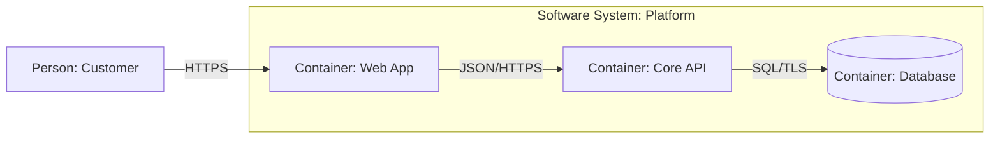

# System Architecture

Make architecture decisions traceable to business outcomes, measurable quality attributes, constraints, and verified evidence.

## Route Matrix

| Route | Required Workflow Steps | Deliverable | Complete When |
|---|---|---|---|
| **Explore** | 1–3, 7 | Trade-off matrix & options | Drivers explicit; all viable options compared against same drivers. Read [decision guide](references/decision-guide.md). |
| **Decide** | 1–3, 7 | Single ADR recommendation | Evidenced choice with drivers, alternatives, and validation step. Read [templates](references/deliverable-templates.md). |
| **Design** | 1–8 | Proportional target architecture | All selected steps satisfy completion criteria; passes quality gate. Read [architecture method](references/architecture-method.md). |
| **Review** | 1, assessed 2–6 | Findings & verdict | All areas cite verified evidence or marked unsupported with severity. Read [review template](references/deliverable-templates.md). |
| **Document** | 1, 7, (8 if migrating) | ADR, arch doc, diagram set | Consistent naming, decision status preserved, zero contradictions. Read [templates](references/deliverable-templates.md). |
| **Evolve** | 1–3, 7–8 | Phased migration plan | Each phase has compatibility, rollback, and exit criteria. Read [visual delta](references/visual-communication.md). |
| **Explain visually** | Audience + boundary + checks | Explanatory / technical visuals | Answers one named question; verified against inspected evidence. Read [diagram patterns](references/diagram-patterns.md). |

## Core Workflow Steps

1. **Frame the problem:** Business outcomes, actors, system boundaries, constraints, non-goals, measurable quality scenarios.
2. **Model domain & ownership:** Capabilities, bounded contexts, invariants, authoritative owners (distinguish logical vs deployment).
3. **Compare system shapes:** Evaluate simplest viable shapes against ranked drivers (delivery, operational cost, failure modes).
4. **Trace runtime behavior:** Happy path + failure modes (timeouts, retries, idempotency, backpressure, degraded modes, recovery).
5. **Design data ownership:** Transaction boundaries, consistency semantics, authoritative writers.
6. **Design operations & security:** Trust boundaries, IAM, secrets, encryption, observability, capacity, deployment, disaster recovery.
7. **Record decisions & uncertainty:** ADR capturing chosen option, drivers, consequences, confidence, and open validation questions.
8. **Plan evolution:** Thin delivery slices with backward compatibility, rollback steps, and verified acceptance gates.

## C4 Abstraction Levels & Quick Pattern

| Level | Boundary Scope | Audience | Diagrams-as-Code Syntax |
|---|---|---|---|
| **L1: Context** | System of interest + external actors/systems | Everyone | `flowchart LR; user["User"] --> sys["System"] --> ext["Ext API"]` |
| **L2: Container** | Deployable units, datastores, queues | Engineers & Ops | `subgraph sys; web["App"] --> api["API"] --> db[("DB")]; end` |
| **L3: Component** | Internal modules & controllers | Module Owners | Class/module interaction within a single container |

## Expansion Handoffs

| Out-of-Scope Need | Action / Delegate |
|---|---|
| Physical DDL, ER diagrams, indexing, zero-downtime migrations | Invoke `data-modeling` companion skill |
| 3-option tracer spike on ambiguous UI/architecture variants | Invoke `rapid-prototyping` companion skill |
| Mission tracking, contracts, receipts, and flight plans | Invoke `spectacular` mission governance |

## Core Invariants & Negative Constraints

- **DO NOT make architectural claims without inspecting evidence.** In codebases, inspect source, configs, schemas, and telemetry before asserting state; label unverified statements as assumptions.
- **DO NOT produce monolithic all-or-nothing designs.** Structure architectures in independently verifiable, reversible slices.
- **DO NOT mix architectural decisions with ungrounded speculation.** Explicitly separate *Facts*, *Assumptions*, *Decisions*, and *Open Questions*.
- **DO NOT add unnecessary distributed complexity.** Default to the simplest monolithic or modular architecture unless scale, team boundaries, or isolation constraints force decoupling.
